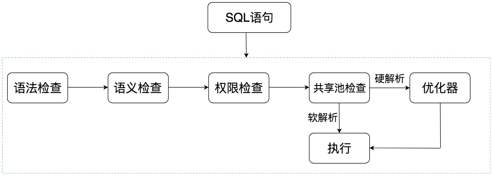
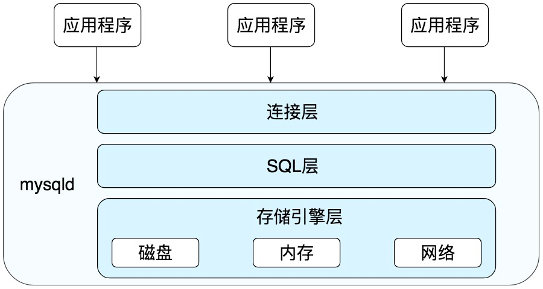
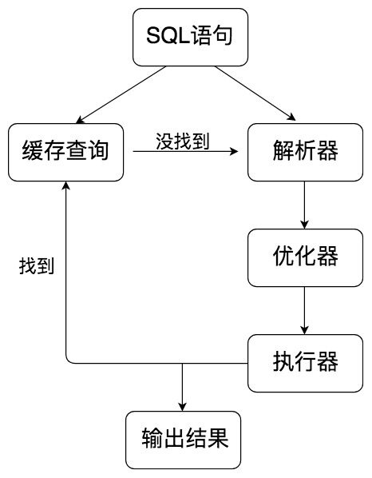
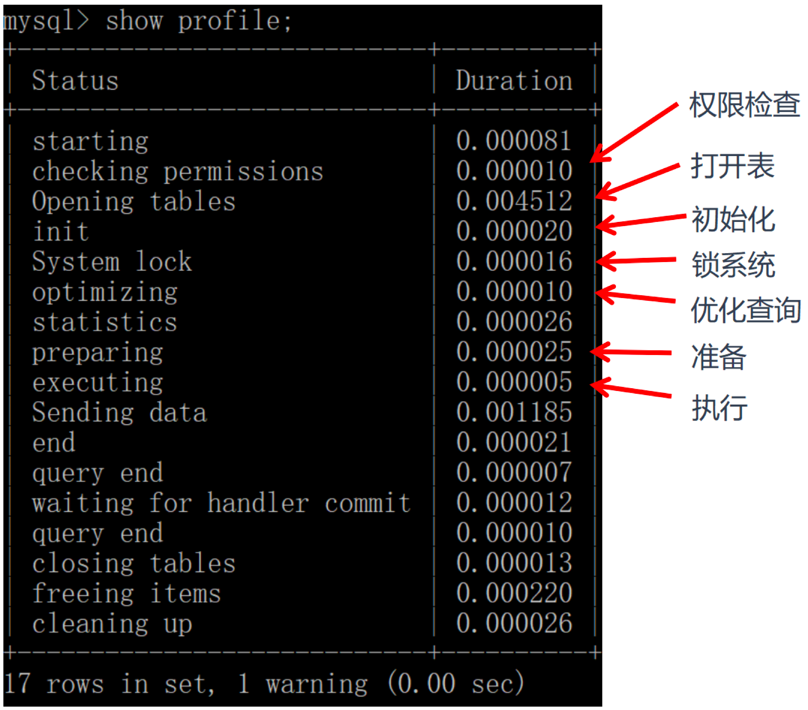

# SQL

## 基础

### 入门

**四个部分**

1. DDL：数据定义语言。它用来定义我们的数据库对象，包括数据库、数据表和列。
2. DML：数据操作语言。它操作和数据库相关的记录，比如增加、删除、修改数据表中的记录。
3. DCL：数据控制语言。定义访问权限和安全级别。
4. DQL：数据查询语言。

**ER图**

实体关系图。

实体、属性、关系。

### DBMS

DataBase Management System数据库管理系统。DBMS = 多个数据库（DB） + 管理程序。

**RDBMS**

关系型数据库。SQL。

**非关系型数据库**

NoSQL：键值型、文档型、搜索引擎、列存储、图形数据库。

1. 键值型：

   优点：查找块。

   缺点：无法自有使用条件过滤where。需要遍历所有键。

2. 文档型：管理文档、文档作为处理信息的基本单位，一个文档相当于一条记录。MongoDB。

3. 搜索引擎：检索。Elasticsearch, Splunk, Solr。采用全文搜索，核心原理：倒排数据。

4. 列存储：将数据按照列存储到数据库中。降低系统IO，适合分布式文件系统。功能有限。

5. 图形数据库：利用图存储实体之间关系。例如社交网络。能高效解决复杂的关系问题。

### SQL如何执行



1. 语法检查：拼写是否正确。

2. 语义检查：访问的对象是否存在。

3. 权限检查：用户是否具备访问该数据的权限。

4. 共享池检查：内存池（缓存SQL语句和其执行计划）。Oracle通过这个检查判断软解析还是硬解析。

   软解析：首先对SQL语句进行hash运算，在库缓存中查找，如果存在执行计划，就直接进入执行器执行。

   硬解析：如果没有找到，创建解析树，生成执行计划，进入优化器。

5. 优化器：硬解析，创建解析树，生成执行计划。

6. 执行器：执行。

**共享池**

Oracle特有。

库缓存：缓存SQL语句和执行计划。

数据字典缓冲区：存储Oracle中的对象定义（表、视图、索引）。

绑定变量，通过不同的变量取值改变SQL的执行结果。可以提升软解析可能性，但是可能导致生成的执行计划不够优化。

```sql
select * from player where player_id = 10001;
--绑定变量减少硬解析。动态SQL。但是因为参数不同会导致SQL执行效率不同，优化也困难--
select * from player where player_id = :player_id;
```

**MySQL流程**



1. 连接层：客户端和服务器建立连接。
2. SQL层：对SQL语句查询。
3. 存储引擎层：与数据库文件打交道，负责数据存取。

**MySQL中SQL层结构**




MySQL8.0取消了查询缓存。

1. 解析器：对SQL语句进行语法分析，语义优化。
2. 优化器：确定SQL执行路径（全表检索还是根据索引检索等）
3. 执行器：执行前判断权限。

**MySQL引擎**

1. InnoDB：5.5+默认。支持事务、行级锁定、外键约束。
2. MyISAM：5.5-默认。不支持事务和外键。速度快，占用资源少。
3. Memory：使用系统内存作为存储介质。
4. NDB：用于分布式集群。
5. Archive：有很好的压缩机制，用于文件归档，在请求写入时会进行压缩。

**MySQL分析执行时间**

1. 检查profiling是否开启：`select @@profiling;`
2. 为0表示关闭。开启：`set profiling=1;`
3. 执行一个查询。
4. 查看当前会话所产生的所有profiles`show profiles;`
5. 获取上一次查询的执行时间`show profile;`也可以指定Query ID。



### 创建库&表

```
create, drop, alter
1.定义数据库：
    CREATE DATABASE nba; // 创建一个名为nba的数据库
    DROP DATABASE nba; // 删除一个名为nba的数据库
2.定义数据表：
	CREATE TABLE [table_name](字段名 数据类型，......)
```

**例子**

```sql
DROP TABLE IF EXISTS `player`;
CREATE TABLE `player`  (
  `player_id` int(11) NOT NULL AUTO_INCREMENT,
  `team_id` int(11) NOT NULL,
  `player_name` varchar(255) CHARACTER SET utf8 COLLATE utf8_general_ci NOT NULL,
  `height` float(3, 2) NULL DEFAULT 0.00,
  PRIMARY KEY (`player_id`) USING BTREE,
  UNIQUE INDEX `player_name`(`player_name`) USING BTREE
) ENGINE = InnoDB CHARACTER SET = utf8 COLLATE = utf8_general_ci ROW_FORMAT = Dynamic;
```

utf8_general_ci：大小写不敏感。utf8_bin：大小写敏感。

**修改表结构**

1. 添加字段：`ALTER TABLE player ADD (age int(11));`
2. 修改字段名：`ALTER TABLE player RENAME COLUMN age to player_age`
3. 修改字段数据类型：`ALTER TABLE player MODIFY (player_age float(3,1));`
4. 删除字段：`ALTER TABLE player DROP COLUMN player_age;`

**约束**

1. 主键约束：唯一标识一条记录。
2. 外键约束：表与表之间引用的完整性。
3. 字段-唯一性约束：不可重复值。相当于创建了一个约束和普通索引，目的是保证字段的正确性。提高检索速度。
4. 字段-not null约束：
5. 字段-default
6. 字段-check约束：检查特定字段取值范围的有效性。

**设计原则**

1. 表个数越少越好。
2. 表中字段个数越少越好。各个字段相互独立。也会在数据冗余和检索效率中平衡。
3. 表中联合主键的字段个数越少越好。
4. 使用主键和外键越多越好。关系越多，证明实体之间冗余度越低，利用度越高。保证表间独立性，提升相互之间的关联使用率。

### 检索数据

**select**

**查询列**

**起别名**

**查询常数**

在查询结果中增加一列固定的常数列，取值自己指定。

如果想整合不同的数据源，用常数列作为这个表的标记需要查询常数。

例子：`SQL：SELECT '王者荣耀' as platform, name FROM heros`

虚构了一个字段。加上''。否则会被当成列名进行查询。如果是数字可以直接写。

**去除重复行**

distinct：`SQL：SELECT DISTINCT attack_range FROM heros`

注意：distinct放到所有列前面。对后面所有列名组合去重。

**排序检索数据**

order by：`SELECT name, hp_max FROM heros ORDER BY hp_max DESC `

`SELECT name, hp_max FROM heros ORDER BY mp_max, hp_max DESC`

1. 排序的列明：可以有多个。
2. 顺序：asc升序，desc降序。
3. 非选择列区分：可以使用非选择列。
4. 位置：位于select的最后一条字句。

**约束返回结果的数量**

limit：`SELECT name, hp_max FROM heros ORDER BY hp_max DESC LIMIT 5`

放在select语句的最后面。不同数据库关键字不同。

**执行顺序**

1. 关键字顺序不能颠倒：SELECT ... FROM ... WHERE ... GROUP BY ... HAVING ... ORDER BY ...
2. 执行顺序：FROM > WHERE > GROUP BY > HAVING > SELECT的字段 > DISTINCT > ORDER BY > LIMIT

```sql
SELECT DISTINCT player_id, player_name, count(*) as num #顺序5
FROM player JOIN team ON player.team_id = team.team_id #顺序1
WHERE height > 1.80 #顺序2
GROUP BY player.team_id #顺序3
HAVING num > 2 #顺序4
ORDER BY num DESC #顺序6
LIMIT 2 #顺序7
```

每个步骤产生一个虚拟表，将这个虚拟表传入下一个步骤作为输入。

1、from，如果多表：

1. 通过cross join求笛卡尔积，相当于得到虚拟表vt1-1.

2. 通过on筛选，得到虚拟表vt1-2

3. 添加外部行，如果左连接、有连接、全连接会涉及。得到虚拟表vt-1-3

   直到所有表被处理完。得到vt1

2、where阶段，筛选过滤。得到vt2

3、group&having：分组和分组过滤，得到vt3, vt4.

4、select&distinct：提取想要的字段，去重。得到vt5-1, vt5-2

5、order by：得到vt6.

6、limit：取出指定行的记录。得到vt7

### 数据过滤

**比较运算符**


比较运算符在 SQL 中，我们可以使用 WHERE 子句对条件进行筛选，在此之前，你需要了解 WHERE 子句中的比较运算符。这些比较运算符的含义你可以参见下面这张表格：


实际上你能看到，同样的含义可能会有多种表达方式，比如小于等于，可以是（<=），也可以是不大于（!>）。同样不等于，可以用（<>），也可以用（!=），它们的含义都是相同的，但这些符号的顺序都不能颠倒，比如你不能写（=<）。需要注意的是，你需要查看使用的 DBMS 是否支持，不同的 DBMS 支持的运算符可能是不同的，比如 Access 不支持（!=），不等于应该使用（<>）。在 MySQL 中，不支持（!>）（!<）等。我在上一篇文章中使用了 heros 数据表，今天还是以这张表格做练习。下面我们通过比较运算符对王者荣耀的英雄属性进行条件筛选。WHERE 子句的基本格式是：SELECT ……(列名) FROM ……(表名) WHERE ……(子句条件)比如我们想要查询所有最大生命值大于 6000 的英雄：

逻辑运算符我刚才介绍了比较运算符，如果我们存在多个 WHERE 条件子句，可以使用逻辑运算符：

你能看到我把 WHERE 子句分成了两个部分。第一部分是关于主要定位和次要定位的条件过滤，使用的是role_main in ('法师', '射手') OR role_assist in ('法师', '射手')。这里用到了 IN 逻辑运算符，同时role_main和role_assist是 OR（或）的关系。第二部分是关于上线时间的条件过滤。NOT 代表否，因为我们要找到不在 2016-01-01 到 2017-01-01 之间的日期，因此用到了NOT BETWEEN '2016-01-01' AND '2017-01-01'。同时我们是在对日期类型数据进行检索，所以使用到了 DATE 函数，将字段 birthdate 转化为日期类型再进行比较。关于日期的操作，我会在下一篇文章中再作具体介绍。这是运行结果（6 条记录）：

使用通配符进行过滤刚才讲解的条件过滤都是对已知值进行的过滤，还有一种情况是我们要检索文本中包含某个词的所有数据，这里就需要使用通配符。通配符就是我们用来匹配值的一部分的特殊字符。这里我们需要使用到 LIKE 操作符。如果我们想要匹配任意字符串出现的任意次数，需要使用（%）通配符。比如我们想要查找英雄名中包含“太”字的英雄都有哪些：

需要说明的是不同 DBMS 对通配符的定义不同，在 Access 中使用的是（*）而不是（%）。另外关于字符串的搜索可能是需要区分大小写的，比如'liu%'就不能匹配上'LIU BEI'。具体是否区分大小写还需要考虑不同的 DBMS 以及它们的配置。如果我们想要匹配单个字符，就需要使用下划线 () 通配符。（%）和（）的区别在于，（%）代表零个或多个字符，而（_）只代表一个字符。比如我们想要查找英雄名除了第一个字以外，包含‘太’字的英雄有哪些。

因为太乙真人的太是第一个字符，而_%太%中的太不是在第一个字符，所以匹配不到“太乙真人”，只可以匹配上“东皇太一”。同样需要说明的是，在 Access 中使用（?）来代替（_），而且在 DB2 中是不支持通配符（_）的，因此你需要在使用的时候查阅相关的 DBMS 文档。你能看出来通配符还是很有用的，尤其是在进行字符串匹配的时候。不过在实际操作过程中，我还是建议你尽量少用通配符，因为它需要消耗数据库更长的时间来进行匹配。即使你对 LIKE 检索的字段进行了索引，索引的价值也可能会失效。如果要让索引生效，那么 LIKE 后面就不能以（%）开头，比如使用LIKE '%太%'或LIKE '%太'的时候就会对全表进行扫描。如果使用LIKE '太%'，同时检索的字段进行了索引的时候，则不会进行全表扫描。

总结今天我对 SQL 语句中的 WHERE 子句进行了讲解，你可以使用比较运算符、逻辑运算符和通配符这三种方式对检索条件进行过滤。比较运算符是对数值进行比较，不同的 DBMS 支持的比较运算符可能不同，你需要事先查阅相应的 DBMS 文档。逻辑运算符可以让我们同时使用多个 WHERE 子句，你需要注意的是 AND 和 OR 运算符的执行顺序。通配符可以让我们对文本类型的字段进行模糊查询，不过检索的代价也是很高的，通常都需要用到全表扫描，所以效率很低。只有当 LIKE 语句后面不用通配符，并且对字段进行索引的时候才不会对全表进行扫描。你可能认为学习 SQL 并不难，掌握这些语法就可以对数据进行筛选查询。但实际工作中不同人写的 SQL 语句的查询效率差别很大，保持高效率的一个很重要的原因，就是要避免全表扫描，所以我们会考虑在 WHERE 及 ORDER BY 涉及到的列上增加索引。