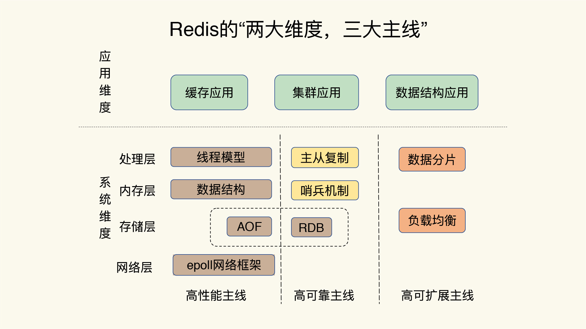
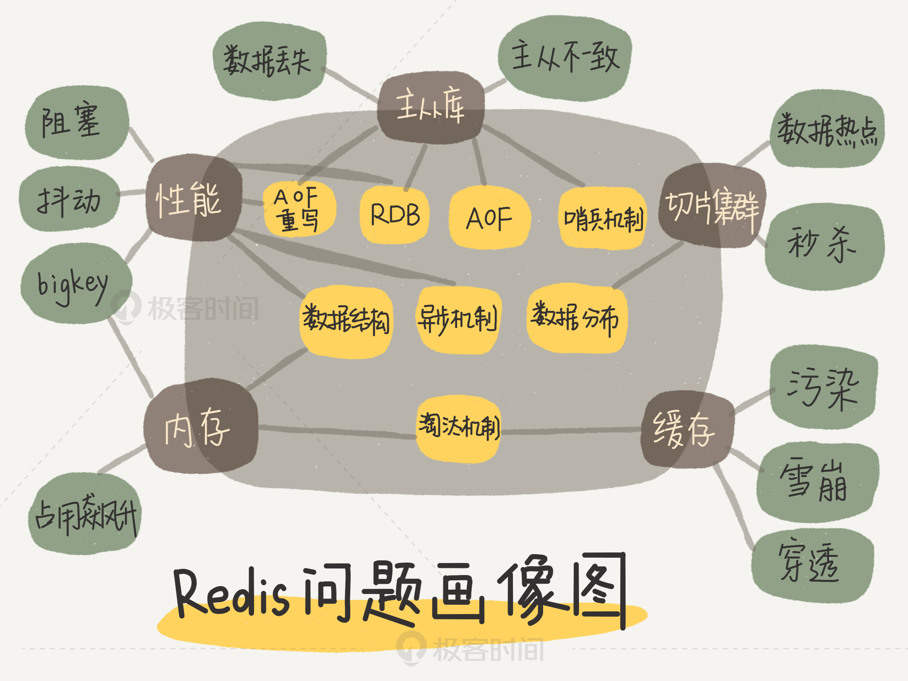

# 基本类型

## string

使用场景：计数器，统计多单位的数量 uid:123456:follow 0

粉丝数，对象缓存存储

```shell
# 基本操作
set key1 v1
get key1
keys *
exists key1 # 判断是否存在
append key1 "hello" # 如果不存在，相当于setkey
strlen key1
# 步长
set views 0
incr views # i++
decr views # i--
incrby views 10 # i += 10
decrby views 5
# 字符串范围range
getrange key1 0 3
getrange key1 0 -1
# 替换
get key2 # ->"abcdefg"
setrange key2 1 xx # -> "axxdefg"
# 过期与不存在
setex key3 30 "hello" # key3的值为hello，30秒后过期
setnx mykey "redis"
ttl key3 # 剩余过期时间
# mset mget
mset k1 v1 k2 v3 ...
mget k1 k2 ...
msetnx k1 v1 k4 v4
# 对象
# user:{id}:{field}
set user:1 {name:xx, age:3} # 对象user:1,值为json字符来保存一个对象
mset user:1:name zhangsan user:1:age 2
mget user:1:name user:1:age
# getset
getset db redis # 如果不存在，返回nil, 如果存在，获取原来的值，设置新值
```

## list

可以把list当成栈，队列，阻塞队列。l开头

实际上是一个链表

如果key不存在，创建新链表

如果key存在，新增内容

如果移除了所有值，空链表，也代表不存在

在两边插入或改动值，效率最高。

应用：消息排队，消息队列，栈

```shell
# push
lpush list one
lpush list two
lrange list 0 -1
lrange list 0 1
rpush list r
# pop
Lpop list
Rpop list
# lindex
lindex list 1 # 通过下标获得list中的某个值
# len
llen list
# lrem
lrem list 1 one # 移除list集合中指定个数的value，精确匹配
# trim 修剪。list截断
ltrim mylist 1 2 # 通过下标截取指定的长度，这个list已经被改变了，只剩下截取的元素
# rpoplpush 移除最后一个元素，将它移动到新的列表
rpoplpush mylist myotherlist
# lset 将列表中指定下标的值替换为另一个值，更新
exists list # 判断list是否存在
lset list 0 v1 # 如果不存在会报错
# linsert 将某个具体value插入到列表中某个元素的前面或后面
linsert mylist before "world" "other" # "world"前面插入"other"
linsert mylist after world new # world后面插入new
```

## set

使用：共同关注，共同爱好，二度好友，推荐好友。

```shell
sadd myset "hello"
smembers myset # 查看所有值
sismember myset hello # hello在不在集合中
# scard
scard myset # 获取set集合中的内容元素个数
# rem
srem myset hello # 移除指定元素
# 抽取随机
srandmember myset
srandmember myset 2 # 随机抽取指定个数元素
# 删除指定key，删除随机key
spop myset # 随机
# 移动元素到另一个集合
smove myset myset2 "xx"
# 差集，交集，并集
sdiff key1 key2 # 差集
sinter key1 key2 # 交集
sunion key1 key2 # 并集
```

## hash

map集合，key-map。值是一个map集合。本质和string没太大区别，还是个简单的k-v

经常变动的信息。hash更适合存储对象。string更适合字符串存储。

```shell
hset myhash field1 xx # set一个具体k-v
hget myhash field1
hmset myhash field1 hello field2 world
hmget myhash field1 field2
hgetall myhash
hdel myhash field1
hlen myhash # 字段数量
hexists myhash field1
# 获取所有field&value
hkeys myhash
hvals myhash
# incr decr
hset myhash field3 5
hincrby myhash field3 1
hincrby hsetnx myhash field4 hello
```

## zset

有序集合

在set基础上增加了一个值。score

使用：排序，存储班级成绩表，工资表。

普通消息，重要消息。带权重进行判断。

排行榜应用实现，取topN测试

```shell
zadd myset 1 one
zadd myset 2 two 3 three
zrange myset 0 -1
# 排序
zrangebyscore myset -inf +inf # 从小到大显示
zrangebyscore myset 0 -1
zrangebyscore myset -inf +inf withscores
zrevrange salary 0 -1 # 从大到小
# 移除
zrem myset one
# 获取个数
zcard salary
# 指定区域内
zcount myset 1 3
```

# 特殊类型

## geospatial

六个命令：GEOADD; GEODIST; GEOHASH; GEOPOS; GEORADIUS; GEORADIUSBYMEMBER

```shell
# geoadd 添加地理位置，两极无法添加，一般下载城市数据，通过java程序一次性导入
# 参数：key val(纬度，经度，名称)
geoadd china:city 116.4 39.9 beijing
# getpos 获取当前定位
getpos china:city beijing
# getdist 两人之间距离 m / km / mi英里 / ft英尺
geodist china:city beijing shanghai km
# georadius 以给定的经纬度为中心，找出某一半径内的元素
# 应用：附近的人
georadius china:city 110 30 1000 km # 以100 30经纬度为中心，寻找房源1000km内的城市
georadius china:city 110 30 500 km withdist
# 筛选出指定的结果
georadius china:city 110 30 500 km withdist withcoord count 1
# georadiusbymember 找出指定元素周围的其他元素
georadiusbymember china:city beijing 1000 km
# geohash 返回一个或多个位置元素的geohash表示
# 返回11个字符的geohash字符串
geohash china:city beijing chongqing
# 查看地图中全部的元素
zrange china:city 0 -1
# 移除指定元素
zrem china:city 0 -1
```

## hyperloglog

基数统计法。可以接受误差

优点：占用的内存时固定的。2^64不同元素。只需要12kb的空间。

使用：网页的UV(一个人访问一个网站多次，还是算一个人)

传统方式用set保存id。存大量id浪费内存。

0.81%错误率

```shell
PFadd mykey a a b c d e g
pfcount mykey
pfmerge mykey2 mykey mykey1 # 合并到mykey2
```

## bitmaps

统计用户信息，活跃情况，打卡情况。

位图。0/1

```shell
setbit sign 0 1
setbit sign 1 0
setbit sign 2 0
...
getbit sign 3 # 查看某一天是否打卡
bitcount sign # 统计这周的打卡记录。可以看到是否有全勤
```

# 事务

没有隔离级别的概念。

只有发起执行命令exec才会执行。

单条命令是原子性的。

1. 开启事务(multi)
2. 命令入队
3. 执行事务(exec)
4. 放弃事务(discard)

编译型异常：命令有问题，事务中的所有命令都不会被执行

运行时异常：事务队列中存在语法性，执行命令的时候其他命令可以正常执行。

# 锁

## 悲观锁

无论做什么都会加锁

## 乐观锁

更新的时候判断一下。期间是否有人修改过数据。

获取version

比较version

```shell
set money 100
set out 0
watch money # 监视
multi
...
exec
# 如果失败，重新获取新的值
unwatch
watch money
multi
...
exec
```

