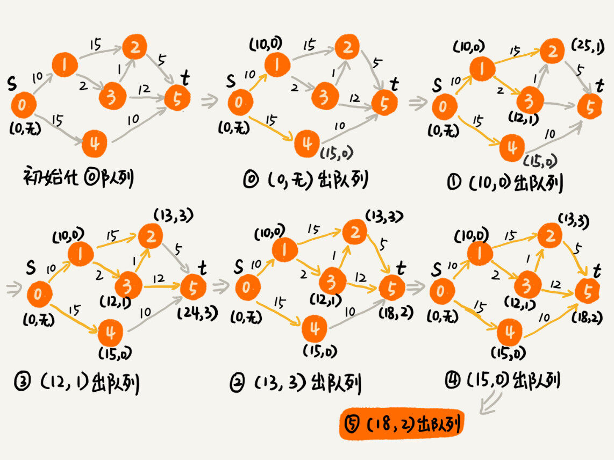

# 排序

## 冒泡，插入，选择

原地：√	√	√

稳定：√	√	×

最好：O(n)	O(n)	O(n^2)

最坏：O(n^2)	O(n^2)	O(n^2)

平均：O(n^2)	O(n^2)	O(n^2)

冒泡和插入的对比：

冒泡排序元素的交换次数和插入排序元素移动次数是原始数据的逆序度。冒泡排序的数据交换需要三个赋值操作。插入排序元素移动只需要一个赋值操作。

```
冒泡排序中数据的交换操作：
if (a[j] > a[j+1]) { // 交换
   int tmp = a[j];
   a[j] = a[j+1];
   a[j+1] = tmp;
   flag = true;
}

插入排序中数据的移动操作：
if (a[j] > value) {
  a[j+1] = a[j];  // 数据移动
} else {
  break;
}
```

## 归并、快速

### 归并

适合大规模数据

分治思想。分治一般用递归实现。

```
// 归并排序算法, A是数组，n表示数组大小
merge_sort(A, n) {
  merge_sort_c(A, 0, n-1)
}

// 递归调用函数
merge_sort_c(A, p, r) {
  // 递归终止条件
  if p >= r  then return

  // 取p到r之间的中间位置q
  q = (p+r) / 2
  // 分治递归
  merge_sort_c(A, p, q)
  merge_sort_c(A, q+1, r)
  // 将A[p...q]和A[q+1...r]合并为A[p...r]
  merge(A[p...r], A[p...q], A[q+1...r])
}

merge(A[p...r], A[p...q], A[q+1...r]) {
  var i := p，j := q+1，k := 0 // 初始化变量i, j, k
  var tmp := new array[0...r-p] // 申请一个大小跟A[p...r]一样的临时数组
  while i<=q AND j<=r do {
    if A[i] <= A[j] {
      tmp[k++] = A[i++] // i++等于i:=i+1
    } else {
      tmp[k++] = A[j++]
    }
  }
  
  // 判断哪个子数组中有剩余的数据
  var start := i，end := q
  if j<=r then start := j, end:=r
  
  // 将剩余的数据拷贝到临时数组tmp
  while start <= end do {
    tmp[k++] = A[start++]
  }
  
  // 将tmp中的数组拷贝回A[p...r]
  for i:=0 to r-p do {
    A[p+i] = tmp[i]
  }
}
```

需要额外空间。

### 快速

```
// Quick_Sort.cpp : Defines the entry point for the application.
// 快速排序算法
 
#include "stdafx.h"
#include<iostream>
using namespace std;
 
//快速排序算法(从小到大)
//arr:需要排序的数组，begin:需要排序的区间左边界，end:需要排序的区间的右边界
void quickSort(int *arr,int begin,int end)
{
	//如果区间不只一个数
	if(begin < end)
	{
		int temp = arr[begin]; //将区间的第一个数作为基准数
		int i = begin; //从左到右进行查找时的“指针”，指示当前左位置
		int j = end; //从右到左进行查找时的“指针”，指示当前右位置
		//不重复遍历
		while(i < j)
		{
			//当右边的数大于基准数时，略过，继续向左查找
			//不满足条件时跳出循环，此时的j对应的元素是小于基准元素的
			while(i<j && arr[j] > temp)
				j--;
			//将右边小于等于基准元素的数填入右边相应位置
			arr[i] = arr[j];
			//当左边的数小于等于基准数时，略过，继续向右查找
			//(重复的基准元素集合到左区间)
			//不满足条件时跳出循环，此时的i对应的元素是大于等于基准元素的
			while(i<j && arr[i] <= temp)
				i++;
			//将左边大于基准元素的数填入左边相应位置
			arr[j] = arr[i];
		}
		//将基准元素填入相应位置
		arr[i] = temp;
		//此时的i即为基准元素的位置
		//对基准元素的左边子区间进行相似的快速排序
		quickSort(arr,begin,i-1);
		//对基准元素的右边子区间进行相似的快速排序
		quickSort(arr,i+1,end);
	}
	//如果区间只有一个数，则返回
}
int main()
{
	int num[12] = {23,45,17,11,13,89,72,26,3,17,11,13};
	int n = 12;
	quickSort(num,0,n-1);
	cout << "排序后的数组为：" << endl;
	for(int i=0;i<n;i++)
		cout << num[i] << ' ';
	cout << endl;
	system("pause");
	return 0;
}
```

**优化快速排序**

选取分区点

1. 三数取中法
2. 随机法

为了避免快速排序里，递归过深而堆栈过小，导致堆栈溢出，我们有两种解决办法：第一种是限制递归深度。一旦递归过深，超过了我们事先设定的阈值，就停止递归。第二种是通过在堆上模拟实现一个函数调用栈，手动模拟递归压栈、出栈的过程，这样就没有了系统栈大小的限制。

对于小量数据，用插入排序。

### 对比

归并由下到上；快排由上到下。

归并稳定，时间O(nlogn), 非原地，浪费内存

快排不稳定。原地排序。如果每次都能把数组分成大小相等两个区间，时间O(nlogn), 最坏O(n^2)

```
归并中，对n个元素排序需要T(n), 分解成两个子数组T(n/2), merge合并两个子数组时间O(n)
快排也是如此
T(1) = C；   n=1时，只需要常量级的执行时间，所以表示为C。
T(n) = 2*T(n/2) + n； n>1
```

**应用例题**

**O(n)时间内求无序第K大元素**

我们选择数组区间 A[0...n-1]的最后一个元素 A[n-1]作为 pivot，对数组 A[0...n-1]原地分区，这样数组就分成了三部分，A[0...p-1]、A[p]、A[p+1...n-1]。

如果 p+1=K，那 A[p]就是要求解的元素；

如果 K>p+1, 说明第 K 大元素出现在 A[p+1...n-1]区间，递归地在 A[p+1...n-1]这个区间内查找。

同理，如果 K<p+1，在 A[0...p-1]区间查找。

时间复杂度是 O(n)：第一次分区查找，对大小为 n 的数组执行分区操作，需要遍历 n 个元素。第二次分区查找，需要遍历 n/2 个元素。依次类推，分区遍历元素的个数分别为、n/2、n/4、n/8、n/16.……直到区间缩小为 1。n+n/2+n/4+n/8+...+1。这是一个等比数列求和，最后的和等于 2n-1。

如果每次取数组中的最小值，将其移动到数组的最前面，然后在剩下的数组中继续找最小值，以此类推，执行 K 次。时间 O(K * n)。当 K 是比较小的常量时，比如 1、2，时间复杂度 O(n)；但当 K 等于 n/2 或者 n 时，时间复杂度就是 O(n^2) 。

## 线性排序

非基于比较，不涉及元素之间的比较操作

### 桶排序

**时间O(n)：**把n个数据均匀分到m个桶里，每个桶有k=n/m个元素。每个桶内部用快排，时间O(m\*k\*logk)->O(n\*log(n/m))。当m接近n时，log(n/m)是一个非常小的常量，时间接近O(n)。

**要求：**①数据很容易就能分成m个桶。桶与桶之间有天然的大小顺序。②数据在各个桶之间均匀分布，否则会退化为快排。

**适用于：**适用于外部排序，数据量大，内存有限时。

**例子：**有10G订单数据，按交易金额排序。内存很小。可以先扫描一遍数据获取数据范围得到1~10万。根据金额划分到100个桶。每个桶存1000个范围的数据。按金额范围命名(00~99)。如果数据均匀分布，一次把100个小文件排序，再按编号依次读取每个小文件写入大文件即可。如果不均匀，把比较大的继续这样划分。直到所有文件都能读入内存为止。

### 计数排序

计数排序其实是桶排序的一种特殊情况。

数据范围不大(1~k)时，可以分为k个桶，每个桶内数据相同，省了桶内排序的时间。

**例子：**高考50万人分数为0~900，可以分成901个桶。不需要排序，依次扫描么个桶，依次输出即可，时间O(n)。

当要排序的 n 个数据，所处的范围并不大的时候，比如最大值是 k，我们就可以把数据划分成 k 个桶。每个桶内的数据值都是相同的，省掉了桶内排序的时间。桶内存放人数而不是考生。第k个桶存放分数<=k的考生个数。获取每个人的排序位置可以从后到前扫描数据，查桶得到<=该数据的有x个，它就是排在x-1上，该桶里数字-1.以此类推。扫描完所有数据后，就得到了顺序。

**适用于：**数据范围小，数据为非负整数。如果不是，就要不改变相对大小的情况下转化为非负整数。

```java
// 计数排序，a是数组，n是数组大小。假设数组中存储的都是非负整数。
public void countingSort(int[] a, int n) {
  if (n <= 1) return;

  // 查找数组中数据的范围
  int max = a[0];
  for (int i = 1; i < n; ++i) {
    if (max < a[i]) {
      max = a[i];
    }
  }

  int[] c = new int[max + 1]; // 申请一个计数数组c，下标大小[0,max]
  for (int i = 0; i <= max; ++i) {
    c[i] = 0;
  }

  // 计算每个元素的个数，放入c中
  for (int i = 0; i < n; ++i) {
    c[a[i]]++;
  }

  // 依次累加
  for (int i = 1; i <= max; ++i) {
    c[i] = c[i-1] + c[i];
  }

  // 临时数组r，存储排序之后的结果
  int[] r = new int[n];
  // 计算排序的关键步骤，有点难理解
  for (int i = n - 1; i >= 0; --i) {
    int index = c[a[i]]-1;
    r[index] = a[i];
    c[a[i]]--;
  }

  // 将结果拷贝给a数组
  for (int i = 0; i < n; ++i) {
    a[i] = r[i];
  }
}
```

### 基数排序

**例子：**将这 10 万个手机号码从小到大排序。

用稳定排序的方法，先按最后一位排序，再按倒数第二位排序，以此类推。11次后就有序了。根据每一位排序可以用桶排序或者计数排序，时间O(n)。有k位数据就需要k次桶排序或者计数排序。总时间O(k\*n)。如果数据不等长，可以补齐为等长。

**要求：**可以分割出独立的“位”来比较，而且位之间有递进关系。每一位范围不能太大，否则时间无法O(n)。

### 应用例题

如何根据年龄给100万用户排序

假设年龄的范围最小 1 岁，最大不超过 120 岁。遍历这 100 万用户，根据年龄将其划分到这 120 个桶里，然后依次顺序遍历这 120 个桶中的元素。这样就得到了按照年龄排序的 100 万用户数据。

## 总结


写通用的排序函数，不能选择线性排序算法。

如果对小规模数据进行排序，可以选择时间复杂度是 O(n^2) 的算法；

如果对大规模数据进行排序，时间复杂度是 O(nlogn) 的算法更加高效(首选)。

Java 语言采用堆排序实现排序函数，C 语言使用快速排序实现排序函数。

## 补充：

### 希尔排序

插入排序的性质：对有序数据排序效率高。但是每次只能将数据移动1位。

**改进：**将元素分为几个区域来提升插入排序性能。让一个元素一次性朝最终位置前进一大步。所以小数据只需要进行少数比较合交换即可。*

**实现：**通过增加索引的步长。`i += step_size`而不是`i++`。

**步长的选择：**最开始以一定步长开始，最终步长为1.最初建议选n/2.


```c++
template<typename T>
void shell_sort(T array[], int length) {
    int h = 1;
    while (h < length / 3) {
        h = 3 * h + 1;
    }
    while (h >= 1) {
        for (int i = h; i < length; i++) {
            for (int j = i; j >= h && array[j] < array[j - h]; j -= h) {
                std::swap(array[j], array[j - h]);
            }
        }
        h = h / 3;
    }
}
```

### 递归树

**分析归并时间**

归并排序最耗时的是把两个子数组合并为大数组，每层归并消耗的时间一样，和数据规模有关。树的高度h，因此时间O(n\*h)。树是满二叉树，高度log2n,所以归并排序递归实现的时间O(nlogn)。

**分析快排时间**

每次分区要遍历待分区区间的所有数据，所以每层遍历数据个数和为n。递归树高度h，快排遍历数据个数h\*n，时间O(h\*n)。树高度h不定。每次分区不是均匀一分为二，因此不是满二叉树。时间平均O(nlogn)。

**斐波那契数列时间**

f(n) 分解为 f(n−1) 和 f(n−2)，每次数据规模都是 −1 或者 −2，叶子节点的数据规模是 1 或者 2。从根节点到叶子节点，如果每次-1，最长路径约n；如果每次-2，最短路径2n。每次分解后的合并需要一次加法运算。从上往下，第一层时间1，第二层2，第k层2^(k-1)。总时间为每一层时间的和。介于O(2^n)~O(2^(n/2))。

**全排列时间**

确定了最后一位，就变成了求剩下n-1个数据的排列。最后一个数据有n中情况。所以可以分解为n个n-1个数据的排列，有n次交换操作。第 k 层总的交换次数就是 n∗(n−1)∗(n−2)∗...∗(n−k+1)。最后一层的交换次数就是 n∗(n−1)∗(n−2)∗...∗2∗1。每一层的交换次数之和就是总的交换次数。

`n + n*(n-1) + n*(n-1)*(n-2) +... + n*(n-1)*(n-2)*...*2*1`

n∗(n−1)∗(n−2)∗...∗2∗1 等于 n!，而前面的 n−1 个数都小于最后一个数，所以，总和肯定小于 n∗n!，因此时间复杂度大于 O(n!)，小于 O(n∗n!)。

**例题**

1 个细胞的生命周期是 3 小时，1 小时分裂一次。求 n 小时后，容器内有多少细胞？

细胞的生命周期是三个小时，一个小时后，第一个细胞分裂，此时细胞总数变成 2，但是这两个细胞的生存时间是不一样的，如果都当成新生细胞即存活时间为 0，那么给定的 3小时生命周期也就没意义了，所以这个时候其中一个细胞的生存时间变成了 1，另外一个刚分裂出来的是 0，下面简单表示一下分裂进程（-1 表示死亡）
时间 细胞状态 (生存时间) 细胞总数
 0 0 1
 1 1 0 2
 2 2 1 0 0 4
 3 -1 2 1 1 0 0 0 0 7
 4 -1 2 2 1 1 1 1 0 0 0 0 0 0 0 13
 5 -1 -1 2 2 2 2 1 1 1 1 1 1 1
          0 0 0 0 0 0 0 0 0 0 0 0 0 24
 .... ............................................. ....
f0 = 1
f1 = 2
f2 = 4
f3 = 7
可以发现到第四个小时的时候，规律出来了，在第四个小时死亡的细胞是三小时前也就是第一个小时的时候同时出生的细胞，而在第一个小时同时出生的细胞数等于第一个小时前一个小时的细胞总数
所以有递推式：f(n) = 2 * f(n - 1) - f(n - 4)

### 堆和堆排序

①堆必须是完全二叉树。②堆中每个节点都>=(<=)其左右子节点的值。

堆排序是一种原地的、时间复杂度为 O(nlogn) 的排序算法。

**快速排序性能比堆排序好**

①快排顺序访问数据，堆排序跳着访问，对CPU缓存不友好。

②排序过程中，堆排序数据交换次数多于快排。快排数据交换次数不会比逆序度多，但是堆排序建堆会打乱原有相对顺序，导致有序度降低。

**插入**

把新数据放在堆的最后。然后调整(堆化有两种：从上往下&从下往上)。

从下往上堆化：新数据与其父节点对比大小。如果不满足大小关系，互换。重复。直到父子节点满足大小关系。

```java
public class Heap {
  private int[] a; // 数组，从下标1开始存储数据
  private int n;  // 堆可以存储的最大数据个数
  private int count; // 堆中已经存储的数据个数

  public Heap(int capacity) {
    a = new int[capacity + 1];
    n = capacity;
    count = 0;
  }

  public void insert(int data) {
    if (count >= n) return; // 堆满了
    ++count;
    a[count] = data;
    int i = count;
    while (i/2 > 0 && a[i] > a[i/2]) { // 自下往上堆化
      swap(a, i, i/2); // swap()函数作用：交换下标为i和i/2的两个元素
      i = i/2;
    }
  }
 }
```

**删除堆顶**

堆顶存储堆中的最大(小)值。把最后一个节点换到堆顶，移除最后一个元素(原来的堆顶)。不断对比父子节点并互换，直到父子节点满足大小关系(从上往下堆化)。

```java
public void removeMax() {
  if (count == 0) return -1; // 堆中没有数据
  a[1] = a[count];
  --count;
  heapify(a, count, 1);
}

private void heapify(int[] a, int n, int i) { // 自上往下堆化
  while (true) {
    int maxPos = i;
    if (i*2 <= n && a[i] < a[i*2]) maxPos = i*2;
    if (i*2+1 <= n && a[maxPos] < a[i*2+1]) maxPos = i*2+1;
    if (maxPos == i) break;
    swap(a, i, maxPos);
    i = maxPos;
  }
}
```

 n 个节点的完全二叉树高度不会超过 log2n。因此插入和删除时间都是 O(logn)。

**建堆**

思路①：用插入数据的方法，从起初堆只有一个数据开始依次插入。

思路②：从后往前处理数组，每个数据都是从上往下堆化。堆化从倒数第二层开始，也就是最后一个非叶子结点。需要比较和交换的节点个数，和这个节点的高度有关。

时间：

第h层有1个节点。第一层有2^(h-1)个节点。

将每个非叶子节点的高度求和：

`S1 = 1*h + 2*(h-1) + 2^2*(h-2) + ... + 2^k*(h-k) + ... + 2^(h-1)*1`

`S2 = 2*h + 2^2*(h-1) + ... + 2^k*(h-k+1) + ... + 2^(k-1)*2 + 2^h*1`

`S = S2 - S1 = h^(h+1) - h - 2`

`h = log2n`

时间O(n)。

```java
private static void buildHeap(int[] a, int n) {
  for (int i = n/2; i >= 1; --i) {
    heapify(a, n, i);
  }
}

private static void heapify(int[] a, int n, int i) {
  while (true) {
    int maxPos = i;
    if (i*2 <= n && a[i] < a[i*2]) maxPos = i*2;
    if (i*2+1 <= n && a[maxPos] < a[i*2+1]) maxPos = i*2+1;
    if (maxPos == i) break;
    swap(a, i, maxPos);
    i = maxPos;
  }
}
```

**排序**

类似删除堆顶操作。堆顶与最后一个元素互换，堆化。再取堆顶互换。重复。直到堆中剩下一个元素。

```java
// n表示数据的个数，数组a中的数据从下标1到n的位置。
public static void sort(int[] a, int n) {
  buildHeap(a, n);
  int k = n;
  while (k > 1) {
    swap(a, 1, k);
    --k;
    heapify(a, k, 1);
  }
}
```

**时间、空间、稳定性**

空间：原地排序。

时间：建堆O(n) + 排序O(nlogn) = O(nlogn)

不稳定：排序时，存在将堆的最后一个节点跟堆顶节点互换的操作。可能改变原始相对顺序。

**应用**

1. 优先级队列：比如合并有序小文件；高性能定时器。
2. 求Top K：静态数据集合；动态数据集合。可以搭配散列表使用。
3. 求动态数据集合中的中位数：99%响应时间。

# 查找

## 二分查找

O(logn)

```java
// 二分查找的递归实现
public int bsearch(int[] a, int n, int val) {
  return bsearchInternally(a, 0, n - 1, val);
}

private int bsearchInternally(int[] a, int low, int high, int value) {
  if (low > high) return -1;

  int mid =  low + ((high - low) >> 1);
  if (a[mid] == value) {
    return mid;
  } else if (a[mid] < value) {
    return bsearchInternally(a, mid+1, high, value);
  } else {
    return bsearchInternally(a, low, mid-1, value);
  }
}
```

**注意事项**

1. 循环退出条件注意是 low<=high，而不是 low<high。
2. low 和 high 的更新low=mid+1，high=mid-1。

**局限性**

①依赖顺序表结构；

②针对有序数据；只能用在插入删除不频繁，一次排序多次查找的场景。

③数据量太小的不适合。不过如果数据比较非常耗时，那么不管数据量大小都应该用二分查找。

④数据量太大不适合。底层依赖数组，需要内存空间连续，对内存要求苛刻。

优点：节约内存。

**应用**

通过IP地址来查找IP归属地

如果不经常更新，可以先预处理数据，让其按IP从小到大排序。方法是把IP转化为32位整型数来排序。然后通过二分查找找到最后一个起始IP<=target的IP区间，检查这个IP是否在区间里。

**变形问题**

1. 查找第一个值等于给定值的元素

```java
public int bsearch(int[] a, int n, int value) {
  int low = 0;
  int high = n - 1;
  while (low <= high) {
    int mid =  low + ((high - low) >> 1);
    if (a[mid] > value) {
      high = mid - 1;
    } else if (a[mid] < value) {
      low = mid + 1;
    } else {
      // 关键位置
      if ((mid == 0) || (a[mid - 1] != value)) return mid;
      else high = mid - 1;
    }
  }
  return -1;
}
```

2. 查找最后一个值等于给定值的元素

```
public int bsearch(int[] a, int n, int value) {
  int low = 0;
  int high = n - 1;
  while (low <= high) {
    int mid =  low + ((high - low) >> 1);
    if (a[mid] > value) {
      high = mid - 1;
    } else if (a[mid] < value) {
      low = mid + 1;
    } else {
      // 关键位置
      if ((mid == n - 1) || (a[mid + 1] != value)) return mid;
      else low = mid + 1;
    }
  }
  return -1;
}
```

3. 查找第一个大于等于给定值的元素

```java
public int bsearch(int[] a, int n, int value) {
  int low = 0;
  int high = n - 1;
  while (low <= high) {
    int mid =  low + ((high - low) >> 1);
    // 关键位置
    if (a[mid] >= value) {
      if ((mid == 0) || (a[mid - 1] < value)) return mid;
      else high = mid - 1;
    } else {
      low = mid + 1;
    }
  }
  return -1;
}
```

4. 查找最后一个小于等于给定值的元素

```java
public int bsearch7(int[] a, int n, int value) {
  int low = 0;
  int high = n - 1;
  while (low <= high) {
    int mid =  low + ((high - low) >> 1);
    if (a[mid] > value) {
      high = mid - 1;
    } else {
      // 关键位置
      if ((mid == n - 1) || (a[mid + 1] > value)) return mid;
      else low = mid + 1;
    }
  }
  return -1;
}
```

**总结**

这些容易出错的细节有：终止条件、区间上下界更新方法、返回值选择。

适用于查找模糊值。给定值用散列表或二叉查找树

## 跳表

**时间**

链表+多级索引：第 k 级索引的结点个数是第 k-1 级索引的结点个数的 1/2，那第 k级索引结点的个数就是 n/(2k)。

在跳表中查询任意数据的时间复杂度就是 O(logn)。

**空间**

假设原始链表大小为 n，第一级索引大约有 n/2 个结点，第二级索引大约有 n/4 个结点，以此类推，每上升一级就减少一半，直到剩下 2 个结点。

这几级索引的结点总和就是 n/2+n/4+n/8…+8+4+2=n-2。

所以，跳表的空间复杂度是 O(n)。

**插入&删除**

查找位置O(logn), 插入删除O(1)。

**动态更新**

通过一个随机函数来决定将这个节点插入到哪几级索引中。如果生成K，那么插入到1~K级索引中。

**应用**

Redis有序集合：散列表+跳表。核心操作：插入&删除&查找&按区间查找&迭代输出有序序列。

## 散列表

数组的扩展。通过散列函数把元素的键值映射为下标，存储在数组中对应位置。查询时用同样的散列函数转换查询。

散列函数设计的基本要求：

①散列函数计算得到的散列值是一个非负整数；

②如果 key1 = key2，那 hash(key1) == hash(key2)；

③如果 key1 ≠ key2，那 hash(key1) ≠ hash(key2)。

**散列冲突**

1. 开放寻址法：

   把删除的数据标记为deleted。探测方法：线性探测、二次探测(探测步长为原来的二次方：hash(key)+0, hash(key)+1^2, hash(key)+2^2...)、双重散列(用不止一个散列函数，如果得到的位置已经被占用，就用第二个函数，以此类推直到找到空闲位置)。

   装载因子来表示空位多少：

   `散列表的装载因子=填入表中的元素个数/散列表的长度`

   优点：有效利用CPU缓存，序列化简单，没有指针。

   缺点：删除麻烦，需要特殊标记。冲突代价高，因此装载因子上限不能太大，浪费内存。

   适用于：数据量小、装载因子小时。

   例子：java中ThreadLocalMap。

2. 链表法

   时间O(k).k=链表长度=n/m.(n=数据个数。m=槽个数)

   优点：内存利用率高，需要时创建；对大装载因子容忍度高。

   缺点：对于小对象，消耗内存；对CPU缓存不友好。

   适用于：大对象；大数据量。

   改进：将链表改造成跳表、红黑树。查找时间最差O(logn)。有效避免散列碰撞攻击。

**设计散列函数**

①不能复杂；

②生成的值尽量随机并且均匀分布；

③综合考虑关键字长度、特点、分布、散列表大小；

④数据分析法。

**装载因子**

因为动态扩容&动态缩容时需要重新计算位置，搬移的时间是O(n)。

装载因子阈值的设置要权衡时间、空间复杂度。如果内存空间不紧张，对执行效率要求很高，可以降低负载因子的阈值；相反，如果内存空间紧张，对执行效率要求又不高，可以增加负载因子的值，甚至可以大于 1。

解决一次性扩容耗时过多的情况：扩容穿插在插入操作中，分批完成。即每次插入将新数据插入新表，并从老表拿出一个数据放入新表。对于这期间的查询操作，先从新表找，没找到去老表找。将一次性扩容的代价均摊到多次插入中，任何时候插入时间都是O(1)。

**工业级散列表HashMap**

1. 初始大小：默认16,。如果事先知道数据量大小，可以修改，减少动态扩容次数，提高性能。
2. 装载因子&动态扩容：默认0.75.元素个数超过0.75*capacity，两倍扩容。
3. 冲突解决：链表法。链表长度>8，变成红黑树。因为数据量小的时候红黑树要维护平衡。

```java
int hash(Object key) {
    int h = key.hashCode()；
    return (h ^ (h >>> 16)) & (capicity -1); //capicity表示散列表的大小
}


public int hashCode() {
  int var1 = this.hash;
  if(var1 == 0 && this.value.length > 0) {
    char[] var2 = this.value;
    for(int var3 = 0; var3 < this.value.length; ++var3) {
      var1 = 31 * var1 + var2[var3];
    }
    this.hash = var1;
  }
  return var1;
}
```

**工业级散列表的设计**

要求：①快速查询插入删除；②不浪费过多内存；③性能稳定。

思路：①合适的散列函数；②定义装载因子阈值，设计动态扩容策略；③合适的散列冲突解决方法。

### 和链表一起用

**LRU缓存淘汰**

按访问时间从大到小排序的链表。

主要操作：添加，删除，查找。

思路：双向链表。存储数据，前驱，后继，hnext(散列表拉链中的位置)。每个节点在两条链中，一个是双向链表，一个是散列表的拉链。

查找：找到后移动到表尾。

删除：找到节点，删除。O(1)。

添加：当要缓存某个数据时，先查表，如果没有，空间不够的时候删除表头，节点放在表尾；如果找到了，把它移动到表尾。O(1)。

```
	class LRUCache {
       int cap;
       LinkedHashMap<Integer, Integer> cache = new LinkedHashMap<>();
       public LRUCache(int capacity) { 
           this.cap = capacity;
       }
   
       public int get(int key) {
           if (!cache.containsKey(key)) {
               return -1;
           }
           // 将 key 变为最近使用
           makeRecently(key);
           return cache.get(key);
       }
   
       public void put(int key, int val) {
           if (cache.containsKey(key)) {
               // 修改 key 的值
               cache.put(key, val);
               // 将 key 变为最近使用
               makeRecently(key);
               return;
           }
   
           if (cache.size() >= this.cap) {
               // 链表头部就是最久未使用的 key
               int oldestKey = cache.keySet().iterator().next();
               cache.remove(oldestKey);
           }
           // 将新的 key 添加链表尾部
           cache.put(key, val);
       }
   
       private void makeRecently(int key) {
           int val = cache.get(key);
           // 删除 key，重新插入到队尾
           cache.remove(key);
           cache.put(key, val);
       }
   }
```

**Redis有序集合**

属性：key&score

操作：添加；按key查找、删除；按分值区间查找；按分值排序。

思路：按键值构建一个散列表。按key查找删除时间O(1)。

补充：查找成员排名或者根据排名区间查找成员对象。

**Java LinkedHashMap**

支持按照插入&访问顺序遍历数据。

LinkedHashMap 是通过双向链表和散列表这两种数据结构组合实现的。LinkedHashMap 中的“Linked”实际上是指的是双向链表，并非指用链表法解决散列冲突。

**总结**

散列表中的数据是通过散列函数打乱后无规律存储的。无法按照某种顺序快速遍历，除非拷贝到数组排序。但是散列表是动态的，排序效率低，所以将散列表结合链表或跳表来使用。

**应用**

1. Word 文档中单词拼写检查功能

   用散列表来存储整个英文单词辞典。用户输入单词后去表中查找。如果查到，则说明拼写正确；如果没有查到，则说明拼写可能有误，给予提示。

2. 假设我们有 10 万条 URL 访问日志，如何按照访问次数给 URL 排序？

   遍历 10 万条数据，以 URL 为 key，访问次数为 value，存入散列表，同时记录下访问次数的最大值 K，时间复杂度 O(N)。

   如果 K 不是很大，可以使用桶排序，时间复杂度 O(N)。如果 K 非常大（比如大于 10 万），就使用快速排序，复杂度 O(NlogN)。

3. 有两个字符串数组，每个数组大约有 10 万条字符串，如何快速找出两个数组中相同的字符串？

   以第一个字符串数组构建散列表，key 为字符串，value 为出现次数。再遍历第二个字符串数组，以字符串为 key 在散列表中查找，如果 value 大于零，说明存在相同字符串。时间复杂度 O(N)。

## 哈希算法

**要求：**单向的(重要)。对输入数据敏感。冲突概率要小(重要)。尽量高效。

**应用：**最常见的：安全加密、唯一标识、数据校验、散列函数、负载均衡、数据分片、分布式存储。

1. 安全加密

   最常用（MD5 Message-Digest Algorithm，MD5 消息摘要算法）和 SHA（Secure Hash Algorithm，安全散列算法）。其他还有DES（Data Encryption Standard，数据加密标准）、AES（Advanced Encryption Standard，高级加密标准）。

   一般情况下，哈希值越长的哈希算法，散列冲突的概率越低。

2. 唯一标识

   例如取图片开头，中间，结尾各100字节通过哈希算法得到唯一标识。把标识和图片路径存到散列表。

   查看某个图片是否在图库：先计算出唯一标识，在表中查找。如果存在，再对比文件路径。做对比。

3. 数据校验

   例如网络传输文件，对100个文件块分别去哈希值保存在种子文件中。文件块下载完后，通过相同的哈希算法比对。

4. 散列函数

5. 负载均衡

   实现会话粘连（session sticky）的负载均衡：通过哈希算法对客户端IP或者会话ID计算哈希值，将取得的哈希值与服务器列表的大小进行取模，最终得到的值就是应该被路由到的服务器编号。可以把同一个IP过来的所有请求都路由到同一个服务器上。

6. 数据分片

   1. 如何统计“搜索关键词”出现的次数？

      1T 的日志文件，记录了用户的搜索关键词，想要快速统计出每个关键词被搜索的次数。

      对数据分片，用n台机器处理。依次读出每个关键词，计算哈希值，跟n取模，就是应该被分配到的机器编号。这样同一个关键词会被分到同一个机器，每个机器分别计算关键词出现的次数。

      这也是MapReduce 的基本设计思想。

   2. 如何快速判断图片是否在图库中？如何快速判断图片是否在图库中？

      如果图库有一亿张图片，需要对数据分片，用多机处理。

      n台机器，每次从图库取一张图片计算唯一标识，与n取模，得到的就是要分配的机器编号。将唯一标识和路径构建散列表。判断图是否在图库时，通过同样的方法计算唯一标识取模得到k，去编号k的机器找。

      提前估算：哈希值MD5为128比特(16字节)，文件路径假设平均128字节，链表法解决冲突，指针8字节，共约152字节。机器内存2GB，装载因子0.75，一台机器大约给1000万张图片构建散列表(2GB\*0.75/152)，一共大约需要十几台机器。

7. 分布式存储

   有海量数据需要缓存，要分布在多台机器。但是如果数据增多，需要扩容机器数量，所有数据重新计算哈希值并搬移，相当于缓存的数据一下子失效，引起缓存穿透，全都去请求数据库，发生雪崩压垮数据库。所以要通过一致性哈希，将数据分成m个小区间，m远大于机器数量k。每个机器负责m/k个小区间。有新机器加入的时候，将某几个小区间的数据从原来的机器搬到新机器。

**例子**

①防止数据库中的用户信息被脱库

通过加密算法对密码加密在存储。还需要维护一个常用密码的字典表，把每个密码计算哈希值，拿哈希值跟脱库后的密文比对。针对字典攻击，可以引入一个盐（salt），跟用户的密码组合在一起，拿组合之后的字符串来做哈希算法加密，增加破解的难度。

**应用**

区块链：

区块链是一块块区块组成的，每个区块分为两部分：区块头和区块体。区块头保存着 自己区块体 和 上一个区块头 的哈希值。

因为这种链式关系和哈希值的唯一性，只要区块链上任意一个区块被修改过，后面所有区块保存的哈希值就不对了。

区块链使用的是 SHA256 哈希算法，计算哈希值非常耗时，如果要篡改一个区块，就必须重新计算该区块后面所有的区块的哈希值，短时间内几乎不可能做到。

### 补充：一致性哈希

设3台缓存服务器，服务器A、服务器B、服务器C，那么，使用它们各自的IP地址进行哈希计算，使用哈希后的结果对2^32取模。

**hash（服务器A的IP地址） %  2^32**

用算出的这个整数，代表服务器A，映射到这个环上。一致性哈希算法就是通过这种方法，判断一个对象应该被缓存到哪台服务器上。

将缓存服务器与被缓存对象都映射到hash环上以后，从被缓存对象的位置出发，沿顺时针方向遇到的第一个服务器，就是当前对象将要缓存于的服务器，由于被缓存对象与服务器hash后的值是固定的，所以，在服务器不变的情况下，一张图片必定会被缓存到固定的服务器上，那么，当下次想要访问这张图片时，只要再次使用相同的算法进行计算，即可算出这个图片被缓存在哪个服务器上，直接去对应的服务器查找对应的图片即可。

优点：如果使用之前的hash算法，服务器数量发生改变时，所有服务器的所有缓存在同一时间失效了，而使用一致性哈希算法时，服务器的数量如果发生改变，并不是所有缓存都会失效，而是只有部分缓存会失效，前端的缓存仍然能分担整个系统的压力，而不至于所有压力都在同一时间集中到后端服务器上。

**虚拟节点解决哈希环偏移**

如果想要均衡的将缓存分布到3台服务器上，最好能让这3台服务器尽量多的、均匀的出现在hash环上。就是将现有的物理节点通过虚拟的方法复制出来，这些由实际节点虚拟复制而来的节点被称为”虚拟节点”。

“虚拟节点”是”实际节点”（实际的物理服务器）在hash环上的复制品,一个实际节点可以对应多个虚拟节点。虚拟节点越多，hash环上的节点就越多，缓存被均匀分布的概率就越大。

## 二叉树

**存储：**①基于指针或者引用的二叉链式存储法；②基于数组的顺序存储法。

**顺序：**对于完全二叉树如果节点 X 存储在数组中下标为 i 的位置，下标为 2 * i 的位置存储的就是左子节点，下标为 2 * i + 1 的位置存储的就是右子节点。下标为 i/2 的位置存储就是它的父节点。根节点一般存在下标为1的位置。如果不是完全二叉树，会浪费比较多的空间。

**遍历：**

```c++
前序遍历的递推公式：
preOrder(r) = print r->preOrder(r->left)->preOrder(r->right)

中序遍历的递推公式：
inOrder(r) = inOrder(r->left)->print r->inOrder(r->right)

后序遍历的递推公式：
postOrder(r) = postOrder(r->left)->postOrder(r->right)->print r

void preOrder(Node* root) {
  if (root == null) return;
  print root // 此处为伪代码，表示打印root节点
  preOrder(root->left);
  preOrder(root->right);
}

void inOrder(Node* root) {
  if (root == null) return;
  inOrder(root->left);
  print root // 此处为伪代码，表示打印root节点
  inOrder(root->right);
}

void postOrder(Node* root) {
  if (root == null) return;
  postOrder(root->left);
  postOrder(root->right);
  print root // 此处为伪代码，表示打印root节点
}
```

### 二叉查找树

```java
// 查找
public class BinarySearchTree {
  private Node tree;

  public Node find(int data) {
    Node p = tree;
    while (p != null) {
      if (data < p.data) p = p.left;
      else if (data > p.data) p = p.right;
      else return p;
    }
    return null;
  }

  public static class Node {
    private int data;
    private Node left;
    private Node right;

    public Node(int data) {
      this.data = data;
    }
  }
}
// 插入

public void insert(int data) {
  if (tree == null) {
    tree = new Node(data);
    return;
  }

  Node p = tree;
  while (p != null) {
    if (data > p.data) {
      if (p.right == null) {
        p.right = new Node(data);
        return;
      }
      p = p.right;
    } else { // data < p.data
      if (p.left == null) {
        p.left = new Node(data);
        return;
      }
      p = p.left;
    }
  }
}
// 删除

public void delete(int data) {
  Node p = tree; // p指向要删除的节点，初始化指向根节点
  Node pp = null; // pp记录的是p的父节点
  while (p != null && p.data != data) {
    pp = p;
    if (data > p.data) p = p.right;
    else p = p.left;
  }
  if (p == null) return; // 没有找到

  // 要删除的节点有两个子节点
  if (p.left != null && p.right != null) { // 查找右子树中最小节点
    Node minP = p.right;
    Node minPP = p; // minPP表示minP的父节点
    while (minP.left != null) {
      minPP = minP;
      minP = minP.left;
    }
    p.data = minP.data; // 将minP的数据替换到p中
    p = minP; // 下面就变成了删除minP了
    pp = minPP;
  }

  // 删除节点是叶子节点或者仅有一个子节点
  Node child; // p的子节点
  if (p.left != null) child = p.left;
  else if (p.right != null) child = p.right;
  else child = null;

  if (pp == null) tree = child; // 删除的是根节点
  else if (pp.left == p) pp.left = child;
  else pp.right = child;
}
```

**支持重复数据**

实际二叉查找树中存储的是包含很多字段的对象，利用某个字段作为key来构建二叉查找树。把对象中其他字段叫做卫星数据。对于两个对象键值相同，有两种解决方法。

①通过链表和支持动态扩容的数组，把值相同的数据存储在同一个节点。

②把新插入的相同数据当做大于这个节点的值处理。查找数据时，遇到相同的节点，不停止查找，而是继续在右子树查找，直到遇到叶节点，就可以把等于目标值的所有节点都找出来。

**时间**

不管操作是插入、删除还是查找，时间复杂度都跟树的高度成正比， O(height)。

完全二叉树的高度：最大层数-1.如果节点的个数是 n，那么 n 满足这样一个关系

```
n >= 1+2+4+8+...+2^(L-2)+1
n <= 1+2+4+8+...+2^(L-2)+2^(L-1)
```

**对比散列表**

散列表插入、删除、查询时间O(1)，二叉查找树O(logn)。

①散列表数据无序，如果要输出有序数据，需要先排序。二叉查找树中序遍历就可以输出有序序列。

②散列表扩容耗时，遇到散列冲突性能不稳定。平衡二叉查找树时间稳定在O(logn)。

③如果有哈希冲突，实际查找速度不一定比O(logn)快，加上哈希函数的耗时，时间不一定比平衡二叉查找树高。

④散列表构造复杂，要考虑散列函数的设计、冲突解决、扩容、缩容。平衡二叉查找树只需要考虑平衡性。

⑤为了避免散列冲突，装载因子不能太大。

### 平衡二叉树

**定义：**二叉树中任意一个节点的左右子树的高度相差不能大于 1。实际上只要树的高度不比log2n大很多，就算是合格的平衡二叉查找树。

**AVL树**


**删除**

从AVL树中删除，可以通过把要删除的节点向下旋转成一个叶子节点，接着直接移除这个叶子节点来完成。因为在旋转成叶子节点期间最多有log n个节点被旋转，而每次AVL旋转耗费固定的时间，所以删除处理在整体上耗费O(log n) 时间。

**搜索**

O(log n)，因为AVL树总是保持平衡的。

**缺点**

为了维持这种高度的平衡，每次插入、删除都要做调整，就比较复杂、耗时。所以，对于有频繁的插入、删除操作的数据集合，使用 AVL 树的代价就有点高了。

### 2-3树

 2-3树是二叉查找树的变种，树中的2和3代表两种节点，以下表示为2-节点和3-节点。

  2-节点即普通节点：包含一个元素，两条子链接。

  3-节点则是扩充版，包含2个元素和三条链接：两个元素A、B，左边的链接指向小于A的节点，中间的链接指向介于A、B值之间的节点，右边的链接指向大于B的节点。

在这两种节点的配合下，2-3树可以保证在插入值过程中，任意叶子节点到根节点的距离都是相同的。完全实现了矮胖矮胖的目标。

   

这样需要维护两种不同类型的节点，将链接和其他信息从一个节点复制到另一个节点，将节点从一种类型转换为另一种类型等等。

   因此，红黑树出现了，红黑树的背后逻辑就是2-3树的逻辑，但是由于用红黑作为标记这个小技巧，最后实现的代码量并不大。

 红黑树中，所有的节点都是标准的2-节点，为了体现出3-节点，这里将3-节点的两个元素用左斜红色的链接连接起来，即连接了两个2-节点来表示一个3-节点。这里红色节点标记就代表指向其的链接是红链接，黑色标记的节点就是普通的节点。所以才会有那样一条定义，叫“从任一节点到其每个叶子的所有简单路径都包含相同数目的黑色节点”，因为红色节点是可以与其父节点合并为一个3-节点的，红黑树实现的其实是一个**完美的黑色平衡，**如果你将红黑树中所有的红色链接放平，那么它所有的叶子节点到根节点的距离都是相同的。所以它并不是一个严格的平衡二叉树，但是它的综合性能已经很优秀了。


所以，红黑树的另一种定义是满足下列条件的二叉查找树：
⑴红链接均为左链接。
⑵没有任何一个结点同时和两条红链接相连。(这样会出现4-节点)
⑶该树是完美黑色平衡的，即任意空链接到根结点的路径上的黑链接数量相同。

### 红黑树

**要求：**①根节点是黑色的；②每个叶子节点都是黑色的空节点（NIL），也就是说，叶子节点不存储数据；③任何相邻的节点都不能同时为红色，也就是说，红色节点是被黑色节点隔开的；④每个节点，从该节点到达其可达叶子节点的所有路径，都包含相同数目的黑色节点；

**高度**

如果将红色节点从红黑树中去掉，之前的二叉树就变成了四叉树。前面红黑树的定义里有这么一条：从任意节点到可达的叶子节点的每个路径包含相同数目的黑色节点。我们从四叉树中取出某些节点，放到叶节点位置，四叉树就变成了完全二叉树。去掉红色节点的“黑树”的高度也不会超过 log2n。所以加入红色节点之后，最长路径不会超过 2log2n，也就是说，红黑树的高度近似 2log2n。

**优势**

红黑树只是做到了近似平衡，并不是严格的平衡，所以在维护平衡的成本上，要比 AVL 树要低。所以，红黑树的插入、删除、查找各种操作性能都比较稳定O(logn)。对于工程应用来说，要面对各种异常情况，为了支撑这种工业级的应用，我们更倾向于这种性能稳定的平衡二叉查找树。

**实现**

1. 插入：

   如果插入节点的父节点是黑色的，那我们什么都不用做，它仍然满足红黑树的定义。

   如果插入的节点是根节点，那我们直接改变它的颜色，把它变成黑色就可以了。除此之外，其他情况都会违背红黑树的定义，于是我们就需要进行调整，调整的过程包含两种基础的操作：左右旋转和改变颜色。

   红黑树的平衡调整过程是一个迭代的过程。我们把正在处理的节点叫做关注节点。关注节点会随着不停地迭代处理，而不断发生变化。最开始的关注节点就是新插入的节点。

   新节点插入之后，如果红黑树的平衡被打破，那一般会有下面三种情况。我们只需要根据每种情况的特点，不停地调整，就可以让红黑树继续符合定义，也就是继续保持平衡。我们下面依次来看每种情况的调整过程。提醒你注意下，为了简化描述，我把父节点的兄弟节点叫做叔叔节点，父节点的父节点叫做祖父节点。

   CASE 1：如果关注节点是 a，它的叔叔节点 d 是红色，我们就依次执行下面的操作：将关注节点 a 的父节点 b、叔叔节点 d 的颜色都设置成黑色；将关注节点 a 的祖父节点 c 的颜色设置成红色；关注节点变成 a 的祖父节点 c；跳到 CASE  2 或者 CASE  3。

   

   CASE 2：如果关注节点是 a，它的叔叔节点 d 是黑色，关注节点 a 是其父节点 b 的右子节点，我们就依次执行下面的操作：关注节点变成节点 a 的父节点 b；围绕新的关注节点b 左旋；跳到 CASE  3。

   

   CASE 3：如果关注节点是 a，它的叔叔节点 d 是黑色，关注节点 a 是其父节点 b 的左子节点，我们就依次执行下面的操作：围绕关注节点 a 的祖父节点 c 右旋；将关注节点 a 的父节点 b、兄弟节点 c 的颜色互换。调整结束。

   

2. 删除：

   删除操作的平衡调整分为两步，

   第一步是针对删除节点初步调整。初步调整只是保证整棵红黑树在一个节点删除之后，仍然满足最后一条定义的要求，也就是说，每个节点，从该节点到达其可达叶子节点的所有路径，都包含相同数目的黑色节点；

   第二步是针对关注节点进行二次调整，让它满足红黑树的第三条定义，即不存在相邻的两个红色节点。

   1. 针对删除节点初步调整这里需要注意一下，红黑树的定义中“只包含红色节点和黑色节点”，经过初步调整之后，为了保证满足红黑树定义的最后一条要求，有些节点会被标记成两种颜色，“红 - 黑”或者“黑 - 黑”。如果一个节点被标记为了“黑 - 黑”，那在计算黑色节点个数的时候，要算成两个黑色节点。在下面的讲解中，如果一个节点既可以是红色，也可以是黑色，在画图的时候，我会用一半红色一半黑色来表示。如果一个节点是“红 - 黑”或者“黑 - 黑”，我会用左上角的一个小黑点来表示额外的黑色。

      CASE 1：如果要删除的节点是 a，它只有一个子节点 b，那我们就依次进行下面的操作：删除节点 a，并且把节点 b 替换到节点 a 的位置，这一部分操作跟普通的二叉查找树的删除操作一样；节点 a 只能是黑色，节点 b 也只能是红色，其他情况均不符合红黑树的定义。这种情况下，我们把节点 b 改为黑色；调整结束，不需要进行二次调整。

      

      CASE 2：如果要删除的节点 a 有两个非空子节点，并且它的后继节点就是节点 a 的右子节点 c。我们就依次进行下面的操作：如果节点 a 的后继节点就是右子节点 c，那右子节点 c 肯定没有左子树。我们把节点 a 删除，并且将节点 c 替换到节点 a 的位置。这一部分操作跟普通的二叉查找树的删除操作无异；然后把节点 c 的颜色设置为跟节点 a 相同的颜色；如果节点 c 是黑色，为了不违反红黑树的最后一条定义，我们给节点 c 的右子节点 d 多加一个黑色，这个时候节点 d 就成了“红 - 黑”或者“黑 - 黑”；这个时候，关注节点变成了节点 d，第二步的调整操作就会针对关注节点来做。

      

      CASE 3：如果要删除的是节点 a，它有两个非空子节点，并且节点 a 的后继节点不是右子节点，我们就依次进行下面的操作：找到后继节点 d，并将它删除，删除后继节点 d 的过程参照 CASE  1；将节点 a 替换成后继节点 d；把节点 d 的颜色设置为跟节点 a 相同的颜色；如果节点 d 是黑色，为了不违反红黑树的最后一条定义，我们给节点 d 的右子节点 c 多加一个黑色，这个时候节点 c 就成了“红 - 黑”或者“黑 - 黑”；这个时候，关注节点变成了节点 c，第二步的调整操作就会针对关注节点来做。

      

   2. 针对关注节点进行二次调整经过初步调整

      针对关注节点进行二次调整经过初步调整之后，关注节点变成了“红 - 黑”或者“黑 - 黑”节点。针对这个关注节点，我们再分四种情况来进行二次调整。二次调整是为了让红黑树中不存在相邻的红色节点。

      CASE 1：如果关注节点是 a，它的兄弟节点 c 是红色的，我们就依次进行下面的操作：围绕关注节点 a 的父节点 b 左旋；关注节点 a 的父节点 b 和祖父节点 c 交换颜色；关注节点不变；继续从四种情况中选择适合的规则来调整。

      

      CASE 2：如果关注节点是 a，它的兄弟节点 c 是黑色的，并且节点 c 的左右子节点 d、e 都是黑色的，我们就依次进行下面的操作：将关注节点 a 的兄弟节点 c 的颜色变成红色；从关注节点 a 中去掉一个黑色，这个时候节点 a 就是单纯的红色或者黑色；给关注节点 a 的父节点 b 添加一个黑色，这个时候节点 b 就变成了“红 - 黑”或者“黑 - 黑”；关注节点从 a 变成其父节点 b；继续从四种情况中选择符合的规则来调整。

      

      CASE 3：如果关注节点是 a，它的兄弟节点 c 是黑色，c 的左子节点 d 是红色，c 的右子节点 e 是黑色，我们就依次进行下面的操作：围绕关注节点 a 的兄弟节点 c 右旋；节点 c 和节点 d 交换颜色；关注节点不变；跳转到 CASE  4，继续调整。

      

      CASE 4：如果关注节点 a 的兄弟节点 c 是黑色的，并且 c 的右子节点是红色的，我们就依次进行下面的操作：围绕关注节点 a 的父节点 b 左旋；将关注节点 a 的兄弟节点 c 的颜色，跟关注节点 a 的父节点 b 设置成相同的颜色；将关注节点 a 的父节点 b 的颜色设置为黑色；从关注节点 a 中去掉一个黑色，节点 a 就变成了单纯的红色或者黑色；将关注节点 a 的叔叔节点 e 设置为黑色；调整结束。

      

红黑树的平衡调整就讲完了，现在，你能回答开篇的问题了吗？为什么红黑树的定义中，要求叶子节点是黑色的空节点？要我说，之所以有这么奇怪的要求，其实就是为了实现起来方便。

只要满足这一条要求，那在任何时刻，红黑树的平衡操作都可以归结为我们刚刚讲的那几种情况。还是有点不好理解，我通过一个例子来解释一下。

假设红黑树的定义中不包含刚刚提到的那一条“叶子节点必须是黑色的空节点”，我们往一棵红黑树中插入一个数据，新插入节点的父节点也是红色的，两个红色的节点相邻，这个时候，红黑树的定义就被破坏了。那我们应该如何调整呢？

你会发现，这个时候，我们前面在讲插入时，三种情况下的平衡调整规则，没有一种是适用的。但是，如果我们把黑色的空节点都给它加上，变成下面这样，你会发现，它满足 CASE 2 了

你可能会说，你可以调整一下平衡调整规则啊。比如把 CASE 2 改为“如果关注节点 a 的叔叔节点 b 是黑色或者不存在，a 是父节点的右子节点，就进行某某操作”。当然可以，但是这样的话规则就没有原来简洁了。

你可能还会说，这样给红黑树添加黑色的空的叶子节点，会不会比较浪费存储空间呢？答案是不会的。虽然我们在讲解或者画图的时候，每个黑色的、空的叶子节点都是独立画出来的。实际上，在具体实现的时候，我们只需要像下面这样，共用一个黑色的、空的叶子节点就行了。

总结：

第一点，把红黑树的平衡调整的过程比作魔方复原，不要过于深究这个算法的正确性。你只需要明白，只要按照固定的操作步骤，保持插入、删除的过程，不破坏平衡树的定义就行了。

第二点，找准关注节点，不要搞丢、搞错关注节点。因为每种操作规则，都是基于关注节点来做的，只有弄对了关注节点，才能对应到正确的操作规则中。在迭代的调整过程中，关注节点在不停地改变，所以，这个过程一定要注意，不要弄丢了关注节点。

第三点，插入操作的平衡调整比较简单，但是删除操作就比较复杂。针对删除操作，我们有两次调整，第一次是针对要删除的节点做初步调整，让调整后的红黑树继续满足第四条定义，“每个节点到可达叶子节点的路径都包含相同个数的黑色节点”。但是这个时候，第三条定义就不满足了，有可能会存在两个红色节点相邻的情况。第二次调整就是解决这个问题，让红黑树不存在相邻的红色节点。

# 图

**存储**

带权图：例如qq的亲密度。

邻接矩阵：浪费空间，使用起来节省时间。不适合稀疏图。

邻接表：节省空间，使用起来浪费时间。缓存不友好。可以将邻接表中的链表改成平衡二叉查找树、跳表、散列表、有序动态数组等。实际开发中，可以选择用红黑树,可以更加快速地查找两个顶点之间是否存在边。

**应用**

存储微博、微信等社交网络中的好友关系。微博、微信是两种“图”，前者是有向图，后者是无向图。

针对微博用户关系，假设我们需要支持下面这样几个操作：①判断用户 A 是否关注了用户 B；②判断用户 A 是否是用户 B 的粉丝；③用户 A 关注用户 B；④用户 A 取消关注用户 B；⑤根据用户名称的首字母排序，分页获取用户的粉丝列表；⑥根据用户名称的首字母排序，分页获取用户的关注列表。

方法一：社交网络是一张稀疏图，采用邻接表(关注，这个顶点指向的顶点)+逆邻接表(被关注，指向这个顶点的顶点)来存储。因为需要按照用户名首字母排序，分页获取关注列表，因此用跳表来改进邻接表。数据规模太大的话，通过哈希算法对数据分片，将邻接表存储在不同机器。查询顶点关系时，先定位机器，再查找。

方法二：利用外部存储(例如硬盘)。用数据库，在表上建立2个索引。

**邻接表**

```java
public class Graph { // 无向图
  private int v; // 顶点的个数
  private LinkedList<Integer> adj[]; // 邻接表

  public Graph(int v) {
    this.v = v;
    adj = new LinkedList[v];
    for (int i=0; i<v; ++i) {
      adj[i] = new LinkedList<>();
    }
  }

  public void addEdge(int s, int t) { // 无向图一条边存两次
    adj[s].add(t);
    adj[t].add(s);
  }
}
```

**BFS广度优先**

```java
public void bfs(int s, int t) {
  if (s == t) return;
  boolean[] visited = new boolean[v];
  visited[s]=true;
  Queue<Integer> queue = new LinkedList<>();
  queue.add(s);
    // 存储路径
  int[] prev = new int[v];
  for (int i = 0; i < v; ++i) {
    prev[i] = -1;
  }
  while (queue.size() != 0) {
    int w = queue.poll();
      // 遍历w的邻接点
   for (int i = 0; i < adj[w].size(); ++i) {
      int q = adj[w].get(i);
       // 如果没访问过，记录路径
      if (!visited[q]) {
        prev[q] = w;
        if (q == t) {
          print(prev, s, t);
          return;
        }
        visited[q] = true;
        queue.add(q); // 入队
      }
    }
  }
}

private void print(int[] prev, int s, int t) { // 递归打印s->t的路径
  if (prev[t] != -1 && t != s) {
    print(prev, s, prev[t]);
  }
  System.out.print(t + " ");
}
```

最坏情况下，终止顶点 t 离起始顶点 s 很远，需要遍历完整个图才能找到。每个顶点都要进出一遍队列，每个边也都会被访问一次，所以，广度优先搜索的时间复杂度是 O(V+E)，V 表示顶点的个数，E 表示边的个数。对于一个连通图来说，E 大于等于 V-1，所以，广度优先搜索的时间复杂度也可以简写为 O(E)。

广度优先搜索的空间消耗主要在几个辅助变量 visited 数组、queue 队列、prev 数组上。这三个存储空间的大小都不会超过顶点的个数，所以空间复杂度是 O(V)。

**DFS深度优先**

```java
boolean found = false; // 全局变量或者类成员变量

public void dfs(int s, int t) {
  found = false;
  boolean[] visited = new boolean[v];
  int[] prev = new int[v];
  for (int i = 0; i < v; ++i) {
    prev[i] = -1;
  }
  recurDfs(s, t, visited, prev);
  print(prev, s, t);
}

private void recurDfs(int w, int t, boolean[] visited, int[] prev) {
  if (found == true) return;
  visited[w] = true;
  if (w == t) {
    found = true;
    return;
  }
  for (int i = 0; i < adj[w].size(); ++i) {
    int q = adj[w].get(i);
    if (!visited[q]) {
      prev[q] = w;
      recurDfs(q, t, visited, prev);
    }
  }
}
```

每条边最多会被访问两次，一次是遍历，一次是回退。所以，图上的深度优先搜索算法的时间复杂度是 O(E)，E 表示边的个数。

深度优先搜索算法的消耗内存主要是 visited、prev 数组和递归调用栈。visited、prev 数组的大小跟顶点的个数 V 成正比，递归调用栈的最大深度不会超过顶点的个数，所以总的空间复杂度就是 O(V)。

**问题**

找出用户的所有三度（其中包含一度、二度和三度）好友关系

图的广度优先搜索算法：因为广度优先搜索是层层往外推进的。首先，遍历与起始顶点最近的一层顶点，也就是用户的一度好友，然后再遍历与用户距离的边数为 2 的顶点，也就是二度好友关系，以及与用户距离的边数为 3 的顶点，也就是三度好友关系。只需要稍加改造一下广度优先搜索代码，用一个数组来记录每个顶点与起始顶点的距离，非常容易就可以找出三度好友关系。

**总结**

广度优先搜索和深度优先搜索仅适用于图不大的搜索。广度优先搜索需要借助队列来实现，遍历得到的路径就是，起始顶点到终止顶点的最短路径。深度优先搜索用的是回溯思想，非常适合用递归实现。换种说法，深度优先搜索是借助栈来实现的。在执行效率方面，深度优先和广度优先搜索的时间复杂度都是 O(E)，空间复杂度是 O(V)。

## 拓扑排序

**问题**

编译器通过源文件两两之间的局部依赖关系确定全局编译顺序

思路：把依赖关系抽象成一个有向图。每个源文件对应一个顶点，依赖关系就是顶点之间的边。如果b依赖于a，构建从a指向b的边。要求是有向无环图。

```java
// 定义数据结构
public class Graph {
  private int v; // 顶点的个数
  private LinkedList<Integer> adj[]; // 邻接表

  public Graph(int v) {
    this.v = v;
    adj = new LinkedList[v];
    for (int i=0; i<v; ++i) {
      adj[i] = new LinkedList<>();
    }
  }

  public void addEdge(int s, int t) { // s先于t，边s->t
    adj[s].add(t);
  }
}
```

**拓扑排序实现**

①Kahn算法

贪心思想。先找出一个入度为0的顶点，输出到拓扑排序的结果序列中，把这个顶点从图中删除(把它可达的顶点入度都-1)。循环，直到所有顶点都被输出。

时间：每个顶点和边被访问一次，O(V+E)。图肯能不连通，有几个子图构成。所以E不一定大于V，因此V、E都要考虑。

```java
public void topoSortByKahn() {
  int[] inDegree = new int[v]; // 统计每个顶点的入度
  for (int i = 0; i < v; ++i) {
    for (int j = 0; j < adj[i].size(); ++j) {
      int w = adj[i].get(j); // i->w
      inDegree[w]++;
    }
  }
  LinkedList<Integer> queue = new LinkedList<>();
  for (int i = 0; i < v; ++i) {
    if (inDegree[i] == 0) queue.add(i);
  }
  while (!queue.isEmpty()) {
    int i = queue.remove();
    System.out.print("->" + i);
    for (int j = 0; j < adj[i].size(); ++j) {
      int k = adj[i].get(j);
      inDegree[k]--;
      if (inDegree[k] == 0) queue.add(k);
    }
  }
}
```

②DFS算法

遍历所有顶点，而非只是搜索一个顶点到另一个顶点的路径。

1. 通过邻接表构造逆邻接表；
2. 递归处理每个顶点。对于顶点v，先输出它可达的所有顶点(它依赖的顶点)，再输出自己。

时间：每个顶点访问两次，每个边被访问一次。时间O(V+E)。

```java
public void topoSortByDFS() {
  // 先构建逆邻接表，边s->t表示，s依赖于t，t先于s
  LinkedList<Integer> inverseAdj[] = new LinkedList[v];
  for (int i = 0; i < v; ++i) { // 申请空间
    inverseAdj[i] = new LinkedList<>();
  }
  for (int i = 0; i < v; ++i) { // 通过邻接表生成逆邻接表
    for (int j = 0; j < adj[i].size(); ++j) {
      int w = adj[i].get(j); // i->w
      inverseAdj[w].add(i); // w->i
    }
  }
  boolean[] visited = new boolean[v];
  for (int i = 0; i < v; ++i) { // 深度优先遍历图
    if (visited[i] == false) {
      visited[i] = true;
      dfs(i, inverseAdj, visited);
    }
  }
}

private void dfs(
    int vertex, LinkedList<Integer> inverseAdj[], boolean[] visited) {
  for (int i = 0; i < inverseAdj[vertex].size(); ++i) {
    int w = inverseAdj[vertex].get(i);
    if (visited[w] == true) continue;
    visited[w] = true;
    dfs(w, inverseAdj, visited);
  } // 先把vertex这个顶点可达的所有顶点都打印出来之后，再打印它自己
  System.out.print("->" + vertex);
}
```

**总结**

凡是需要通过局部顺序推导全局顺序的一般都能用拓扑排序解决。还可以检测图中环的存在。

对于Kahn, 如果输出的顶点个数<途中顶点个数，途中还有入度不是0的顶点->存在环。

例子：查找用户的最终推荐人：记录已经访问过的ID，当ID第二次被访问，说明存在脏数据。

```java
HashSet<Integer> hashTable = new HashSet<>(); // 保存已经访问过的actorId
long findRootReferrerId(long actorId) {
  if (hashTable.contains(actorId)) { // 存在环
    return;
  }
  hashTable.add(actorId);
  Long referrerId = 
       select referrer_id from [table] where actor_id = actorId;
  if (referrerId == null) return actorId;
  return findRootReferrerId(referrerId);
}
```

查询数据库中所有用户之间的推荐关系：把用户关系从数据库加载到内存，构建有向图，利用拓扑排序检索。

## 最短路径

**应用**

地图路径规划：最短路线、最少用时、最少红绿灯。

思路：每个岔路口看做一个顶点，路口与路口之间的路看做边，路的长度是边的权重。单行道有向边；双行道画两个方向不同的边。转换成在一个有向权图中国求两个顶点的最短路径。

```java
public class Graph { // 有向有权图的邻接表表示
  private LinkedList<Edge> adj[]; // 邻接表
  private int v; // 顶点个数

  public Graph(int v) {
    this.v = v;
    this.adj = new LinkedList[v];
    for (int i = 0; i < v; ++i) {
      this.adj[i] = new LinkedList<>();
    }
  }

  public void addEdge(int s, int t, int w) { // 添加一条边
    this.adj[s].add(new Edge(s, t, w));
  }

  private class Edge {
    public int sid; // 边的起始顶点编号
    public int tid; // 边的终止顶点编号
    public int w; // 权重
    public Edge(int sid, int tid, int w) {
      this.sid = sid;
      this.tid = tid;
      this.w = w;
    }
  }
  // 下面这个类是为了dijkstra实现用的
  private class Vertex {
    public int id; // 顶点编号ID
    public int dist; // 从起始顶点到这个顶点的距离
    public Vertex(int id, int dist) {
      this.id = id;
      this.dist = dist;
    }
  }
}
```

**Dijkstra实现**



核心：Vervexes记录从起点到每个顶点的距离。从起点开始，距离初始化为0，入堆。从堆取出dist最小的顶点，考察它可达的所有顶点nextVertex，检查是否要更新nextVertex的最小距离。然后把nextVertex入堆。直到找到终点或者队列为空。

额外变量：

①predecessor用来还原最短路径，记录每个顶点的前驱顶点。最后通过递归打印路径。

②inqueue为了避免将一个顶点多次入堆。

```java
// 因为Java提供的优先级队列，没有暴露更新数据的接口，所以我们需要重新实现一个
private class PriorityQueue { // 根据vertex.dist构建小顶堆
  private Vertex[] nodes;
  private int count;
  public PriorityQueue(int v) {
    this.nodes = new Vertex[v+1];
    this.count = v;
  }
  public Vertex poll() { // TODO: 留给读者实现... }
  public void add(Vertex vertex) { // TODO: 留给读者实现...}
  // 更新结点的值，并且从下往上堆化，重新符合堆的定义。时间复杂度O(logn)。
  public void update(Vertex vertex) { // TODO: 留给读者实现...} 
  public boolean isEmpty() { // TODO: 留给读者实现...}
}

public void dijkstra(int s, int t) { // 从顶点s到顶点t的最短路径
  int[] predecessor = new int[this.v]; // 用来还原最短路径
  Vertex[] vertexes = new Vertex[this.v]; // 记录从起点到每个顶点的距离
  for (int i = 0; i < this.v; ++i) {
    vertexes[i] = new Vertex(i, Integer.MAX_VALUE);
  }
  PriorityQueue queue = new PriorityQueue(this.v);// 小顶堆
  boolean[] inqueue = new boolean[this.v]; // 标记是否进入过队列
  vertexes[s].dist = 0;
  queue.add(vertexes[s]);
  inqueue[s] = true;
  while (!queue.isEmpty()) {
      // 从堆取出dist最小的顶点，考察它可以到达的所有顶点
    Vertex minVertex= queue.poll(); // 取堆顶元素并删除
    if (minVertex.id == t) break; // 最短路径产生了
    for (int i = 0; i < adj[minVertex.id].size(); ++i) {
      Edge e = adj[minVertex.id].get(i); // 取出一条minVetex相连的边
      Vertex nextVertex = vertexes[e.tid]; // minVertex-->nextVertex
        // 如果发现了一条道nextVertex更短的路径，更新，把nextVertex入堆
        // 直到找到终点或者队列为空
      if (minVertex.dist + e.w < nextVertex.dist) { // 更新next的dist
        nextVertex.dist = minVertex.dist + e.w;
        predecessor[nextVertex.id] = minVertex.id;
        if (inqueue[nextVertex.id] == true) {
          queue.update(nextVertex); // 更新队列中的dist值
        } else {
          queue.add(nextVertex);
          inqueue[nextVertex.id] = true;
        }
      }
    }
  }
  // 输出最短路径
  System.out.print(s);
  print(s, t, predecessor);
}

private void print(int s, int t, int[] predecessor) {
  if (s == t) return;
  print(s, predecessor[t], predecessor);
  System.out.print("->" + t);
}
```

**时间**

while执行V次，for次数和每个顶点相邻边个数有关，最大不会超过E。

for：从优先队列取数据、添加数据、更新数据，每个时间都是O(logV)。

总时间：O(E\*logV)

**优化：找出最短路径**

画出一个小区块恰好可以覆盖两个点，在区块内部运行Dijkstra算法。如果距离很远，可以把大目标当成顶点规划大的出行路线，必须经过几个顶点或干道，再细化小路线。

**最少时间**

把边的权重从路的长度变成经过这条路所需要的的时间。

**最少红绿灯**

把每条边的权重改为1，算法不变。

**应用**

背景：翻译系统，只能翻译单个词。针对每个单词，返回一组可选的列表，针对每个翻译打分表示可信程度，从列表中选一个，组合成整句翻译。随意搭配翻译会得到不同句子，算出得分最高的前k个翻译结果。

思路：①回溯，穷举所有排列组合。②Dijkstra，每个单词按分数降序排列，取出最高分组合，再把每个单词分别替换成下一个单词的翻译的组合。重复，直到获取k个组合或队列空。时间： O(k\*n\*logX)。

**题目**

1. 在计算最短时间的出行路线中，获得通过某条路的时间。

   获取通过某条路的时间：通过某条路的时间与①路长度②路况(是否平坦等)③拥堵情况④红绿灯个数等因素相关。获取这些因素后就可以建立一个回归模型(比如线性回归)来估算时间。其中①②④因素比较固定，容易获得。③是动态的，但也可以通过a.与交通部门合作获得路段拥堵情况；b.联合其他导航软件获得在该路段的在线人数；c.通过现在时间段正好在次路段的其他用户的真实情况等方式估算。

2. 混合地铁、公交、步行，又该如何规划路线呢。

   地铁时刻表是固定的，容易估算。公交虽然没那么准时，大致时间是可以估计的，步行时间受路拥堵状况小，基本与道路长度成正比，也容易估算。

# 字符串匹配

## 单模式

一个串跟一个串匹配。

### BF&RK

**BF暴力匹配算法**

在主串A(长度n)中查找模式串B(长度m)，依次对比，比n-m+1次。时间O(n\*m)。

**RK**

通过哈希算法对主串中n-m+1个子串求哈希值，然后逐个和模式串哈希值比较。如果要匹配的字符集包含K个字符，可以用一个K进制数表示一个子串，把它转换成十进制数，作为哈希值。

补充：这种哈希算法的规律是两个相邻子串的计算有交集，因此可以使用s[i-1]很快算出s[i]。比如26个字母的26进制数，可以把26^(m-1)这部分存储在一个长度为m的数组中，省了计算时间。也可以采取其他哈希算法。

如果子串哈希值跟模式串匹配，再对比一下字符串本身。

### BM

思路：当模式串和主串某个字符不匹配的时候，能够跳过一些肯定不会匹配的情况，将模式串往后多滑动几位。

**原理**

两部分：坏字符规则（bad character rule）和好后缀规则（good suffix shift）。

1. 坏字符规则

   当发生不匹配的时候，把坏字符对应的模式串中的字符下标记作 si。如果坏字符在模式串中存在，下标记作 xi。如果不存在，xi 记作 -1。那模式串往后移动的位数就等于 si-xi。(下标为模式串中的下标)

   

   如果坏字符在模式串里多处出现，选择最靠后的那个。时间最好O(n/m)。例如 aaabaaabaaabaaab，模式串 aaaa。每次比对，模式串都可以直接后移四位，但如果是aaaaaaaaaaaaaaaa，模式串 baaa。不但不会向后滑动模式串，还有可能倒退。所以，BM 算法还需要用到“好后缀规则”。

2. 好后缀规则

   把已经匹配的 子串部分叫作好后缀{u}。

   如果在模式串中找到了另一个子串{u\*}，将模式串滑动到子串{u\*}与主串中{u}对齐的位置。

   如果在模式串中找不到另一个等于{u}的子串，在一步一步往后滑动模式串的过程中，只要主串中的{u}与模式串有重合，那肯定就无法完全匹配。但是当模式串滑动到前缀与主串中{u}的后缀有部分重合的时候，并且重合的部分相等的时候，就有可能会存在完全匹配的情况。

   所以不仅要看好后缀在模式串中，是否有另一个匹配的子串，还要考察好后缀的后缀子串，是否存在跟模式串的前缀子串匹配的。即从好后缀的后缀子串中，找一个最长的并且能跟模式串的前缀子串匹配的{v}，将模式串滑动到这里。

当模式串和主串中的某个字符不匹配的时候，分别计算好后缀和坏字符往后滑动的位数，取两个数中最大的，作为模式串往后滑动的位数。

**实现**

将模式串中的每个字符及其下标都存到散列表中。这样就可以快速找到坏字符在模式串的位置下标了。

关于这个散列表，假设字符串的字符集不是很大，每个字符长度是 1 字节，用大小为 256 的数组，来记录每个字符在模式串中出现的位置。数组的下标对应字符的 ASCII 码值，数组中存储这个字符在模式串中出现的位置。

```java
private static final int SIZE = 256; // 全局变量或成员变量
private void generateBC(char[] b, int m, int[] bc) {
  for (int i = 0; i < SIZE; ++i) {
    bc[i] = -1; // 初始化bc
  }
  for (int i = 0; i < m; ++i) {
    int ascii = (int)b[i]; // 计算b[i]的ASCII值
    bc[ascii] = i;
  }
}
```

仅用坏字符规则，并且不考虑 si-xi 计算得到的移动位数可能会出现负数的情况。

```java
public int bm(char[] a, int n, char[] b, int m) {
  int[] bc = new int[SIZE]; // 记录模式串中每个字符最后出现的位置
  generateBC(b, m, bc); // 构建坏字符哈希表
  int i = 0; // i表示主串与模式串对齐的第一个字符
  while (i <= n - m) {
    int j;
    for (j = m - 1; j >= 0; --j) { // 模式串从后往前匹配
      if (a[i+j] != b[j]) break; // 坏字符对应模式串中的下标是j
    }
    if (j < 0) {
      return i; // 匹配成功，返回主串与模式串第一个匹配的字符的位置
    }
    // 这里等同于将模式串往后滑动j-bc[(int)a[i+j]]位
    i = i + (j - bc[(int)a[i+j]]); 
  }
  return -1;
}
```


在模式串和主串正式匹配之前，预先计算好模式串的每个后缀子串对应的另一个可匹配子串的位置。suffix数组下标k表示后缀子串长度，存储模式串中跟好后缀{u}相匹配的最靠后的子串{u\*}的起始下标。prefix数组记录模式串的后缀子串是否能匹配模式串的前缀子串。

计算：如果公共后缀子串的长度是 k，那我们就记录 suffix[k]=j（j 表示公共后缀子串的起始下标）。如果 j 等于 0，也就是说，公共后缀子串也是模式串的前缀子串，我们就记录 prefix[k]=true。

```java
// b表示模式串，m表示长度，suffix，prefix数组事先申请好了
private void generateGS(char[] b, int m, int[] suffix, boolean[] prefix) {
  for (int i = 0; i < m; ++i) { // 初始化
    suffix[i] = -1;
    prefix[i] = false;
  }
  for (int i = 0; i < m - 1; ++i) { // b[0, i]
    int j = i;
    int k = 0; // 公共后缀子串长度
    while (j >= 0 && b[j] == b[m-1-k]) { // 与b[0, m-1]求公共后缀子串
      --j;
      ++k;
      suffix[k] = j+1; //j+1表示公共后缀子串在b[0, i]中的起始下标
    }
    if (j == -1) prefix[k] = true; //如果公共后缀子串也是模式串的前缀子串
  }
}
```

如果 suffix[k]不等于 -1（-1 表示不存在匹配的子串），将模式串往后移动 j-suffix[k]+1 位（j 表示坏字符对应的模式串中的字符下标）。

如果 suffix[k]等于 -1，表示模式串中不存在另一个跟好后缀匹配的子串片段。好后缀的后缀子串 b[r, m-1]（其中，r 取值从 j+2 到 m-1）的长度 k=m-r，如果 prefix[k]等于 true，表示长度为 k 的后缀子串，有可匹配的前缀子串，这样我们可以把模式串后移 r 位。

如果两条规则都没有找到可以匹配好后缀及其后缀子串的子串，我们就将整个模式串后移 m 位。

```java
// a,b表示主串和模式串；n，m表示主串和模式串的长度。
public int bm(char[] a, int n, char[] b, int m) {
  int[] bc = new int[SIZE]; // 记录模式串中每个字符最后出现的位置
  generateBC(b, m, bc); // 构建坏字符哈希表
  int[] suffix = new int[m];
  boolean[] prefix = new boolean[m];
  generateGS(b, m, suffix, prefix);
  int i = 0; // j表示主串与模式串匹配的第一个字符
  while (i <= n - m) {
    int j;
    for (j = m - 1; j >= 0; --j) { // 模式串从后往前匹配
      if (a[i+j] != b[j]) break; // 坏字符对应模式串中的下标是j
    }
    if (j < 0) {
      return i; // 匹配成功，返回主串与模式串第一个匹配的字符的位置
    }
    int x = j - bc[(int)a[i+j]];
    int y = 0;
    if (j < m-1) { // 如果有好后缀的话
      y = moveByGS(j, m, suffix, prefix);
    }
    i = i + Math.max(x, y);
  }
  return -1;
}

// j表示坏字符对应的模式串中的字符下标; m表示模式串长度
private int moveByGS(int j, int m, int[] suffix, boolean[] prefix) {
  int k = m - 1 - j; // 好后缀长度
  if (suffix[k] != -1) return j - suffix[k] +1;
  for (int r = j+2; r <= m-1; ++r) {
    if (prefix[m-r] == true) {
      return r;
    }
  }
  return m;
}
```

**性能分析优化**

空间：三个额外数组，一个和字符集有关(bc记录模式串中每个字符最后出现的位置)，两个和模式串有关。如果字符集很大或者运行的环境对内存要求苛刻，可以只使用好后缀规则，避免bc数组过多内存消耗。

时间：模式串为aaaaa这种包含很多重复字符的话，预处理时间O(m^2)。

**应用**

文本编辑器中的查找替换功能

### KMP

**原理**

KMP 算法就是在试图寻找一种规律：在模式串和主串匹配的过程中，当遇到坏字符后，对于已经比对过的好前缀，将模式串一次性滑动很多位。

思路：假设最长的可匹配的那部分前缀子串是{v}，长度是 k。我们把模式串一次性往后滑动 j-k 位，相当于，每次遇到坏字符的时候，我们就把 j 更新为 k，i 不变，然后继续比较。


构建next数组(失效函数)存储模式串中每个前缀(都有可能是好前缀)的最长可匹配前缀子串的结尾字符下标。下标是每个前缀结尾字符的下标。

```java
// a, b分别是主串和模式串；n, m分别是主串和模式串的长度。
public static int kmp(char[] a, int n, char[] b, int m) {
  int[] next = getNexts(b, m);
  int j = 0;
  for (int i = 0; i < n; ++i) {
    while (j > 0 && a[i] != b[j]) { // 一直找到a[i]和b[j]
      j = next[j - 1] + 1;
    }
    if (a[i] == b[j]) {
      ++j;
    }
    if (j == m) { // 找到匹配模式串的了
      return i - m + 1;
    }
  }
  return -1;
}
```

**失效函数计算方法**

如果next[i-1]=k-1, 子串b[0,k-1]是b[0,i-1]的最长可匹配前缀子串，并且b[k]和b[i]匹配，那b[0,k]就是b[0,i]的最长可匹配前缀子串。如果b[k]和b[i]不匹配，考察b[0,i-1]的次长可匹配后缀子串b[x,i-1]对应的可匹配前缀子串b[0,i-1-x]的下一个字符b[i-x]是否等于b[i],如果是，b[x,i]就是b[0,i]的最长可匹配后缀子串。

b[0,i-1]的次长可匹配后缀子串：最长可匹配后缀子串对应的最长可匹配前缀子串b[0,y]，考察所有的b[0,i-1]的可匹配后缀子串b[y,i-1],直到找到一个可匹配的后缀子串，b[y,i]是b[0,i]的最长可匹配后缀子串。


```java
// b表示模式串，m表示模式串的长度
private static int[] getNexts(char[] b, int m) {
  int[] next = new int[m];
  next[0] = -1;
  int k = -1;
  for (int i = 1; i < m; ++i) {
    while (k != -1 && b[k + 1] != b[i]) {
      k = next[k];
    }
    if (b[k + 1] == b[i]) {
      ++k;
    }
    next[i] = k;
  }
  return next;
}
```

**分析**

空间：额外空间next数组，大小和模式串一样。O(m)。

时间：①构建next数组部分，因为k<m, 所以是O(m)。②时间O(n)。一共O(m+n)。

## 多模式

在一个串中同时查找多个串。

### Trie树

**定义：**字典树。用来解决在一组字符串集合中快速查找某个字符串的问题。本质是利用字符串之间的公共前缀，将重复的前缀合并在一起。


根节点不包含任何信息。每个节点表示一个字符串中的字符，从根节点到红色节点的一条路径表示一个字符串（注意：红色节点并不都是叶子节点）。

**实现**

①构造；②查询。

存储方式：散列表思想，通过一个下标与字符一一映射的数组存储子节点指针。


```java
class TrieNode {
  char data;
  TrieNode children[26];
}
```

```java
public class Trie {
  private TrieNode root = new TrieNode('/'); // 存储无意义字符

  // 往Trie树中插入一个字符串
  public void insert(char[] text) {
    TrieNode p = root;
    for (int i = 0; i < text.length; ++i) {
      int index = text[i] - 'a';
      if (p.children[index] == null) {
        TrieNode newNode = new TrieNode(text[i]);
        p.children[index] = newNode;
      }
      p = p.children[index];
    }
    p.isEndingChar = true;
  }

  // 在Trie树中查找一个字符串
  public boolean find(char[] pattern) {
    TrieNode p = root;
    for (int i = 0; i < pattern.length; ++i) {
      int index = pattern[i] - 'a';
      if (p.children[index] == null) {
        return false; // 不存在pattern
      }
      p = p.children[index];
    }
    if (p.isEndingChar == false) return false; // 不能完全匹配，只是前缀
    else return true; // 找到pattern
  }

  public class TrieNode {
    public char data;
    public TrieNode[] children = new TrieNode[26];
    public boolean isEndingChar = false;
    public TrieNode(char data) {
      this.data = data;
    }
  }
}
```

**应用**

搜索引擎的搜索关键词提示功能-->自动输入补全。

**分析**

时间：构建O(n)。查询O(k)，k表示要查找的字符串的长度。

空间：耗费内存。如果字符串包含26个字符，每个节点要存储一个长度26的数组，每个数组元素存储一个指针。

改进：把每个节点中的数组换成有序数组、跳表、散列表、红黑树来存储一个节点的子节点指针。降低查询效率。

**对比**

散列表&红黑树&Trie树

在一组字符串中查找字符串Trie树表现不好。精确查找适合散列表、红黑树。Trie树适合查找前缀匹配的字符串。

Trie树的限制：①字符集不能太大；②要求字符串的前缀重合比较多；③需要从零开始实现一个Trie树；④通过指针串起数据块，缓存不友好。

### AC自动机

**应用：**敏感词过滤-->维护敏感词字典，通过字符串匹配来过滤。

**构建：**

在Trie树上，加了类似KMP的next数组。

```java
public class AcNode {
  public char data; 
  public AcNode[] children = new AcNode[26]; // 字符集只包含a~z这26个字符
  public boolean isEndingChar = false; // 结尾字符为true
  public int length = -1; // 当isEndingChar=true时，记录模式串长度
  public AcNode fail; // 失败指针
  public AcNode(char data) {
    this.data = data;
  }
}
```

①构建Trie树；②在Trie树上构建失败指针。


Trie 树中的每一个节点都有一个失败指针，它的作用和构建过程，跟 KMP 算法中的 next 数组极其相似。所以要想看懂这节内容，你要先理解 KMP 算法中 next 数组的构建过程。如果你还有点不清楚，建议你先回头去弄懂 KMP 算法。假设我们沿 Trie 树走到 p 节点，也就是下图中的紫色节点，那 p 的失败指针就是从 root 走到紫色节点形成的字符串 abc，跟所有模式串前缀匹配的最长可匹配后缀子串，就是箭头指的 bc 模式串。这里的最长可匹配后缀子串，我稍微解释一下。字符串 abc 的后缀子串有两个 bc，c，我们拿它们与其他模式串匹配，如果某个后缀子串可以匹配某个模式串的前缀，那我们就把这个后缀子串叫作可匹配后缀子串。我们从可匹配后缀子串中，找出最长的一个，就是刚刚讲到的最长可匹配后缀子串。我们将 p 节点的失败指针指向那个最长匹配后缀子串对应的模式串的前缀的最后一个节点，就是下图中箭头指向的节点。

计算每个节点的失败指针这个过程看起来有些复杂。其实，如果我们把树中相同深度的节点放到同一层，那么某个节点的失败指针只有可能出现在它所在层的上一层。我们可以像 KMP 算法那样，当我们要求某个节点的失败指针的时候，我们通过已经求得的、深度更小的那些节点的失败指针来推导。也就是说，我们可以逐层依次来求解每个节点的失败指针。所以，失败指针的构建过程，是一个按层遍历树的过程。首先 root 的失败指针为 NULL，也就是指向自己。当我们已经求得某个节点 p 的失败指针之后，如何寻找它的子节点的失败指针呢？我们假设节点 p 的失败指针指向节点 q，我们看节点 p 的子节点 pc 对应的字符，是否也可以在节点 q 的子节点中找到。如果找到了节点 q 的一个子节点 qc，对应的字符跟节点 pc 对应的字符相同，则将节点 pc 的失败指针指向节点 qc。

如果节点 q 中没有子节点的字符等于节点 pc 包含的字符，则令 q=q->fail（fail 表示失败指针，这里有没有很像 KMP 算法里求 next 的过程？），继续上面的查找，直到 q 是 root 为止，如果还没有找到相同字符的子节点，就让节点 pc 的失败指针指向 root。

我将构建失败指针的代码贴在这里，你可以对照着讲解一块看下，应该更容易理解。这里面，构建 Trie 树的代码我并没有贴出来，你可以参看上一节的代码，自己实现。

```java
public void buildFailurePointer() {
  Queue<AcNode> queue = new LinkedList<>();
  root.fail = null;
  queue.add(root);
  while (!queue.isEmpty()) {
    AcNode p = queue.remove();
    for (int i = 0; i < 26; ++i) {
      AcNode pc = p.children[i];
      if (pc == null) continue;
      if (p == root) {
        pc.fail = root;
      } else {
        AcNode q = p.fail;
        while (q != null) {
          AcNode qc = q.children[pc.data - 'a'];
          if (qc != null) {
            pc.fail = qc;
            break;
          }
          q = q.fail;
        }
        if (q == null) {
          pc.fail = root;
        }
      }
      queue.add(pc);
    }
  }
}
```

通过按层来计算每个节点的子节点的失效指针，刚刚举的那个例子，最后构建完成之后的 AC 自动机就是下面这个样子：

AC 自动机到此就构建完成了。我们现在来看下，如何在 AC 自动机上匹配主串？我们还是拿之前的例子来讲解。在匹配过程中，主串从 i=0 开始，AC 自动机从指针 p=root 开始，假设模式串是 b，主串是 a。如果 p 指向的节点有一个等于 b[i]的子节点 x，我们就更新 p 指向 x，这个时候我们需要通过失败指针，检测一系列失败指针为结尾的路径是否是模式串。这一句不好理解，你可以结合代码看。处理完之后，我们将 i 加一，继续这两个过程；如果 p 指向的节点没有等于 b[i]的子节点，那失败指针就派上用场了，我们让 p=p->fail，然后继续这 2 个过程。关于匹配的这部分，文字描述不如代码看得清楚，所以我把代码贴了出来，非常简短，并且添加了详细的注释，你可以对照着看下。这段代码输出的就是，在主串中每个可以匹配的模式串出现的位置。

```java
public void match(char[] text) { // text是主串
  int n = text.length;
  AcNode p = root;
  for (int i = 0; i < n; ++i) {
    int idx = text[i] - 'a';
    while (p.children[idx] == null && p != root) {
      p = p.fail; // 失败指针发挥作用的地方
    }
    p = p.children[idx];
    if (p == null) p = root; // 如果没有匹配的，从root开始重新匹配
    AcNode tmp = p;
    while (tmp != root) { // 打印出可以匹配的模式串
      if (tmp.isEndingChar == true) {
        int pos = i-tmp.length+1;
        System.out.println("匹配起始下标" + pos + "; 长度" + tmp.length);
      }
      tmp = tmp.fail;
    }
  }
}
```

解答开篇AC 自动机的内容讲完了，关于开篇的问题，你应该能解答了吧？实际上，我上面贴出来的代码，已经是一个敏感词过滤的原型代码了。它可以找到所有敏感词出现的位置（在用户输入的文本中的起始下标）。你只需要稍加改造，再遍历一遍文本内容（主串），就可以将文本中的所有敏感词替换成“***”。所以我这里着重讲一下，AC 自动机实现的敏感词过滤系统，是否比单模式串匹配方法更高效呢？首先，我们需要将敏感词构建成 AC 自动机，包括构建 Trie 树以及构建失败指针。我们上一节讲过，Trie 树构建的时间复杂度是 O(m*len)，其中 len 表示敏感词的平均长度，m 表示敏感词的个数。那构建失败指针的时间复杂度是多少呢？我这里给出一个不是很紧确的上界。假设 Trie 树中总的节点个数是 k，每个节点构建失败指针的时候，（你可以看下代码）最耗时的环节是 while 循环中的 q=q->fail，每运行一次这个语句，q 指向节点的深度都会减少 1，而树的高度最高也不会超过 len，所以每个节点构建失败指针的时间复杂度是 O(len)。整个失败指针的构建过程就是 O(k*len)。不过，AC 自动机的构建过程都是预先处理好的，构建好之后，并不会频繁地更新，所以不会影响到敏感词过滤的运行效率。

我们再来看下，用 AC 自动机做匹配的时间复杂度是多少？跟刚刚构建失败指针的分析类似，for 循环依次遍历主串中的每个字符，for 循环内部最耗时的部分也是 while 循环，而这一部分的时间复杂度也是 O(len)，所以总的匹配的时间复杂度就是 O(n*len)。因为敏感词并不会很长，而且这个时间复杂度只是一个非常宽泛的上限，实际情况下，可能近似于 O(n)，所以 AC 自动机做敏感词过滤，性能非常高。你可以会说，从时间复杂度上看，AC 自动机匹配的效率跟 Trie 树一样啊。实际上，因为失效指针可能大部分情况下都指向 root 节点，所以绝大部分情况下，在 AC 自动机上做匹配的效率要远高于刚刚计算出的比较宽泛的时间复杂度。只有在极端情况下，如图所示，AC 自动机的性能才会退化的跟 Trie 树一样。

内容小结今天我们讲了多模式串匹配算法，AC 自动机。单模式串匹配算法是为了快速在主串中查找一个模式串，而多模式串匹配算法是为了快速在主串中查找多个模式串。AC 自动机是基于 Trie 树的一种改进算法，它跟 Trie 树的关系，就像单模式串中，KMP 算法与 BF 算法的关系一样。KMP 算法中有一个非常关键的 next 数组，类比到 AC 自动机中就是失败指针。而且，AC 自动机失败指针的构建过程，跟 KMP 算法中计算 next 数组极其相似。所以，要理解 AC 自动机，最好先掌握 KMP 算法，因为 AC 自动机其实就是 KMP 算法在多模式串上的改造。整个 AC 自动机算法包含两个部分，第一部分是将多个模式串构建成 AC 自动机，第二部分是在 AC 自动机中匹配主串。第一部分又分为两个小的步骤，一个是将模式串构建成 Trie 树，另一个是在 Trie 树上构建失败指针。课后思考到此为止，字符串匹配算法我们全都讲完了，你能试着分析总结一下，各个字符串匹配算法的特点和比较适合的应用场景吗？

# 算法思想

## 贪心算法

**应用：**霍夫曼编码、Prim和Kruskal最小生成树算法那、Dijkstra单源最短路径算法。

**步骤：**①目标：针对一组数据，定义了限制值和期望值，希望选出几个数据，在满足限制值情况下期望值最大。②尝试：每次选择当前情况下，在对限制值同等贡献量的情况下，对期望值贡献最大的数据。③举例验证结果是否是最优。

**例子**

1. 分糖果

   问题：m个糖果(大小为s1~sm)，n个孩子(需求g1~gn)。m<n。如何分配糖果满足更多孩子。

   思路：每次取出对糖果需求最小的孩子，发给他能满足他的最小的糖果。

2. 钱币找零

   问题：有1,2,5,10,20,50,100的纸币，数目为c1,c2,c5,c10,c20,c50,c100.支付K元，最少用多少张纸币。

   思路：每次选择面值最大的支付。

3. 区间覆盖

   问题：n个区间[l1,r1]~[ln,rn]。选出多少个区间两两不想交。

   应用：任务调度、教室排课。

   思路：按照起始端点从小到大排序，每次选择左端点跟前面的已经覆盖的区间不重合的，右端点又尽量小的。

   ```c++
   class Solution {
   public:
       vector<vector<int>> merge(vector<vector<int>>& intervals) {
           int n = intervals.size();
           vector<vector<int>> res;
           if (0 == n) {
               return res;
           }
           sort(intervals.begin(), intervals.end());
           for (int i = 0; i < n; ++i) {
               int L = intervals[i][0], R = intervals[i][1];
               if (!res.size() || res.back()[1] < L) {
                   res.push_back({L, R});
               } else {
                   res.back()[1] = max(res.back()[1], R);
               }
           }
           return res;
       }
   };
   ```

**霍夫曼编码**

根据频率不同，选择不同长度的编码。各个字符的编码之间，不会出现某个编码是另一个编码前缀的情况。

把每个字符看做一个节点，把频率放到优先队列，从队列中取出频率最小的两个节点 A、B，新建一个节点 C，把频率设置为两个节点的频率之和，并把这个新节点 C 作为节点 A、B 的父节点。最后再把 C 节点放入到优先级队列中。重复这个过程，直到队列中没有数据。给每一条边画一个权值，指向左子节点的边标记为0，右子节点标记为1.根节点到叶节点的路径就是叶节点对应字符的霍夫曼编码。

**思考**

1. 在一个非负整数a中，移除k个数组，让剩下的数字最小，如何选择？

   由最高位开始，比较低一位数字，如高位大，移除，若高位小，则向右移一位继续比较两个数字，高位大于低位则移除，循环k次。

2. n个人等待被服务，窗口只有一个，每个人需要的服务时间不同。如何安排让总时间最短。

   由等待时间最短的开始服务。

## 分治算法

**应用：**MapReduce

任务调度器。底层依赖GFS存储数据，Borg管理机器。从GFS拿数据交给Borg中的机器执行，时刻监控机器执行的进度，一旦出现宕机、进度卡克，就重新从Borg中调度一台机器执行。

**思想：**将原问题划分成n个规模较小，结构与原问题相似的子问题，递归的解决这些子问题，再合并结果，得到原问题的接。

**条件：**①原问题和小问题有相同的模式；②子问题可以独立求解，没有相关性；③具有分解终止条件；④可以将子问题合并成原问题，合并的复杂度不能太高。

**例题：**

①求出一组数据的逆序对个数。

```java
private int num = 0; // 全局变量或者成员变量

public int count(int[] a, int n) {
  num = 0;
  mergeSortCounting(a, 0, n-1);
  return num;
}

private void mergeSortCounting(int[] a, int p, int r) {
  if (p >= r) return;
  int q = (p+r)/2;
  mergeSortCounting(a, p, q);
  mergeSortCounting(a, q+1, r);
  merge(a, p, q, r);
}

private void merge(int[] a, int p, int q, int r) {
  int i = p, j = q+1, k = 0;
  int[] tmp = new int[r-p+1];
  while (i<=q && j<=r) {
    if (a[i] <= a[j]) {
      tmp[k++] = a[i++];
    } else {
      num += (q-i+1); // 统计p-q之间，比a[j]大的元素个数
      tmp[k++] = a[j++];
    }
  }
  while (i <= q) { // 处理剩下的
    tmp[k++] = a[i++];
  }
  while (j <= r) { // 处理剩下的
    tmp[k++] = a[j++];
  }
  for (i = 0; i <= r-p; ++i) { // 从tmp拷贝回a
    a[p+i] = tmp[i];
  }
}
```

②二维平面上有 n 个点，如何快速计算出两个距离最近的点对？

思路：

数据预处理：把这些点按x从小到大排序。

```java
	//数据预处理：将点按照横坐标由小到大排序
	//快速排序
	private static double[][] quickSort(double[][] oldData) {
		double[][] newData=oldData.clone();
		QSRecursion(newData,0,newData.length-1);
		return newData;
	}
	private static void QSRecursion(double[][] newData, int i, int j) {
		if(i==j)return;
		int standardIndex=i+new java.util.Random().nextInt(j-i+1);
		int pivot=partition(newData,i,j,standardIndex);//保存基准元素的正确位置
		if(pivot!=i)QSRecursion(newData,i,pivot-1);//左边
		if(pivot!=j)QSRecursion(newData,pivot+1,j);//右边
	}
	private static int partition(double[][] newData, int i, int j, int standardIndex) {
		swap(newData,i,standardIndex);//将序列首个元素和基准元素对换位置
		int left=i+1;//i为头指针
		int right=j;//j为尾指针
		while(left<right) {
			while(newData[left][0]<=newData[i][0]&left<right) {
				left++;
			}
			while(newData[right][0]>=newData[i][0]&left<right) {
				right--;
			}
			if(left<right) {
				swap(newData,right,left);//对换位置,保证左小右大
			}
		}
		if(newData[right][0]>newData[i][0]) {
			swap(newData,right-1,i);
			standardIndex=right-1;
		}else {
			swap(newData,j,i);
			standardIndex=j;
		}
		return standardIndex;
	}
	private static void swap(double[][] newData, int a, int b) {//对换位置
		double[] temp=newData[a];
		newData[a]=newData[b];
		newData[b]=temp;
	}

```

划分中轴：选择最中间的两个元素，求x平均值，设为中轴。

递归左右半边，直到剩下4个点。

求中间的最小距离：只考察中轴左右两边距离<d的点，因为>d的点和另一个半边的点肯定>d。

优化：如果选取了左侧的m点，只需要跟右侧d\*2d以内的点比，也就是跟m垂直距离在d以内的点。

```java
	//分治法求解
	public static double getByDivideConquer(double[][] points) {
		if(points.length==1|points.length==0) {
			return 0;
		}
		double[][] pointsSorted=quickSort(points);
//		for(int i=0;i<pointsSorted.length;i++)//检查排序是否正确
//		{
//			      System.out.println(pointsSorted[i][0]);
//			
//		}
		int head=0;
		int tail=pointsSorted.length-1;
		int [] minIndex=getByDivideConquer(pointsSorted,head,tail);
		double minDist=getDistance(pointsSorted,minIndex[0],minIndex[1]);
		return minDist;
	}
/
	private static int[] getByDivideConquer(double[][] points, int head, int tail) {
		double minDist=getDistance(points,head,head+1);//初始化最小距离
		int [] minIndex=new int[] {head,head+1};//初始化最小点对序号
		if(tail-head+1<=4) {//点数小于等于4时
			for(int i=head;i<=tail-1;i++) {//遍历求距离
				for(int j=i+1;j<=tail;j++) {
					if(getDistance(points,i,j)<minDist) {
						minDist=getDistance(points,i,j);
						minIndex[0]=i;
						minIndex[1]=j;
					}
				}
			}
		}else {
			int [] minIndexLeft=getByDivideConquer(points,head,head+(tail-head)/2);
			int [] minIndexRight=getByDivideConquer(points,head+(tail-head)/2+1,tail);
			double minDisLeft=getDistance(points,minIndexLeft[0],minIndexLeft[1]);
			double minDisRight=getDistance(points,minIndexRight[0],minIndexRight[1]);
			double minDisTwoSide=Math.min(minDisLeft, minDisRight);//即d
			if(minDisLeft>=minDisRight) {
				minDist=minDisRight;
				minIndex=minIndexRight;
			}else {
				minDist=minDisLeft;
				minIndex=minIndexLeft;
			}
			double middleAxis=(points[head+(tail-head)/2][0]+points[head+(tail-head)/2+1][0])/2;//设置中间线，该变量为中间线的x轴坐标
			int i=head+(tail-head)/2+1;//中间线右边的点
			while(i<=tail&&(points[i][0]-middleAxis<minDisTwoSide)) {//i点没越界且和中间线的x轴距离小于d
				{
					int count=0;
					for(int j=head+(tail-head)/2;j>=head&&(points[j][0]-middleAxis<minDisTwoSide)&&(count<=6);j--) {//j点没越界且符合条件的个数小于6
						if(Math.abs(points[j][1]-points[j][1])<minDisTwoSide) {//找出d*2d矩形的点
							if(getDistance(points,i,j)<minDist) {
								minDist=getDistance(points,i,j);
								minIndex[0]=i;
								minIndex[1]=j;
							}
						count++;
						}
					}
					i++;
				}
			}
		}
		return minIndex ;
	}
//
	//计算点i和点j的距离
	private static double getDistance(double[][] points, int i, int j) {
		double dis=Math.sqrt(Math.pow(points[i][0]-points[j][0], 2)+Math.pow(points[i][1]-points[j][1], 2));
		//System.out.println(dis);//测试输出
		return dis;
	}

```

③有两个 n\*n 的矩阵 A，B，如何快速求解两个矩阵的乘积 C=A\*B？

## 回溯算法

**应用：**数独、八皇后、0-1 背包、图的着色、旅行商问题、全排列

1. 八皇后

```java
int[] result = new int[8];//全局或成员变量,下标表示行,值表示queen存储在哪一列
public void cal8queens(int row) { // 调用方式：cal8queens(0);
  if (row == 8) { // 8个棋子都放置好了，打印结果
    printQueens(result);
    return; // 8行棋子都放好了，已经没法再往下递归了，所以就return
  }
  for (int column = 0; column < 8; ++column) { // 每一行都有8中放法
    if (isOk(row, column)) { // 有些放法不满足要求
      result[row] = column; // 第row行的棋子放到了column列
      cal8queens(row+1); // 考察下一行
    }
  }
}

private boolean isOk(int row, int column) {//判断row行column列放置是否合适
  int leftup = column - 1, rightup = column + 1;
  for (int i = row-1; i >= 0; --i) { // 逐行往上考察每一行
    if (result[i] == column) return false; // 第i行的column列有棋子吗？
    if (leftup >= 0) { // 考察左上对角线：第i行leftup列有棋子吗？
      if (result[i] == leftup) return false;
    }
    if (rightup < 8) { // 考察右上对角线：第i行rightup列有棋子吗？
      if (result[i] == rightup) return false;
    }
    --leftup; ++rightup;
  }
  return true;
}

private void printQueens(int[] result) { // 打印出一个二维矩阵
  for (int row = 0; row < 8; ++row) {
    for (int column = 0; column < 8; ++column) {
      if (result[row] == column) System.out.print("Q ");
      else System.out.print("* ");
    }
    System.out.println();
  }
  System.out.println();
}
```

2. 0-1背包

   描述：背包总承重Wkg，有n个物品，每个物品重量不等。选几件物品装包，让背包总重量最大。

   思路：把物品依次排列，问题就分解为n个阶段，每个阶段对应一个物品怎么选择。从第一个开始选择，然后递归选择。通过剪枝优化，发现重量超过Wkg后，就停止探测。

   时间：O(2^n)

```java
public int maxW = Integer.MIN_VALUE; //存储背包中物品总重量的最大值
// cw表示当前已经装进去的物品的重量和；i表示考察到哪个物品了；
// w背包重量；items表示每个物品的重量；n表示物品个数
// 假设背包可承受重量100，物品个数10，物品重量存储在数组a中，那可以这样调用函数：
// f(0, 0, a, 10, 100)
public void f(int i, int cw, int[] items, int n, int w) {
  if (cw == w || i == n) { // cw==w表示装满了;i==n表示已经考察完所有的物品
    if (cw > maxW) maxW = cw;
    return;
  }
  f(i+1, cw, items, n, w);
  if (cw + items[i] <= w) {// 已经超过可以背包承受的重量的时候，就不要再装了
    f(i+1,cw + items[i], items, n, w);
  }
}
```

3. 正则表达式

   描述："\*"匹配>=0个任意字符。"?"匹配0/1个任意字符。

   思路：如果不是通配符且匹配，继续；如果不同，则回溯；如果是通配符，随机选择一种方案，继续考察，如果中途发现无法匹配，就回到这个岔路口重新选择一种方案再继续匹配。

```java
public class Pattern {
  private boolean matched = false;
  private char[] pattern; // 正则表达式
  private int plen; // 正则表达式长度

  public Pattern(char[] pattern, int plen) {
    this.pattern = pattern;
    this.plen = plen;
  }

  public boolean match(char[] text, int tlen) { // 文本串及长度
    matched = false;
    rmatch(0, 0, text, tlen);
    return matched;
  }

  private void rmatch(int ti, int pj, char[] text, int tlen) {
    if (matched) return; // 如果已经匹配了，就不要继续递归了
    if (pj == plen) { // 正则表达式到结尾了
      if (ti == tlen) matched = true; // 文本串也到结尾了
      return;
    }
    if (pattern[pj] == '*') { // *匹配任意个字符
      for (int k = 0; k <= tlen-ti; ++k) {
        rmatch(ti+k, pj+1, text, tlen);
      }
    } else if (pattern[pj] == '?') { // ?匹配0个或者1个字符
      rmatch(ti, pj+1, text, tlen);
      rmatch(ti+1, pj+1, text, tlen);
    } else if (ti < tlen && pattern[pj] == text[ti]) { // 纯字符匹配才行
      rmatch(ti+1, pj+1, text, tlen);
    }
  }
}
```

## 动态规划

**适用于：**求解最优问题。

**0-1背包改进**

①添加备忘录

```java
private int maxW = Integer.MIN_VALUE; // 结果放到maxW中
private int[] weight = {2，2，4，6，3};  // 物品重量
private int n = 5; // 物品个数
private int w = 9; // 背包承受的最大重量
private boolean[][] mem = new boolean[5][10]; // 备忘录，默认值false
public void f(int i, int cw) { // 调用f(0, 0)
  if (cw == w || i == n) { // cw==w表示装满了，i==n表示物品都考察完了
    if (cw > maxW) maxW = cw;
    return;
  }
  if (mem[i][cw]) return; // 重复状态
  mem[i][cw] = true; // 记录(i, cw)这个状态
  f(i+1, cw); // 选择不装第i个物品
  if (cw + weight[i] <= w) {
    f(i+1,cw + weight[i]); // 选择装第i个物品
  }
}
```

②动态规划

思路：分成n个阶段，每个阶段决策一个物品是否放到背包中。决策完，包中重量会有多种状态。把每一层重复的状态合并，只记录不同的状态，基于上一层的状态推导下一层状态集合。

```java
weight:物品重量，n:物品个数，w:背包可承载重量
public int knapsack(int[] weight, int n, int w) {
    // 记录每层可以到达的不同状态。
  boolean[][] states = new boolean[n][w+1]; // 默认值false
  states[0][0] = true;  // 第一行的数据要特殊处理，可以利用哨兵优化
    // 第一个物品入袋
  if (weight[0] <= w) {
    states[0][weight[0]] = true;
  }
    // states[i]=第i个物品放入与不放入时包中的重量
  for (int i = 1; i < n; ++i) { // 动态规划状态转移
    for (int j = 0; j <= w; ++j) {
        // 不把第i个物品放入背包，包中重量和上一物品选择时的重量一样
      if (states[i-1][j] == true) states[i][j] = states[i-1][j];
    }
    for (int j = 0; j <= w-weight[i]; ++j) {
        //把第i个物品放入背包
      if (states[i-1][j]==true) states[i][j+weight[i]] = true;
    }
  }
  for (int i = w; i >= 0; --i) { 
      // 输出结果，值为true的最接近w的值就是包中重量最大值
    if (states[n-1][i] == true) return i;
  }
  return 0;
}
```

时间：O(n\*w)。

③改进动态规划

```java
public static int knapsack2(int[] items, int n, int w) {
  boolean[] states = new boolean[w+1]; // 默认值false
  states[0] = true;  // 第一行的数据要特殊处理，可以利用哨兵优化
  if (items[0] <= w) {
    states[items[0]] = true;
  }
  for (int i = 1; i < n; ++i) { // 动态规划
      // 这里的j从大到小处理，否则会出现for循环重复计算问题
    for (int j = w-items[i]; j >= 0; --j) {//把第i个物品放入背包
      if (states[j]==true) states[j+items[i]] = true;
    }
  }
  for (int i = w; i >= 0; --i) { // 输出结果
    if (states[i] == true) return i;
  }
  return 0;
}

```

**0-1背包升级**

对于一组不同重量、不同价值、不可分割的物品，将某些物品装入背包，在满足背包最大重量限制的前提下，背包中可装入物品的总价值最大是多少？

①回溯

```java
private int maxV = Integer.MIN_VALUE; // 结果放到maxV中
private int[] items = {2，2，4，6，3};  // 物品的重量
private int[] value = {3，4，8，9，6}; // 物品的价值
private int n = 5; // 物品个数
private int w = 9; // 背包承受的最大重量
// i:即将要决策第i个物品是否装入背包;cw:当前背包中物品的总重量;cv:当前背包中物品的总价值。
public void f(int i, int cw, int cv) { // 调用f(0, 0, 0)
  if (cw == w || i == n) { // cw==w表示装满了，i==n表示物品都考察完了
    if (cv > maxV) maxV = cv;
    return;
  }
  f(i+1, cw, cv); // 选择不装第i个物品
  if (cw + weight[i] <= w) {
    f(i+1,cw+weight[i], cv+value[i]); // 选择装第i个物品
  }
}
```

对(i, cw)相同的不同状态，只保留cv最大的，继续递归。

②动态规划

```java
public static int knapsack3(int[] weight, int[] value, int n, int w) {
    // 存储当前状态对应的最大总价值
  int[][] states = new int[n][w+1];
  for (int i = 0; i < n; ++i) { // 初始化states
    for (int j = 0; j < w+1; ++j) {
      states[i][j] = -1;
    }
  }
  states[0][0] = 0;
    // 把第一个装包的状态
  if (weight[0] <= w) {
    states[0][weight[0]] = value[0];
  }
  for (int i = 1; i < n; ++i) { //动态规划，状态转移
    for (int j = 0; j <= w; ++j) { // 不选择第i个物品
      if (states[i-1][j] >= 0) states[i][j] = states[i-1][j];
    }
    for (int j = 0; j <= w-weight[i]; ++j) { // 选择第i个物品
      if (states[i-1][j] >= 0) {
        int v = states[i-1][j] + value[i];
          // 更新价值
        if (v > states[i][j+weight[i]]) {
          states[i][j+weight[i]] = v;
        }
      }
    }
  }
  // 找出最大值
  int maxvalue = -1;
  for (int j = 0; j <= w; ++j) {
    if (states[n-1][j] > maxvalue) maxvalue = states[n-1][j];
  }
  return maxvalue;
}
```

时间和空间为O(n\*w)

**购物车满减**

描述：购物车中有 n 个商品。满200减50。

思路：找出>=200的总价格中最小的，和对应要购买的物品。利用states数组倒推被选择的商品序列。

```java
// items商品价格，n商品个数, w表示满减条件，比如200
public static void double11advance(int[] items, int n, int w) {
  boolean[][] states = new boolean[n][3*w+1];//超过3倍就没有薅羊毛的价值了
  states[0][0] = true;  // 第一行的数据要特殊处理
  if (items[0] <= 3*w) {
    states[0][items[0]] = true;
  }
  for (int i = 1; i < n; ++i) { // 动态规划
    for (int j = 0; j <= 3*w; ++j) {// 不购买第i个商品
      if (states[i-1][j] == true) states[i][j] = states[i-1][j];
    }
    for (int j = 0; j <= 3*w-items[i]; ++j) {//购买第i个商品
      if (states[i-1][j]==true) states[i][j+items[i]] = true;
    }
  }

  int j;
  for (j = w; j < 3*w+1; ++j) { 
    if (states[n-1][j] == true) break; // 输出结果大于等于w的最小值
  }
  if (j == 3*w+1) return; // 没有可行解
  for (int i = n-1; i >= 1; --i) { // i表示二维数组中的行，j表示列
    if(j-items[i] >= 0 && states[i-1][j-items[i]] == true) {
      System.out.print(items[i] + " "); // 购买这个商品
      j = j - items[i];
    } // else 没有购买这个商品，j不变。
  }
  if (j != 0) System.out.print(items[0]);
}
```

**杨辉三角**

每个位置的数字可以随意填写，经过某数字只能到达下面一层相邻的两个数字。求从最高层到最底层的最短路径。

```java
int[][] matrix = {{5},{7,8},{2,3,4},{4,9,6,1},{2,7,9,4,5}};

public int yanghuiTriangle(int[][] matrix) {
    int[][] state = new int[matrix.length][matrix.length];
    state[0][0] = matrix[0][0]; // 起点的路径和
    for (int i = 1; i < matrix.length; i++) {
        for (int j = 0; j < matrix[i].length; j++) {
            // 在最左侧的时候只计算从上方过来的路径
            if (j == 0) state[i][j] = state[i - 1][j] + matrix[i][j];
            // 在最右侧的时候只计算从左上方过来的路径
            else if (j == matrix[i].length - 1) state[i][j] = state[i - 1][j - 1] + matrix[i][j];
            // 在矩阵中间的时候选择从上方和左上方过来的最小的路径
            else {
                int top1 = state[i - 1][j - 1];
                int top2 = state[i - 1][j];
                state[i][j] = Math.min(top1, top2) + matrix[i][j];
            }
        }
    }
    int minDis = Integer.MAX_VALUE;
    for (int i = 0; i < matrix[matrix.length - 1].length; i++) {
        int distance = state[matrix.length - 1][i];
        if (distance < minDis) minDis = distance;
    }
    return minDis;
}
```

**一个模型三个特征**

模型：动态规划适合解决的问题的模型--多阶段决策最优解模型。每个决策阶段对应一组状态。

三个特征：最优子结构、无后效性和重复子问题。

1. 最优子结构：问题的最优解包含子问题的最优解。
2. 无后效性：①推导后面状态时，只关心前面阶段的状态值，不关心这个状态怎么来的；②某阶段状态一旦确定，就不收之后阶段的决策影响。
3. 重复子问题：不同的决策序列，到达某个相同阶段时，可能会产生重复的状态。

**解决**

1. 状态转移表法：先用简单的回溯解决，然后定义状态，每个状态表示一个节点，画递归树，找规律看能否用动态规划解决。找到重复子问题后，①备忘录；②动态规划状态转移表。

   思路：想象成二维数组，每个状态包含行、列、值。根据决策的先后，从前往后根据递推关系分阶段填充表中每个状态。也可能是多维。

   总结：回溯算法实现 - 定义状态 - 画递归树 - 找重复子问题 - 画状态转移表 - 根据递推关系填表 - 将填表过程翻译成代码。

2. 状态转移方程法：找最优子结构 - 写状态转移方程 - 将状态转移方程翻译成代码。

**例题**

描述：棋子从左上角移动到右下角，每次只能向右或者向下移动一位。最短路径？

思路：一个模型(共2\*(n-1)步，对应2\*(n-1)个阶段，每个阶段两种决策，每个阶段对应一个状态集合)；三个特征(画递归树发现有重复节点；不允许后退；min_dist(i, j) 可以通过 min_dist(i, j-1) 和 min_dist(i-1, j) 两个状态推导出来)。

①回溯

```java
private int minDist = Integer.MAX_VALUE; // 全局变量或者成员变量
// 调用方式：minDistBacktracing(0, 0, 0, w, n);
public void minDistBT(int i, int j, int dist, int[][] w, int n) {
  // 到达了n-1, n-1这个位置了，这里看着有点奇怪哈，你自己举个例子看下
  if (i == n && j == n) {
    if (dist < minDist) minDist = dist;
    return;
  }
  if (i < n) { // 往下走，更新i=i+1, j=j
    minDistBT(i + 1, j, dist+w[i][j], w, n);
  }
  if (j < n) { // 往右走，更新i=i, j=j+1
    minDistBT(i, j+1, dist+w[i][j], w, n);
  }
}
```

②动态规划-状态转移表法

画递归树寻找重复子问题。对(i, j)重复的节点，只选择dist最小的节点。

```java

public int minDistDP(int[][] matrix, int n) {
  int[][] states = new int[n][n];
  int sum = 0;
    // 第一行表示一直向右，为从左到右的和
  for (int j = 0; j < n; ++j) { // 初始化states的第一行数据
    sum += matrix[0][j];
    states[0][j] = sum;
  }
  sum = 0;
    // 同上，相当于一直向下
  for (int i = 0; i < n; ++i) { // 初始化states的第一列数据
    sum += matrix[i][0];
    states[i][0] = sum;
  }
  for (int i = 1; i < n; ++i) {
    for (int j = 1; j < n; ++j) {
      states[i][j] = 
            matrix[i][j] + Math.min(states[i][j-1], states[i-1][j]);
    }
  }
  return states[n-1][n-1];
}
```

③动态规划-状态转移方程法

根据最优子结构写递归公式，也就是状态转移方程。递归＋备忘录。

`min_dist(i, j) = w[i][j] + min(min_dist(i, j-1), min_dist(i-1, j))`

```java
private int[][] matrix = 
         {{1，3，5，9}, {2，1，3，4}，{5，2，6，7}，{6，8，4，3}};
private int n = 4;
private int[][] mem = new int[4][4];
// 不断拆解成子问题
public int minDist(int i, int j) { // 调用minDist(n-1, n-1);
    // 递归出口，起点的位置
  if (i == 0 && j == 0) return matrix[0][0];
    // 遇到已经遍历过的
  if (mem[i][j] > 0) return mem[i][j];
  int minLeft = Integer.MAX_VALUE;
  if (j-1 >= 0) {
    minLeft = minDist(i, j-1);
  }
  int minUp = Integer.MAX_VALUE;
  if (i-1 >= 0) {
    minUp = minDist(i-1, j);
  }
  
  int currMinDist = matrix[i][j] + Math.min(minLeft, minUp);
    // 更新当前子问题的最优解
  mem[i][j] = currMinDist;
  return currMinDist;
}
```

**应用**

搜索引擎拼写纠错：编辑距离。

①莱文斯坦距离：增加、删除、替换字符。表示两个字符串差异的大小。

②最长公共子串长度：增加、删除字符。表示两个字符串相似程度的大小。

**回溯计算莱文斯坦距离**

```
思路：
if a[i] == b[j]:
	递归考察a[i+1], b[j+1]
if a[i] != b[j]:
	①delete a[i],递归考察a[i+1], b[j]
	②delete b[j],递归考察a[i], b[j+1]
	③a[i]前面添加c(c=b[j]), 递归考察a[i], b[j+1]
	④b[j]前面添加c(c=a[i]), 递归考察a[i+1], b[j]
	⑤a[i]=>b[j]/b[j]=>a[i], 递归考察a[i+1], b[j+1]
```

```java
private char[] a = "mitcmu".toCharArray();
private char[] b = "mtacnu".toCharArray();
private int n = 6;
private int m = 6;
private int minDist = Integer.MAX_VALUE; // 存储结果
// 调用方式 lwstBT(0, 0, 0);
public lwstBT(int i, int j, int edist) {
    // 递归出口
  if (i == n || j == m) {
      // 最短距离为没到头的字符串剩下的字符个数
    if (i < n) edist += (n-i);
    if (j < m) edist += (m - j);
      // 更新最短距离
    if (edist < minDist) minDist = edist;
    return;
  }
  if (a[i] == b[j]) { // 两个字符匹配
    lwstBT(i+1, j+1, edist);
  } else { // 两个字符不匹配
    lwstBT(i + 1, j, edist + 1); // 删除a[i]或者b[j]前添加一个字符
    lwstBT(i, j + 1, edist + 1); // 删除b[j]或者a[i]前添加一个字符
    lwstBT(i + 1, j + 1, edist + 1); // 将a[i]和b[j]替换为相同字符
  }
}
```

画出递归树，如果存在重复子问题->动态规划；如果不存在，回溯就是最好的解决方法。

对于(i, j)相同的节点，只保留edist最小的。

```
如果：a[i]!=b[j]，那么：min_edist(i, j)就等于：
min(min_edist(i-1,j)+1, min_edist(i,j-1)+1, min_edist(i-1,j-1)+1)

如果：a[i]==b[j]，那么：min_edist(i, j)就等于：
min(min_edist(i-1,j)+1, min_edist(i,j-1)+1，min_edist(i-1,j-1))

其中，min表示求三数中的最小值。     
```

```java
public int lwstDP(char[] a, int n, char[] b, int m) {
  int[][] minDist = new int[n][m];
    //a中只有一个字符，转换为b[0~j]的距离
  for (int j = 0; j < m; ++j) { // 初始化第0行:a[0..0]与b[0..j]的编辑距离
      // b[0~j-1]全都去掉，距离为j
    if (a[0] == b[j]) minDist[0][j] = j;
    else if (j != 0) minDist[0][j] = minDist[0][j-1]+1;
      // a[i] != b[j], j==0, 距离为1
    else minDist[0][j] = 1;
  }
  for (int i = 0; i < n; ++i) { // 初始化第0列:a[0..i]与b[0..0]的编辑距离
    if (a[i] == b[0]) minDist[i][0] = i;
    else if (i != 0) minDist[i][0] = minDist[i-1][0]+1;
    else minDist[i][0] = 1;
  }
  for (int i = 1; i < n; ++i) { // 按行填表
    for (int j = 1; j < m; ++j) {
      if (a[i] == b[j]) minDist[i][j] = min(
          minDist[i-1][j]+1, minDist[i][j-1]+1, minDist[i-1][j-1]);
      else minDist[i][j] = min(
          minDist[i-1][j]+1, minDist[i][j-1]+1, minDist[i-1][j-1]+1);
    }
  }
  return minDist[n-1][m-1];
}

private int min(int x, int y, int z) {
  int minv = Integer.MAX_VALUE;
  if (x < minv) minv = x;
  if (y < minv) minv = y;
  if (z < minv) minv = z;
  return minv;
}
```

**技巧**

先实例化几个数据，分析具体实例的解，总结规律，套用学过的算法看看能否解决。

**最长公共子串**

编辑距离的一种，相当于只允许增加、删除字符。

```
思路：
if a[i] == b[j]:
	max_lcs++
else:
	max_lcs不变
	①删除a[i]或者在b[j]前添加c(c=a[i])，继续考察a[i+1], b[j]
	②产出b[j],或者在a[i]前面添加c(c=b[j]), 继续考察a[i], b[j+1]
状态转移方程：
如果：a[i]==b[j]，那么：max_lcs(i, j)就等于：
max(max_lcs(i-1,j-1)+1, max_lcs(i-1, j), max_lcs(i, j-1))；

如果：a[i]!=b[j]，那么：max_lcs(i, j)就等于：
max(max_lcs(i-1,j-1), max_lcs(i-1, j), max_lcs(i, j-1))；

其中max表示求三数中的最大值。
```

```java
public int lcs(char[] a, int n, char[] b, int m) {
  int[][] maxlcs = new int[n][m];
  for (int j = 0; j < m; ++j) {//初始化第0行：a[0..0]与b[0..j]的maxlcs
    if (a[0] == b[j]) maxlcs[0][j] = 1;
    else if (j != 0) maxlcs[0][j] = maxlcs[0][j-1];
    else maxlcs[0][j] = 0;
  }
  for (int i = 0; i < n; ++i) {//初始化第0列：a[0..i]与b[0..0]的maxlcs
    if (a[i] == b[0]) maxlcs[i][0] = 1;
    else if (i != 0) maxlcs[i][0] = maxlcs[i-1][0];
    else maxlcs[i][0] = 0;
  }
  for (int i = 1; i < n; ++i) { // 填表
    for (int j = 1; j < m; ++j) {
      if (a[i] == b[j]) maxlcs[i][j] = max(
          maxlcs[i-1][j], maxlcs[i][j-1], maxlcs[i-1][j-1]+1);
      else maxlcs[i][j] = max(
          maxlcs[i-1][j], maxlcs[i][j-1], maxlcs[i-1][j-1]);
    }
  }
  return maxlcs[n-1][m-1];
}

private int max(int x, int y, int z) {
  int maxv = Integer.MIN_VALUE;
  if (x > maxv) maxv = x;
  if (y > maxv) maxv = y;
  if (z > maxv) maxv = z;
  return maxv;
}
```

**商用的搜索引擎**

单纯利用编辑距离，效果不一定好；数据量大，对纠错性能要求高。

纠错效果优化思路：

①取出编辑距离最小的TOP10，根据其他参数(热门程度)来决定选择哪个单词。

②多重编辑距离计算方法，分别求TOP10，求交集，再优化。

③统计用户搜索日志，得到最常拼错的单词和对应的正确单词。

④引入个性化因素，针对用户搜索喜好，首先在用户常用的搜索关键词中计算编辑距离。

纠错性能优化思路：

①如果纠错功能的TPS(系统吞吐量)不高，可以部署多台机器，每个机器运行一个独立的纠错功能。有请求时通过负载均衡分配机器，计算编辑距离，得到就算单词。

②如果纠错系统响应时间太长，有请求时同时发送到多态机器，并行处理，分别得到最小距离单词，比对合并，决定出最优纠错单词。

**问题**

最长递增子序列长度。

```c++
// 动态规划
int lengthOfLIS(vector<int>& nums) {
    int n = (int)nums.size();
    if (n == 0) {
        return 0;
    }
    vector<int> dp(n, 0);
    // 从头开始，以i为终点。
    for (int i = 0; i < n; ++i) {
        // 假设只有i自己一个连续递增，初始化为1
        dp[i] = 1;
        // 如果nums[j]和nums[i]构成了一个递增子序列，更新i的递增子序列
        for (int j = 0; j < i; ++j) {
            if (nums[j] < nums[i]) {
                dp[i] = max(dp[i], dp[j] + 1);
            }
        }
    }
    return *max_element(dp.begin(), dp.end());
}
// 贪心+二分
/*
思路：
让序列上升的尽量慢。数组d[i]表示长度为i的最长升序子序列的末尾元素的最小值。len表示目前最长上升子序列的长度。
如果nums[i]>d[len],len=len+1.否则在d[1~len]中找满足d[i-1]<nums[j]<d[i]的下标i(二分查找)，更新d[i]=nums[j]。
流程：
遍历nums，如果nums[i]>d[len],加入d末尾，len=len+1.否则，在d中二分查找，找到第一个比nums[i]小的数d[k],更新d[k+1]=nums[i]。
*/
int lengthOfLIS(vector<int>& nums) {
        int len = 1, n = (int)nums.size();
        if (n == 0) {
            return 0;
        }
        vector<int> d(n + 1, 0);
        d[len] = nums[0];
        for (int i = 1; i < n; ++i) {
            if (nums[i] > d[len]) {
                d[++len] = nums[i];
            } else {
                int l = 1, r = len, pos = 0; // 如果找不到说明所有的数都比 nums[i] 大，此时要更新 d[1]，所以这里将 pos 设为 0
                while (l <= r) {
                    int mid = (l + r) >> 1;
                    if (d[mid] < nums[i]) {
                        pos = mid;
                        l = mid + 1;
                    } else {
                        r = mid - 1;
                    }
                }
                d[pos + 1] = nums[i];
            }
        }
        return len;
    }
};
```

## 总结

**分类**

贪心、回溯、动态规划：都可以抽象成多阶段决策最优解模型。

分治：分割成子问题，不能有重复子问题。

贪心：最优子结构、无后效性和贪心选择性(通过局部最优的选择，能产生全局的最优选择)

# 位图

# 概率统计

# 向量空间

# B+树

# 搜索

# 索引

# 并行

# Redis

# 搜索引擎

# 高性能队列Disruptor

# 微服务接口鉴权限流

# 短网址系统实现