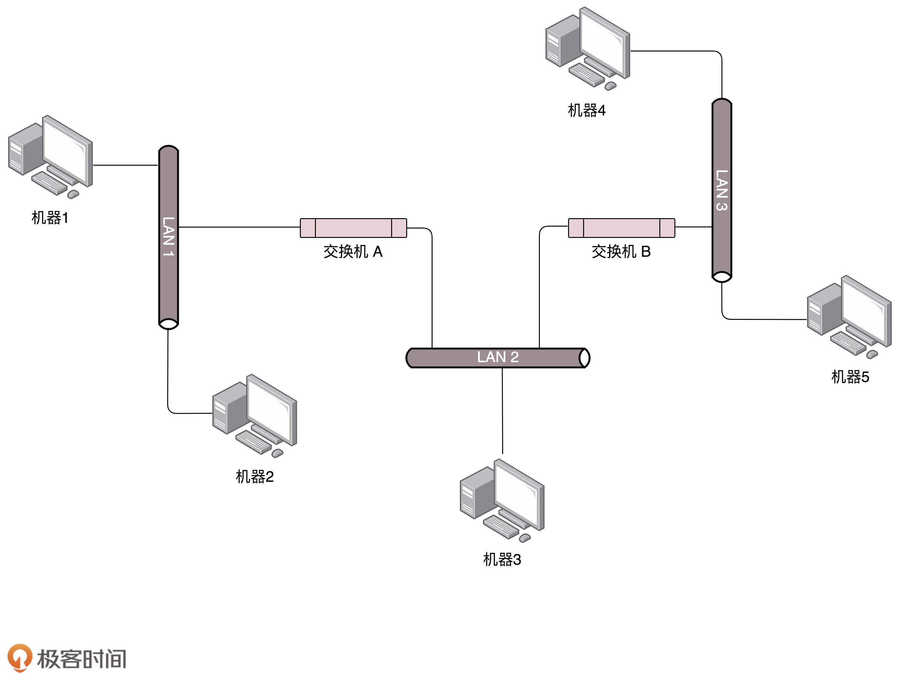
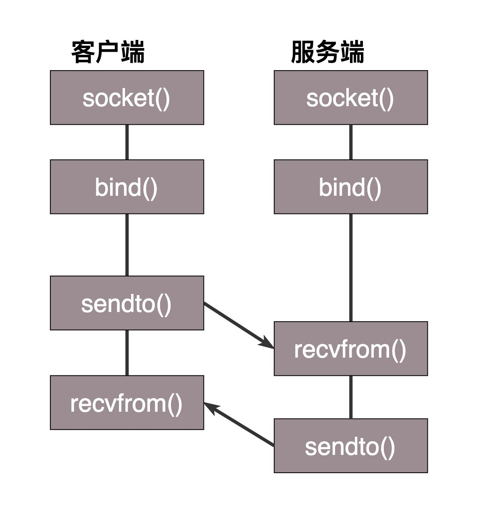
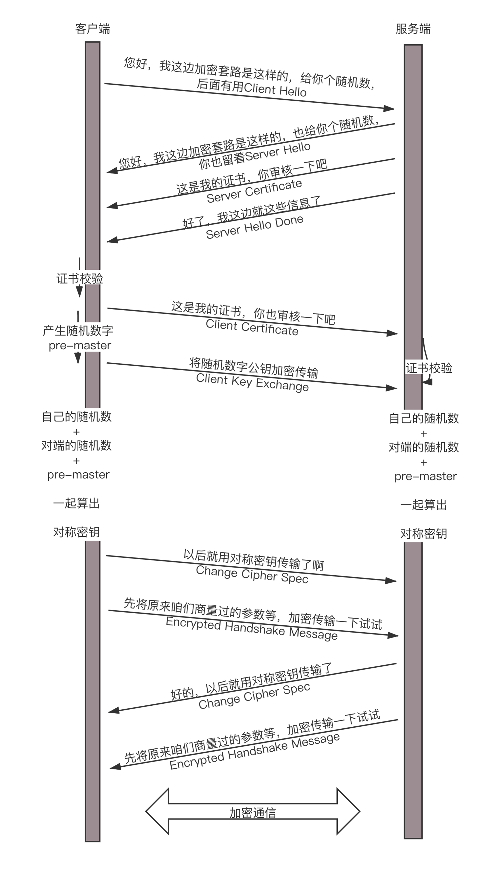

# 综述

## IP

**查看ip地址**

```
windows：ipconfig
linux: ifconfig & ip addr

root@test:~# ip addr
// <LOOPBACK,UP,LOWER_UP>网络设备状态标识。
// disc noqueue排队规则，先入先出。
1: lo: <LOOPBACK,UP,LOWER_UP> mtu 65536 qdisc noqueue state UNKNOWN group default 
    link/loopback 00:00:00:00:00:00 brd 00:00:00:00:00:00
    //这个地址只能用于本机通信。lo->loopback环回接口
    inet 127.0.0.1/8 scope host lo
       valid_lft forever preferred_lft forever
    inet6 ::1/128 scope host 
       valid_lft forever preferred_lft forever
2: eth0: <BROADCAST,MULTICAST,UP,LOWER_UP> mtu 1500 qdisc pfifo_fast state UP group default qlen 1000
	// MAC地址
    link/ether fa:16:3e:c7:79:75 brd ff:ff:ff:ff:ff:ff
    //个ip地址，网络号/主机号。eth0可以对外
    inet 10.100.122.2/24 brd 10.100.122.255 scope global eth0
       valid_lft forever preferred_lft forever
    //ipv6的地址
    inet6 fe80::f816:3eff:fec7:7975/64 scope link 
       valid_lft forever preferred_lft forever
       
区别(net-tools & iproute2)：
```

**ip分类**


**无类型域间选路CIDR**

网络号+主机号

网络号=子网掩码&ip地址

**公有 & 私有ip**


**网络设备的状态标识**

<BROADCAST,MULTICAST,UP,LOWER_UP> ：net_device flags，网络设备的状态标识。

UP 表示网卡处于启动的状态；

BROADCAST 表示这个网卡有广播地址，可以发送广播包；

MULTICAST 表示网卡可以发送多播包；

LOWER_UP 表示 L1 是启动的，也即网线插着呢。

MTU1500 最大传输单元 MTU 为 1500，这是以太网的默认值。

qdisc pfifo_fast：排队规则。三个波段，band0,1,2,。优先级从高到低。数据包按照TOS(Type of Service)分配，这是IP头里面的一个字段，代表优先级。

**总结**

IP 是地址，有定位功能；

MAC 是身份证，无定位功能；

CIDR 可以用来判断是不是本地人；

IP 分公有的 IP 和私有的 IP。

## DHCP & PXE

**配置ip地址**

```bash
// net-tools
$ sudo ifconfig eth1 10.0.0.1/24
$ sudo ifconfig eth1 up
// iproute2
$ sudo ip addr add 10.0.0.1/24 dev eth1
$ sudo ip link set up eth1
```

对于一个ip，Linux首先判断是否和自己同网段，只有一个网段才会发送ARP请求。如果不是，会先获取网关的MAC地址，然后把包发送到网关。网关必须和当前网络的至少一个网卡是同一个网段的。

真正配置的时候，是放在一个配置文件里。

### DHCP

**动态主机配置协议DHCP**

相当于租房，都是配置好的，用完退租。

1. DHCP Discover: 当一台机器新加入一个网络，使用0.0.0.0发送广播包(UDP, 封装了BOOTP)，目的地之255.255.255.255.
2. DHCP Offer: 因为MAC唯一，IP管理员知道来了新人，分配一个ip，DHCP Server就不会为其他客户分配此ip。DHCP Server仍然使用广播地址作为目的地址，还包括子网掩码、网关和ip地址租用期。
3. 机器选择其中一个DHCP Offer，广播DHCP Request，包含客户端Mac地址、接受的ip，提供的DHCP服务器地址。
4. 得到DHCP Server确认前，客户端仍用0.0.0.0和255.服务器收到客户机的DHCP request后，广播DHCP ACK表示接受，包括此ip的合法租用信息和其他配置信息。
5. 租约达成，广播一下。
6. 租期过去50%时，直接向DHCP服务器发送DHCP request包。服务器回复DHCP ACK包含新的租期和其他已经更新的TCP/IP参数，更新自己的配置。

### PXE

预启动执行环境。

**操作系统启动流程**

启动BIOS(一个小系统)，读取硬盘的MBR启动扇区，将GRUB启动起来，将权力交给GRUB.GRUB加载内核、加载作为根文件系统的initramfs文件，然后将权力交给内核。内核启动，初始化系统。

**PXE**

分为客户端和服务端。安装操作系统的过程插在BIOS启动之后。

将操作系统放在一个服务器上，客户端放在BIOS里面。当计算机启动时，BIOS把PXE客户端调入内存里，PXE启动，请求一个ip，告知它PXE服务器地址。

```
// 配置DHCP服务器
ddns-update-style interim;
ignore client-updates;
allow booting;
allow bootp;
subnet 192.168.1.0 netmask 255.255.255.0
{
option routers 192.168.1.1;
option subnet-mask 255.255.255.0;
option time-offset -18000;
default-lease-time 21600;
max-lease-time 43200;
range dynamic-bootp 192.168.1.240 192.168.1.250;
filename "pxelinux.0";
next-server 192.168.1.180; // 使用PXE配置的，指向PXE服务器的地址。
}
```

**解析PXE**

DHCP服务器把ip、PXE服务器地址、启动文件pxelinux.0发给PXE客户端。客户端向TFTP服务器请求下载这个文件，收到文件后，执行。它指示客户端向TFTP服务器请求计算机的配置信息pxelinux.cfg(包含内核在哪，initramfs在哪)，客户端请求这些文件。最后启动Linux内核。

# 数链层 & 网络层

## MAC

**物理层**

采用Hub集线器广播。

问题：①包发给谁；②谁应该接收；③会不会混乱；④顺序规则；⑤发送出错怎么办。

**数据链路层**

控制在往媒体上发送数据时的顺序--多路访问。

方式：①信道划分；②轮流协议；③随机接入协议。

网络包格式：目标MAC, 源MAC, 类型，数据，CRC

类型：0800IP数据报，0806ARP请求，应答。

ARP：已知IP，求MAC。发送广播，此IP拥有者回答。本地进行ARP缓存，过一段时间过期。

转发表：记住哪个MAC发哪个口，有过期时间。

**总结**

1. MAC层是用来解决多路访问的堵车问题；
2. ARP广播，缓存；
3. 交换机有MAC学习能力。

## 交换机&VLAN

**两台交换机，三个局域网**

1给4发包，1广播，其他机器不理会，交换机A收到后，转发到除了来处以外的网口。于是交换机B收到广播，转发到局域网三。这时4收到并相应，一个ARP请求就成功完成。

由此交换机A、B学习到1在左边网口。以后当2要访问1时，A已经知道1不在右边网口，就不会广播到局域网二、三了。



**解决环路问题**

环路问题：1发起ARP广播，交换机A广播到局域网二，交换机B右边的网口收到，B再广播到局域网一，A左边接口收到，又转发到局域网二。变成了圈。

分析：1的广播到达A,B时，两个交换机都知道1在局域网一了。A将包广播到局域网二后，B右边的网口收到来自A的广播包。B重新学习到1是从右边的网口来的。A右边网口也收到B的广播包，也重新学到了1是从右边网口来。循环往复路越来越堵。


### STP协议

Spanning Tree Protocol生成树算法。

**名词**

1. Root Bridge: 根交换机；

2. Designated Bridges: 指定交换机。树枝。其他交换机通过它到达根交换机；

3. BPDU: Bridge Protocol Data Units网桥协议数据单元。可比喻为相互比实力的协议。只有根能发。其他交换机只能传达。

4. Priority Vector: 优先级向量。比喻为实力。是一组ID数。

   比较顺序：Root Bridge ID->Root Path Cost->Bridge ID->Port ID

**工作过程**

每个网桥都认为自己是根，每个网桥一个ID，里面有管理员分配的优先级。互相发送BPDU比较、合并，选出根。

1. 根-根：输的一方带着下面的归顺。
2. 同一根下的：①根-后代。根发现隔代的网桥和自己直连更近，就可以升为与根直连。②后代-后代。和根近的当老大。
3. 一个根和其他根的后代：后代拿自己的根和这个根比，赢了，这个根加入；输了加入新的根，并逐渐拉拢和自己连接的网桥。
4. 不同根的后代：各自拿自己的根比，输了的加入赢了的，并逐渐将与自己连接的网桥拉拢。

### VLAN

**广播问题和安全问题**

1. 物理隔离：配置单独的子网。
2. 虚拟隔离VLAN:虚拟局域网。一个交换机会连属于多个局域网的机器。

**VLAN**

区分哪个机器属于哪个局域网：加一个TAG，里面有一个12位VLAN ID, 可划分4096个用户。只有相同VLAN的包才会相互转发。不同VLAN的看不见。

可以设置交换机每个口所属的VLAN。支持VLAN的交换机有一个Trunk口，可以转发属于任何VLAN的口，交换机之间通过这个相连。

**总结**

1. 交换机越来越多会遭遇环路问题，使网络包迷路->使用STP；
2. STP：通过相互比较，将有环路的图变成没有环路的图->交换机太多面对隔离问题；
3. VLAN虚拟局域网：解决广播问题和安全问题。

## ICMP & ping

### ICMP

Internet Control Message Protocol互联网控制报文协议

**用处：**遇到问题时报告情况，才能调整传输策略。

ICMP报文封装在IP包里，是个侦察兵，轻量。

最常用的类型：主动请求=8，主动应答=0

**差错报文类型**

1. 查询报文：例如ping，主动请求，获得主动应答。ICMP ECHO REQUEST-ICMP ECHO REPLY。比原生ICMP多了标识符和序号字段。选项数据中存放发送请求的时间值，计算往返时间说明路程长短。

2. 差错报文：例子：

   ①终点不可达3：原因在代码中表示，网络不可达0、主机不可达1、协议不可达2、端口不可达    	3、需要分片没分片4.

   ②源抑制4：让源站放慢速度。

   ③超时11

   ④路由重定向5.

**差错报文结构**

ICMP前8字节不变，后面跟上出错的IP包的IP头和IP正文前8个字节。

### ping


**发送和接收过程**

同一局域网下：

源主机构建ICMP请求包，最重要的字段是类型为8、顺序号。每次发送自动+1.在数据部分插入发送时间用来计算往返时间RTT。把包和对方ip一起交给IP层，构建IP数据包。接下来加入MAC头。获取MAC地址，数据链路层构建数据帧，附加控制信息，依据以太网介质访问规则传送。

收到后，检查目的MAC和自己的对比。检查数据帧，将IP数据包从帧中提取交给本机的IP层。IP层将有用的信息提取后交给ICMP协议。构建ICMP应答包，类型为0，顺序号为请求数据包的顺序号，发回去。

源主机根据应答包判断是否可达以及时间延迟。

**说明**

如果跨网段，涉及网关转发、路由器转发等。影响下一跳的选择，需要更换MAC头里的MAC地址。

除了ping之外，还应该有清晰地网络拓扑图。逐个ping中间的设备，在关键点通过`tcpdump -i eth0 icmp`查看包有没有到达某个点，回复的包到达了哪个店，可以更容易推断出出错的位置。

有些中间设备禁止ping，可以用Telnet。

### Traceroute

**差错报文类型的使用：Traceroute**

作用：①设置特殊的TTL，追踪去往目的地时经过的路由器；②设置不分片从而确定路径的MTU。

①详细：参数指向某个目的IP，发送TTL=1的UDP。一旦遇到一个路由器或关卡就返回ICMP时间超时包。接下来发送TTL=2的UDP，如此反复直到到达目的主机。这样就拿到了所有路由器的IP。有的路由器不回这个ICMP，为了确定UDP有没有到达目的主机，Traceroute发送UDP(port=不可能值)给目的主机，数据报到达时，目的主机UDP模块产生端口不可达错误的ICMP报文。

②详细：每次收到ICMP不能分片差错时减小分组长度，直到到达目的主机。

## 网关

一个路由器，三层转发的设备(根据MAC头，IP头决定转发到哪里)。

**MAC头和IP头的细节**

MAC头：目标地址，源地址，协议类型

IP头：版本号，服务类型，TTL，标识(udp/tcp)，源ip，目的ip。

**过程**

要访问另一个ip是，先判断是否和自己在同一网段(通过CIDR和子网掩码)。如果不是就要发往默认网关Gateway。Gateway地址和源ip同网段。发送方法和发给同网段的机器一样。

**路由器：**有五个网口(网卡)，连接五个局域网。每个口的IP得知都和局域网的IP同网段，是哪个局域网的网关。通过包的MAC头和IP头，根据路由算法选择另一个口，加上IP头和MAC头发出去。

### 静态路由

在路由器配置一条规则：想访问的xx站，从x号口出去，下一跳是IPx，然后保存在路由器。每当选择时去匹配规则，从某个口跑出去找下一跳。

**IP头和MAC头如何改变**

MAC只要过网关就会改变。不改变IP的交转发网关；改变IP的叫NAT网关。

1. 欧洲十国游

   包：源MAC；目标MAC(网口的)；源IP；目标IP。

   路由器匹配静态路由，获取目的MAC，发送包。包目标MAC变成目标路由器网口的MAC。

   另一个路由器收到后匹配静态路由发现没有下一跳，目标在自己网段。发送包。包目标MAC变成目的主机的MAC。IP在三个局域网都可见，他们之间的网段都不会冲突。

   每次发送改变MAC，IP不变。

2. 玄奘西行

   局域网之间各自定网段，IP段冲突。

   目标B要有一个国际身份IP，在网关B记下B对应的国际身份。源A访问B，转换成国际IP。根据静态路由配置发给对应网关。

   包：源MAC，目标MAC(网口的)，源IP，目标IP(国际IP)

   网关路由器A根据静态路由得知目标的国际IP在自己网段，发送包。

   包：源MAC(网口出口的)，目标MAC(目标网口的)，源IP(网口出口的)，目标IP(目标网口的)

   包发送到中间的局域网时，源A也要有国际IP。包中源IP变成A的国际IP。路由器B是一个NAT网关，配置了目的的对应IP，转换。发送。

   包：源MAC(网口出口的)，目标MAC(目标的)，源IP(网口出口的)，目标IP(目标的)

   发送返回包时也发给路由器A的国际身份。A做NAT转换IP。

   这个过程中IP也会变。Network Address Translation

## 路由协议

**路由表**

每个路由表包含多条路由规则。路由规则：目的网络；出口设备；下一跳网关。通过`route`和`ip route`可以查询或配置。

`ip route add 10.176.48.0/20 via 10.173.32.1 dev eth0`

**策略路由**

根据多个参数配置路由。根据源IP、入口设备、TOS等选择路由表，在表中查找路由。使不同来源的包走不同路由。

```
// 从这里来的，使用10中的路由表
ip rule add from 192.168.1.0/24 table 10 
ip rule add from 192.168.2.0/24 table 20
// 一条路由规则走多条路径
ip route add default scope global nexthop via 100.100.100.1 weight 1 nexthop via 200.200.200.1 weight 2
```

### 动态路由

将路径抽象为图。

1. 距离矢量路由算法

   基于Bellman-Ford。

   思路：每个路由器保存一个路由表，每行包含要到目标路由器出去的路线和到目标路由器的距离。

   缺点：①如果有路由器加入，邻居能很快发现并广播，传遍整个网络。但一个路由器挂了没有广播；②每次发送要发送整个全局路由表，适用于小型(<15跳)网络。

   路由协议RIP采用的这个。

2. 链路状态路由算法

   基于Dijkstra。

   思路：路由器启动，通知邻居，邻居回复。计算和邻居的距离。将自己和邻居之间的链路状态包广播出去。每个路由器都能在自己本地构建一个完整的图，针对图使用Dijkstra找到两点最短路径。只广播更新或改变的网络拓扑，节省带宽和CPU利用率。一旦路由器挂了，它的邻居会广播，使坏消息迅速收敛。

**动态路由协议**

1. 基于链路状态路由算法的 OSPF

   开放式最短路径优先。用于数据中心路由决策，成为内部网关协议(Interior Gateway Protocol)IGP。发现多个最短路径的话进行负载均衡LVS-等价路由。可以实现高吞吐量的接入层设计。

2. 基于距离矢量路由算法的 BGP

   外网路由协议Broder Gateway Protocol。

   每个数据中心有自己的Policy。自治系统(AS)分类：①Stub AS:对外只有一个连接, 不会传输其他AS包。eg个人或小公司；②Multihomed AS: 可能有多个连接连其他AS，多数拒绝帮其他AS传输包。eg大公司；③Transit AS:可以帮其他AS传输包。eg主干网。

   每个AS有边界路由器和外面的世界建立联系。

   分类：①eBGP：AS间边界路由器用它广播路由；②iBGP：边界路由器用它将BGP学到的路由导入内部网络，使其能找到到达外网目的地的最佳边界路由器。

   改进之处：除了下一跳，还包括AS的路径，避免了坏消息传递慢。路径中把AS看做一个整体。

# 传输层

**TCP & UDP**

TCP: 连接传输、无差错、不丢失、不重复、有序；面向字节流。

UDP：继承IP包的特性，不保证不丢失、不保证有序；继承IP特性，基于数据报。

## UDP

包到达机器，发现MAC匹配，取下来，传给IP层。把IP头取下来发现IP匹配，根据IP头里的8位协议判断给TCP还是UDP。

**包头**

源和目的端口号：根据端口号给相应的应用程序。

长度、校验和、数据。

**特点**

①沟通简单；②轻信他人；③不会权变决定收发。

**使用场景**

1. 需要资源少，网络情况好或对丢包不敏感。
2. 不需要一对一沟通，可以广播。
3. 需要处理速度快、时延低，可以容忍丢包。可以在应用层实现连接，可靠保证，时延要求。

**例子**

1. 网页或者APP的访问基于HTTP，HTTP基于TCP，通常采取多个数据通道共享一个连接，会加大时延。QUIC(Quick UDP Internet Connections快速UDP互联网连接)在应用层实现快速连接建立、减少重传时延、自适应拥塞控制。
2. 流媒体协议。直播多采用RTMP，基于TCP，因为保证顺序可能卡顿。所以很多直播应用基于UDP实现了视频传输协议。
3. 实时游戏。可以采用自定义的可靠UDP协议，自定义重传策略，把丢包产生的延迟降到最低。
4. IoT物联网。终端资源少，内存小，维护TCP代价大；对实时性要求高。物联网通信协议Thread基于UDP。
5. 移动通信在4G里，GTP-U基于UDP

## TCP

**头部**

源和目的端口号；包的序号；确认序号；状态位(SYN发起连接、ACK、RST重新连接、FIN)；窗口大小；

**重点**

顺序；丢包；连接维护；流量控制；拥塞控制；

### 三次握手


请求->应答->应答之应答

A发起连接，杳无音信->丢包 & 超时 & B没响应。

B收到请求，不建立连接，A重试一阵后放弃；

B建立连接，发送应答包给A->丢包 & 超时 & A挂了。

还可以沟通TCP包序号的问题。起始序号根据时间变化。如果都从1开始，A发了123,3丢绕路，A掉线，重连，发了12，这时B收到了之前的3，发生错误。

**补充：两次握手**

AB通信已经结束。A建立连接时发了很多请求，有的请求很晚收到，B建立了连接。

而且A无法知道B的起始序号。

**补充：四次握手**

B应答只要到A，连接就建立，对A来说消息有去有回。A给B发送应答之应答，对B来讲，消息有去有回。所以是可以的。

### 四次挥手


A发起断开后立刻断开->B发起结束得不到回答。

A发起断开后B立刻断开->A不知道B是还有事情处理还是过一会儿会发送结束。

**TIME_WAIT**

A发完最后一个ACK就断开，B没收到，B会重发断开连接请求，B再也收不到ACK。而且A原本的端口可能被新应用占用，也许会造成序号混乱。所以等待2MSL(报文最大生存时间)等到B发的所有包都死了。

如果超过B超过2MSL仍没收到ACK，B重发FIN，A会回复RST表示自己已不在。


### 累计确认

发送端缓存里包的ID根据处理情况分为四个部分：

1. 发送了并且已经确认的。
2. 发送了尚未确认。
3. 没发送，但是在等待发送。
4. 没发送，暂时不会发送。

3,4的作用是流量控制。

接受端缓存里的记录：

1. 接收并且确认过的。
2. 没接收但是马上能接收(能接受的最大工作量)。
3. 还没收也没法接收的(超过工作量的部分)。

### 顺序 & 丢包

发送端：1,2,3已经发送并确认；4,5,6,7,8,9发送了没确认；10,11,12没发送；13,14,15接收方没空间，不准备发。

接收端：1,2,3,4,5已经确认但没读取；6,7等待接收；8,9已经接收但没有确认(因为6,7丢失)。

确认与重发：5的ACK丢失，6,7数据包丢失。

超时重试：发送但没收到ACK的包过一定时间就重发(自适应重传算法，根据TCP采样的RTT计算)。

重发后：发现5接收过，丢弃。6发送ACK。7丢失。

两次超时：TCP策略是超时间隔加倍。说明网络差不宜频繁发送。问题是超市周期相对较长。

快速重传机制：收到大于期望的报文段时，发送冗余的ACK，ACK的是期望的报文段。收到3个冗余ACK后在定时器过期前重传丢失的报文段。

### 流量控制

对包的确认中，携带窗口的大小。

如果接收端处理太慢，通过确认信息修改窗口大小，甚至设为0.如果接收端一直不处理数据，发送端窗口也慢慢变成0，停止发送。这时发送方定时发送窗口探测数据包看是否有机会调整窗口大小。

防止低能窗口综合征(接收端太慢)：当窗口太小时，不更新窗口。缓冲区一半为空才更新窗口。

### 拥塞控制

拥塞窗口cwnd和滑动窗口共同控制发送的速度。

**目的：**避免丢包和超时重传。在不堵塞，不丢包情况下尽量发挥带宽。通道的容量 = 带宽 × 往返延迟。

**慢启动**

TCP一开始把cwnd设为1个报文段；收到这个确认，cwnd+1；收到这两个确认，cwnd+2...指数增长。直到ssthresh=65535, 超过后慢下来，每收到一个确认，cwnd+1/cwnd.变成了线性增长。当出现拥塞(丢包->超时重传)，ssthresh=cwnd/2, cwnd=1，重新开始慢启动。

**改进->快速重传：**发送三次前一个包的ACK后，发送端快速重传，cwnd=cwnd/2, ssthresh=cwnd, 当三个包返回时，cwnd=sshthresh+3.

**TCP BBR**

因为有时候不是网络满了，而是丢了。而且TCP等到中间设备都填满才发生丢包从而降低速度，已经晚了。只要填满管道即可，不应该一直到把缓存也填满。因此找到了平衡点，达到高带宽和低时延的平衡。

**总结**

顺序、丢包、流量控制：通过滑动窗口解决。

拥塞控制通过拥塞窗口解决。

## 套接字Socket

**参数**

ipv4 & ipv6:AF_INET & AF_INET6

TCP & UDP:SOCK_STREAM & SOCK_DGRAM

**基于TCP**


服务端：

1. bind：给整个socket赋予一个ip和port，内核通过TCP头里的端口找到应用程序。一个机器可能有多个网卡(ip)，选择监听一个网卡。
2. listen: 等客户端连接。内核中每个socket维护两个队列->已连接(三次握手完成)；没完全建立连接(三次握手没完成)。
3. accept: 拿出一个已经完成的连接处理。

客户端：

1. connect: 发起连接，参数中指明要连接的IP，port，发起三次握手。内核给分配一个临时端口。握手成后，服务端accept返回另一个socket。

**数据结构**


socket以文件形式存在。每个进程有一个task_struct, 里面指向一个fd数组列出这个进程打开的所有fd。数组中的内容是指向内核中所有打开的文件的列表的指针。文件的inode保存在内存中。这个inode中指向内核中的socket结构。结构中有两个队列->发送 & 接收队列。

**基于UDP**



不需要握手->没有listen & connect。一个socket和多个客户端通信。每次通信调用sendto & recvfrom传入ip和port。

**接更多连接**

一个TCP连接：`{本机IP, 本机端口, 对端IP, 对端端口}`

因为客户端端口可变，因此最大 TCP 连接数 = 客户端 IP 数×客户端端口数=2^32 * 2^16=2^48.

限制：fd数量ulimit和内存。

1. 多进程

   

   一旦建立一个连接，创建子进程，将基于已连接的socket的交互交给子进程。父进程通过子进程id查看子进程是否需要退出。

2. 多线程

   

   `pthread_create`创建线程，共享fd列表、进程空间，只是多了一个引用。

   问题：一个机器无法创建很多进程或线程。

3. IO多路复用-select

   某个线程监听所有socket，都放在一个fd集合fd_set中。一旦有变化，依次查看fd，发生变化的fd在fd_set中对应的位设为1.

4. IO多路复用-epoll

   

   使用select，同时监听的数量由FD_SETSIZE限制。改成事件通知的方式，注册callback，fd变化时主动通知。`epoll_create`创建一个epoll对象(一个文件)，里面有一个红黑树，保存这个epoll要监听的所有socket。`epoll_ctl`添加一个socket到红黑树，挂在被监听的socket的事件列表中。来事件时，从列表中得到epoll对象，用`call_back`通知。可以同时监听的socket数目多，上限为系统定义的、进程打开的最大fd个数。

# 应用层

## HTTP协议

URL统一资源定位符。统一(有格式)。

**过程**

通过DNS解析为IP地址，建立HTTP连接。HTTP1.1默认开启Keep-Alive，连接可以在多次请求中复用。建立后，浏览器发送HTTP请求。

**报文格式**


1. 请求行

   **方法：**

   ①GET：去服务器获取资源，例如页面，json字符串。云计算中服务端要提供一个基于HTTP的api，获取所有云主机列表，返回json串，里面是一个云主机信息的列表。

   ②POST: 主动告诉服务端一些信息，一般放在正文。云计算中要提供一个基于HTTP的创建云主机api，将要创建多大的主机、多少CPU内存、多大硬盘放在json字符串通过POST告诉服务端。

   ③PUT: 向指定资源位置上传最新内容。HTTP的服务器不允许上传文件。所以通常用来修改资源。比如对云主机打标签，说明是生产环境的或测试环境的。

   ④DELETE: 删除资源。例如删除云主机。

2. 请求的首部

   key:value。保存非常重要的字段。

   **例子**

   ①Accept-Charset: 表示客户端可以接受的字符集，防止乱码。

   ②Contend-Type: 这个问题格式。

   ③Cache-control: 控制缓存。缓存：非常大的页面有很多东西，比如商品的展示图片长期不变，库存经常改变。每次更新数据刷新页面对服务器压力大。高并发场景下的系统，真正的业务逻辑之前有一个接入层，将静态资源请求拦在最外面。

   

   Vanish缓存层里的缓存过期才会访问Tomcat应用集群。如果客户端请求中包含max-age，缓存时间比指定时间小，客户端可以接受缓存资源。max-age=0时, 缓存层要将请求转发给应用集群。

   ④If-Modified-Since: 如果服务器资源在某时间之后更新了，客户端应该下载最新的资源。如果没更新，服务端返回"304 Not Modified", 客户端不用下载，节省带宽。

3. 请求正文

接下来浏览器把请求交给传输层。

**HTTP 请求的发送**

基于TCP，通过stream二进制流传给对方，在TCP层把流变成报文段发给服务器。通过IP层，MAC层最后目标机器收到并到了TCP层，解析TCP投，看看序列号是不是需要的。查看端口号，确认后发给HTTP服务器。服务器把响应发给客户端。

**HTTP 返回的构建**


1. 状态行：

   ①200

   ②404：服务器无法响应

   ③503：访问暂时不再和这个值配合使用。

2. 响应头：

   ①Retry-After告诉客户端多久后重试。

   ②Contend-Type表示返回的是HTML还是json等。

3. 响应体。

发送给客户端。根据端口找到浏览器进程。发现返回200，从正文中把内容拿出来。

**HTTP 2.0**

HTTP1.1：纯文本，每次带完整HTTP头。不考虑pipeline的话，一去一回，实时性并发性不好。

HTTP2.0改进：

①对HTTP头压缩，k-v在两端建立索引表，对相同的头只发送表中的索引。

②将一个TCP连接切分成多个流，每个流有自己的id和优先级，客<->服方向不定。是一个虚拟的通道。

③将所欲传输信息分割为更小的消息和帧，采用二进制编码。乱序发到一个TCP连接中。

好处：客户端将多个请求分到不同的流中，将请求拆成帧，进行二进制传输。可以乱序，再根据帧首部的流标识符重组。

成果：解决HTTP1.1的队首阻塞问题；不需要pipline机制用多条TCP连接实现并行；减少TCP连接数对服务器性能的影响；将页面多个数据通过一个数据链接传输，加快页面组件传输速度。

**QUIC协议**

基于UDP。

1. 自定义连接机制

   TCP四元组{源IP，源端口，目的IP，目的端口}有一个改变就要重新连接。

   改进：以一个64位的随机数作为id来标识。IP或port变化，只要id不变就不需要重新建立连接。

2. 自定义重传机制

   TCP超时通过采样往返时间RTT调整，不准确。因为如果发送并重传后收到，不知道该按照哪个计算。

   改进：QUIC序列号递增，每次发送都+1.在数据流中有一个偏移量offset，通过它查看数据发送到了哪里，按照offset拼接。

3. 无阻塞的多路复用

   TCP中stream2丢了一个包，后面其他流的包也要阻塞。

   改进：基于UDP的包无需等待。

4. 自定义流量控制

   TCP累计应答，前面的没到窗口不能右移。

   改进：通过window_update高速对端可以接受的字节数。不但在一个连接上控制窗口，还在一个连接中的每个stream控制窗口。ACK基于offset，到了以后进缓存并应答，应答后不会重发。窗口起始位置为当前收到的最大offset。窗口大小为从起始位置到当前stream能容纳的最大缓存。整个连接的窗口对所有stream的窗口做统计。

**总结**

HTTP 2.0：通过头压缩、分帧、二进制编码、多路复用等技术提升性能；

QUIC：通过基于 UDP 自定义的类似 TCP 的连接、重试、多路复用、流量控制技术，进一步提升性能。

## HTTPS协议

**对称加密**

双方用同一个密钥加密加密。

**非对称加密**

公钥加密，私钥解密。

**数字证书**



流程：创建公钥、私钥，权威部门加入，颁发证书，里面有公钥、所有者、发布机构和有效期。

如何生成证书：发起请求给CA(权威机构)认证，CA给证书卡章(签名算法：不可逆hash计算)。CA用自己的私钥给一方公钥签名，形成了一方的证书(包括颁发者、给谁、期限、公钥内容、签名算法)。

验证证书：二方看CA的上级证书的公钥能否解开这个CA的签名。层层上去。验证成功后得到一方的公钥。

**工作模式**

客户端发送msg{TLS版本、加密套件候选列表、压缩算法候选列表、随机数1}。

服务器返回msg{选择的协议版本、加密套件、压缩算法、随机数2}和证书。

客户端从CA仓库(可能不断向上追溯)中拿证书里的公钥解密这个证书，成功说明可信。产生随机数Pre-master，用证书中服务器的公钥加密发给服务网。

服务器用私钥解密得到Pre-master。

此时双方有三个随机数：自己的，对方的，Pre-master。通过随机数两端产生相同的对称密钥，开始通信。

**重放与篡改**

通过Timestamp和Nonce随机数联合起来做一个不可逆的签名来保证。所以服务器措辞收到相同的两者视为无效。签名保证不可篡改性。

## 流媒体协议

**名词**

1. AVI、MPEG、RMVB、MP4、MOV、FLV、WebM、WMV、ASF、MKV。(二进制文件格式)
2. H.261、 H.262、H.263、H.264、H.265。
3. MPEG-1、MPEG-2、MPEG-4、MPEG-7

**视频和图片的压缩**


1. 空间冗余：图片相邻像素有较强相关性。
2. 时间冗余：视频序列相邻图像相似。
3. 视觉冗余：人对细节不敏感。
4. 编码冗余：类似霍夫曼编码。

**视频编码流派**

1. ITU的VCEG: 侧重传输。
2. ISO的MPEG: 本来是做视频存储，后来也侧重传输了。

联合制定H.264/MPEG-4 AVC

**直播**


**流程**

接流：网络协议将编码好的视频流从主播端推送到服务器，服务器上有个运行同样协议的服务端接收这些网络包，得到视频流。

拉流：服务端接到视频流后转码以适应各种类型的客户端，流处理完毕，等待客户端来请求这些视频流。

视频分发网络：将视频预先加载到就近的边缘节点，大部分观众从边缘节点拉取，降低服务器压力。

解码：二进制转换成图片。

**编码**

1. I帧：关键帧，里面是完整的图片。
2. P帧：前向预测编码帧，表示这帧和前一个I或P帧的差别。
3. B帧：双向预测内插编码帧，记录本帧和前后帧的差别。

视频->一系列帧->每个帧分成多个片放在NALU中->每个片中分成多个宏块->每个宏块分成多个子块。方便空间上的编码。

二进制流：网络提取单元NALU，为了传输。


每一个 NALU 首先是一个起始标识符，用于标识 NALU 之间的间隔；然后是 NALU 的头，里面主要配置了 NALU 的类型；最终 Payload 里面是 NALU 承载的数据。在 NALU 头里面，主要的内容是类型 NAL Type。0x07 表示 SPS，是序列参数集， 包括一个图像序列的所有信息，如图像尺寸、视频格式等。0x08 表示 PPS，是图像参数集，包括一个图像的所有分片的所有相关信息，包括图像类型、序列号等。在传输视频流之前，必须要传输这两类参数，不然无法解码。为了保证容错性，每一个 I 帧前面，都会传一遍这两个参数集合。如果 NALU Header 里面的表示类型是 SPS 或者 PPS，则 Payload 中就是真正的参数集的内容。如果类型是帧，则 Payload 中才是正的视频数据，当然也是一帧一帧存放的，前面说了，一帧的内容还是挺多的，因而每一个 NALU 里面保存的是一片。对于每一片，到底是 I 帧，还是 P 帧，还是 B 帧，在片结构里面也有个 Header，这里面有个类型，然后是片的内容。这样，整个格式就出来了，一个视频，可以拆分成一系列的帧，每一帧拆分成一系列的片，每一片都放在一个 NALU 里面，NALU 之间都是通过特殊的起始标识符分隔，在每一个 I 帧的第一片前面，要插入单独保存 SPS 和 PPS 的 NALU，最终形成一个长长的 NALU 序列。

推流：如何把数据流打包传输到对端？那这个格式是不是就能够直接在网上传输到对端，开始直播了呢？其实还不是，还需要将这个二进制的流打包成网络包进行发送，这里我们使用 RTMP 协议。这就进入了第二个过程，推流。RTMP 是基于 TCP 的，因而肯定需要双方建立一个 TCP 的连接。在有 TCP 的连接的基础上，还需要建立一个 RTMP 的连接，也即在程序里面，你需要调用 RTMP 类库的 Connect 函数，显示创建一个连接。RTMP 为什么需要建立一个单独的连接呢？因为它们需要商量一些事情，保证以后的传输能正常进行。主要就是两个事情，一个是版本号，如果客户端、服务器的版本号不一致，则不能工作。另一个就是时间戳，视频播放中，时间是很重要的，后面的数据流互通的时候，经常要带上时间戳的差值，因而一开始双方就要知道对方的时间戳。未来沟通这些事情，需要发送六条消息：客户端发送 C0、C1、  C2，服务器发送 S0、  S1、  S2。

首先，客户端发送 C0 表示自己的版本号，不必等对方的回复，然后发送 C1 表示自己的时间戳。服务器只有在收到 C0 的时候，才能返回 S0，表明自己的版本号，如果版本不匹配，可以断开连接。服务器发送完 S0 后，也不用等什么，就直接发送自己的时间戳 S1。客户端收到 S1 的时候，发一个知道了对方时间戳的 ACK  C2。同理服务器收到 C1 的时候，发一个知道了对方时间戳的 ACK  S2。于是，握手完成

握手之后，双方需要互相传递一些控制信息，例如 Chunk 块的大小、窗口大小等。真正传输数据的时候，还是需要创建一个流 Stream，然后通过这个 Stream 来推流 publish。推流的过程，就是将 NALU 放在 Message 里面发送，这个也称为 RTMP Packet 包。Message 的格式就像这样。

发送的时候，去掉 NALU 的起始标识符。因为这部分对于 RTMP 协议来讲没有用。接下来，将 SPS 和 PPS 参数集封装成一个 RTMP 包发送，然后发送一个个片的 NALU。RTMP 在收发数据的时候并不是以 Message 为单位的，而是把 Message 拆分成 Chunk 发送，而且必须在一个 Chunk 发送完成之后，才能开始发送下一个 Chunk。每个 Chunk 中都带有 Message  ID，表示属于哪个 Message，接收端也会按照这个 ID 将 Chunk 组装成 Message。前面连接的时候，设置的 Chunk 块大小就是指这个 Chunk。将大的消息变为小的块再发送，可以在低带宽的情况下，减少网络拥塞。这有一个分块的例子，你可以看一下。假设一个视频的消息长度为 307，但是 Chunk 大小约定为 128，于是会拆分为三个 Chunk。第一个 Chunk 的 Type＝0，表示 Chunk 头是完整的；头里面 Timestamp 为 1000，总长度 Length 为 307，类型为 9，是个视频，Stream  ID 为 12346，正文部分承担 128 个字节的 Data。第二个 Chunk 也要发送 128 个字节，Chunk 头由于和第一个 Chunk 一样，因此采用 Chunk Type＝3，表示头一样就不再发送了。第三个 Chunk 要发送的 Data 的长度为 307-128-128=51 个字节，还是采用 Type＝3。

就这样数据就源源不断到达流媒体服务器，整个过程就像这样。

这个时候，大量观看直播的观众就可以通过 RTMP 协议从流媒体服务器上拉取，但是这么多的用户量，都去同一个地方拉取，服务器压力会很大，而且用户分布在全国甚至全球，如果都去统一的一个地方下载，也会时延比较长，需要有分发网络。分发网络分为中心和边缘两层。边缘层服务器部署在全国各地及横跨各大运营商里，和用户距离很近。中心层是流媒体服务集群，负责内容的转发。智能负载均衡系统，根据用户的地理位置信息，就近选择边缘服务器，为用户提供推 / 拉流服务。中心层也负责转码服务，例如，把 RTMP 协议的码流转换为 HLS 码流。

这套机制在后面的 DNS、HTTPDNS、CDN 的章节会更有详细的描述。

拉流：观众的客户端如何看到视频？接下来，我们再来看观众的客户端通过 RTMP 拉流的过程。

先读到的是 H.264 的解码参数，例如 SPS 和 PPS，然后对收到的 NALU 组成的一个个帧，进行解码，交给播发器播放，一个绚丽多彩的视频画面就出来了。小结好了，今天的内容就到这里了，我们来总结一下： 视频名词比较多，编码两大流派达成了一致，都是通过时间、空间的各种算法来压缩数据；压缩好的数据，为了传输组成一系列 NALU，按照帧和片依次排列；排列好的 NALU，在网络传输的时候，要按照 RTMP 包的格式进行包装，RTMP 的包会拆分成 Chunk 进行传输；推送到流媒体集群的视频流经过转码和分发，可以被客户端通过 RTMP 协议拉取，然后组合为 NALU，解码成视频格式进行播放。

## P2P

**下载电影**

1. HTTP：慢

2. FTP：

   采用两个连接传输一个文件：①控制连接(服务器被动打开21，客户端主动连接，传回应答)；②数据连接。

   工作模式：每个文件建立一个连接。①主动(PORT)。客户端随机打开端口N>1024, 向服务器21发起连接，打开N+1端口监听；②被动(PASV)。

FTP 的两种工作模式每传输一个文件，都要建立一个全新的数据连接。FTP 有两种工作模式，分别是主动模式（PORT）和被动模式（PASV），这些都是站在 FTP 服务器的角度来说的。主动模式下，客户端随机打开一个大于 1024 的端口 N，向服务器的命令端口 21 发起连接，同时开放 N+1 端口监听，并向服务器发出 “port N+1” 命令，由服务器从自己的数据端口 20，主动连接到客户端指定的数据端口 N+1。被动模式下，当开启一个 FTP 连接时，客户端打开两个任意的本地端口 N（大于 1024）和 N+1。第一个端口连接服务器的 21 端口，提交 PASV 命令。然后，服务器会开启一个任意的端口 P（大于 1024），返回“227 entering passive mode”消息，里面有 FTP 服务器开放的用来进行数据传输的端口。客户端收到消息取得端口号之后，会通过 N+1 号端口连接服务器的端口 P，然后在两个端口之间进行数据传输。

P2P 是什么？但是无论是 HTTP 的方式，还是 FTP 的方式，都有一个比较大的缺点，就是难以解决单一服务器的带宽压力， 因为它们使用的都是传统的客户端服务器的方式。后来，一种创新的、称为 P2P 的方式流行起来。P2P 就是 peer-to-peer。资源开始并不集中地存储在某些设备上，而是分散地存储在多台设备上。这些设备我们姑且称为 peer。想要下载一个文件的时候，你只要得到那些已经存在了文件的 peer，并和这些 peer 之间，建立点对点的连接，而不需要到中心服务器上，就可以就近下载文件。一旦下载了文件，你也就成为 peer 中的一员，你旁边的那些机器，也可能会选择从你这里下载文件，所以当你使用 P2P 软件的时候，例如 BitTorrent，往往能够看到，既有下载流量，也有上传的流量，也即你自己也加入了这个 P2P 的网络，自己从别人那里下载，同时也提供给其他人下载。可以想象，这种方式，参与的人越多，下载速度越快，一切完美。

种子（.torrent）文件但是有一个问题，当你想下载一个文件的时候，怎么知道哪些 peer 有这个文件呢？这就用到种子啦，也即咱们比较熟悉的.torrent 文件。.torrent 文件由两部分组成，分别是：announce（tracker URL）和文件信息。文件信息里面有这些内容。info 区：这里指定的是该种子有几个文件、文件有多长、目录结构，以及目录和文件的名字。Name 字段：指定顶层目录名字。每个段的大小：BitTorrent（简称 BT）协议把一个文件分成很多个小段，然后分段下载。段哈希值：将整个种子中，每个段的 SHA-1 哈希值拼在一起。

下载时，BT 客户端首先解析.torrent 文件，得到 tracker 地址，然后连接 tracker 服务器。tracker 服务器回应下载者的请求，将其他下载者（包括发布者）的 IP 提供给下载者。下载者再连接其他下载者，根据.torrent 文件，两者分别对方告知自己已经有的块，然后交换对方没有的数据。此时不需要其他服务器参与，并分散了单个线路上的数据流量，因此减轻了服务器的负担。下载者每得到一个块，需要算出下载块的 Hash 验证码，并与.torrent 文件中的对比。如果一样，则说明块正确，不一样则需要重新下载这个块。这种规定是为了解决下载内容的准确性问题。从这个过程也可以看出，这种方式特别依赖 tracker。tracker 需要收集下载者信息的服务器，并将此信息提供给其他下载者，使下载者们相互连接起来，传输数据。虽然下载的过程是非中心化的，但是加入这个 P2P 网络的时候，都需要借助 tracker 中心服务器，这个服务器是用来登记有哪些用户在请求哪些资源。所以，这种工作方式有一个弊端，一旦 tracker 服务器出现故障或者线路遭到屏蔽，BT 工具就无法正常工作了。

去中心化网络（DHT）那能不能彻底非中心化呢？于是，后来就有了一种叫作 DHT（Distributed Hash Table）的去中心化网络。每个加入这个 DHT 网络的人，都要负责存储这个网络里的资源信息和其他成员的联系信息，相当于所有人一起构成了一个庞大的分布式存储数据库。有一种著名的 DHT 协议，叫 Kademlia 协议。这个和区块链的概念一样，很抽象，我来详细讲一下这个协议。任何一个 BitTorrent 启动之后，它都有两个角色。一个是 peer，监听一个 TCP 端口，用来上传和下载文件，这个角色表明，我这里有某个文件。另一个角色 DHT node，监听一个 UDP 的端口，通过这个角色，这个节点加入了一个 DHT 的网络。

在 DHT 网络里面，每一个 DHT node 都有一个 ID。这个 ID 是一个很长的串。每个 DHT node 都有责任掌握一些知识，也就是文件索引，也即它应该知道某些文件是保存在哪些节点上。它只需要有这些知识就可以了，而它自己本身不一定就是保存这个文件的节点。

哈希值当然，每个 DHT node 不会有全局的知识，也即不知道所有的文件保存在哪里，它只需要知道一部分。那应该知道哪一部分呢？这就需要用哈希算法计算出来。每个文件可以计算出一个哈希值，而 DHT node 的 ID 是和哈希值相同长度的串。DHT 算法是这样规定的：如果一个文件计算出一个哈希值，则和这个哈希值一样的那个 DHT node，就有责任知道从哪里下载这个文件，即便它自己没保存这个文件。当然不一定这么巧，总能找到和哈希值一模一样的，有可能一模一样的 DHT node 也下线了，所以 DHT 算法还规定：除了一模一样的那个 DHT node 应该知道，ID 和这个哈希值非常接近的 N 个 DHT node 也应该知道。什么叫和哈希值接近呢？例如只修改了最后一位，就很接近；修改了倒数 2 位，也不远；修改了倒数 3 位，也可以接受。总之，凑齐了规定的 N 这个数就行。刚才那个图里，文件 1 通过哈希运算，得到匹配 ID 的 DHT node 为 node C，当然还会有其他的，我这里没有画出来。所以，node C 有责任知道文件 1 的存放地址，虽然 node C 本身没有存放文件 1。同理，文件 2 通过哈希运算，得到匹配 ID 的 DHT node 为 node E，但是 node D 和 E 的 ID 值很近，所以 node D 也知道。当然，文件 2 本身没有必要一定在 node D 和 E 里，但是碰巧这里就在 E 那有一份。

接下来一个新的节点 node new 上线了。如果想下载文件 1，它首先要加入 DHT 网络，如何加入呢？在这种模式下，种子.torrent 文件里面就不再是 tracker 的地址了，而是一个 list 的 node 的地址，而所有这些 node 都是已经在 DHT 网络里面的。当然随着时间的推移，很可能有退出的，有下线的，但是我们假设，不会所有的都联系不上，总有一个能联系上。node new 只要在种子里面找到一个 DHT node，就加入了网络。node new 会计算文件 1 的哈希值，并根据这个哈希值了解到，和这个哈希值匹配，或者很接近的 node 上知道如何下载这个文件，例如计算出来的哈希值就是 node C。但是 node new 不知道怎么联系上 node C，因为种子里面的 node 列表里面很可能没有 node C，但是它可以问，DHT 网络特别像一个社交网络，node new 只有去它能联系上的 node 问，你们知道不知道 node C 的联系方式呀？在 DHT 网络中，每个 node 都保存了一定的联系方式，但是肯定没有 node 的所有联系方式。DHT 网络中，节点之间通过互相通信，也会交流联系方式，也会删除联系方式。和人们的方式一样，你有你的朋友圈，你的朋友有它的朋友圈，你们互相加微信，就互相认识了，过一段时间不联系，就删除朋友关系。

有个理论是，社交网络中，任何两个人直接的距离不超过六度，也即你想联系比尔盖茨，也就六个人就能够联系到了。所以，node new 想联系 node C，就去万能的朋友圈去问，并且求转发，朋友再问朋友，很快就能找到。如果找不到 C，也能找到和 C 的 ID 很像的节点，它们也知道如何下载文件 1。在 node C 上，告诉 node new，下载文件 1，要去 B、D、 F，于是 node new 选择和 node B 进行 peer 连接，开始下载，它一旦开始下载，自己本地也有文件 1 了，于是 node new 告诉 node C 以及和 node C 的 ID 很像的那些节点，我也有文件 1 了，可以加入那个文件拥有者列表了。但是你会发现 node new 上没有文件索引，但是根据哈希算法，一定会有某些文件的哈希值是和 node new 的 ID 匹配上的。在 DHT 网络中，会有节点告诉它，你既然加入了咱们这个网络，你也有责任知道某些文件的下载地址。

好了，一切都分布式了。这里面遗留几个细节的问题。DHT node ID 以及文件哈希是个什么东西？节点 ID 是一个随机选择的 160bits（20 字节）空间，文件的哈希也使用这样的 160bits 空间。所谓 ID 相似，具体到什么程度算相似？在 Kademlia 网络中，距离是通过异或（XOR）计算的。我们就不以 160bits 举例了。我们以 5 位来举例。01010 与 01000 的距离，就是两个 ID 之间的异或值，为 00010，也即为 2。 01010 与 00010 的距离为 01000，也即为 8,。01010 与 00011 的距离为 01001，也即 8+1=9 。以此类推，高位不同的，表示距离更远一些；低位不同的，表示距离更近一些，总的距离为所有的不同的位的距离之和。这个距离不能比喻为地理位置，因为在 Kademlia 网络中，位置近不算近，ID 近才算近，所以我把这个距离比喻为社交距离，也即在朋友圈中的距离，或者社交网络中的距离。这个和你住的位置没有关系，和人的经历关系比较大。

还是以 5 位 ID 来举例，就像在领英中，排第一位的表示最近一份工作在哪里，第二位的表示上一份工作在哪里，然后第三位的是上上份工作，第四位的是研究生在哪里读，第五位的表示大学在哪里读。如果你是一个猎头，在上面找候选人，当然最近的那份工作是最重要的。而对于工作经历越丰富的候选人，大学在哪里读的反而越不重要。

DHT 网络中的朋友圈是怎么维护的？就像人一样，虽然我们常联系人的只有少数，但是朋友圈里肯定是远近都有。DHT 网络的朋友圈也是一样，远近都有，并且按距离分层。假设某个节点的 ID 为 01010，如果一个节点的 ID，前面所有位数都与它相同，只有最后 1 位不同。这样的节点只有 1 个，为 01011。与基础节点的异或值为 00001，即距离为 1；对于 01010 而言，这样的节点归为“k-bucket 1”。如果一个节点的 ID，前面所有位数都相同，从倒数第 2 位开始不同，这样的节点只有 2 个，即 01000 和 01001，与基础节点的异或值为 00010 和 00011，即距离范围为 2 和 3；对于 01010 而言，这样的节点归为“k-bucket 2”。如果一个节点的 ID，前面所有位数相同，从倒数第 i 位开始不同，这样的节点只有 2^(i-1) 个，与基础节点的距离范围为[2^(i-1), 2^i)；对于 01010 而言，这样的节点归为“k-bucket i”。最终到从倒数 160 位就开始都不同。你会发现，差距越大，陌生人越多，但是朋友圈不能都放下，所以每一层都只放 K 个，这是参数可以配置。

DHT 网络是如何查找朋友的？假设，node A 的 ID 为 00110，要找 node B ID 为 10000，异或距离为 10110，距离范围在[2^4, 2^5)，所以这个目标节点可能在“k-bucket 5”中，这就说明 B 的 ID 与 A 的 ID 从第 5 位开始不同，所以 B 可能在“k-bucket 5”中。然后，A 看看自己的 k-bucket 5 有没有 B。如果有，太好了，找到你了；如果没有，在 k-bucket 5 里随便找一个 C。因为是二进制，C、B 都和 A 的第 5 位不同，那么 C 的 ID 第 5 位肯定与 B 相同，即它与 B 的距离会小于 2^4，相当于比 A、B 之间的距离缩短了一半以上。再请求 C，在它自己的通讯录里，按同样的查找方式找一下 B。如果 C 知道 B，就告诉 A；如果 C 也不知道 B，那 C 按同样的搜索方法，可以在自己的通讯录里找到一个离 B 更近的 D 朋友（D、B 之间距离小于 2^3），把 D 推荐给 A，A 请求 D 进行下一步查找。Kademlia 的这种查询机制，是通过折半查找的方式来收缩范围，对于总的节点数目为 N，最多只需要查询 log2(N) 次，就能够找到。例如，图中这个最差的情况。

A 和 B 每一位都不一样，所以相差 31，A 找到的朋友 C，不巧正好在中间。和 A 的距离是 16，和 B 距离为 15，于是 C 去自己朋友圈找的时候，不巧找到 D，正好又在中间，距离 C 为 8，距离 B 为 7。于是 D 去自己朋友圈找的时候，不巧找到 E，正好又在中间，距离 D 为 4，距离 B 为 3，E 在朋友圈找到 F，距离 E 为 2，距离 B 为 1，最终在 F 的朋友圈距离 1 的地方找到 B。当然这是最最不巧的情况，每次找到的朋友都不远不近，正好在中间。如果碰巧了，在 A 的朋友圈里面有 G，距离 B 只有 3，然后在 G 的朋友圈里面一下子就找到了 B，两次就找到了。在 DHT 网络中，朋友之间怎么沟通呢？Kademlia 算法中，每个节点只有 4 个指令。PING：测试一个节点是否在线，还活着没，相当于打个电话，看还能打通不。STORE：要求一个节点存储一份数据，既然加入了组织，有义务保存一份数据。FIND_NODE：根据节点 ID 查找一个节点，就是给一个 160 位的 ID，通过上面朋友圈的方式找到那个节点。FIND_VALUE：根据 KEY 查找一个数据，实则上跟 FIND_NODE 非常类似。KEY 就是文件对应的 160 位的 ID，就是要找到保存了文件的节点。

DHT 网络中，朋友圈如何更新呢？每个 bucket 里的节点，都按最后一次接触的时间倒序排列，这就相当于，朋友圈里面最近联系过的人往往是最熟的。每次执行四个指令中的任意一个都会触发更新。当一个节点与自己接触时，检查它是否已经在 k-bucket 中，也就是说是否已经在朋友圈。如果在，那么将它挪到 k-bucket 列表的最底，也就是最新的位置，刚联系过，就置顶一下，方便以后多联系；如果不在，新的联系人要不要加到通讯录里面呢？假设通讯录已满的情况，PING 一下列表最上面，也即最旧的一个节点。如果 PING 通了，将旧节点挪到列表最底，并丢弃新节点，老朋友还是留一下；如果 PING 不通，删除旧节点，并将新节点加入列表，这人联系不上了，删了吧。这个机制保证了任意节点加入和离开都不影响整体网络。小结好了，今天的讲解就到这里了，我们总结一下：下载一个文件可以使用 HTTP 或 FTP，这两种都是集中下载的方式，而 P2P 则换了一种思路，采取非中心化下载的方式；P2P 也是有两种，一种是依赖于 tracker 的，也即元数据集中，文件数据分散；另一种是基于分布式的哈希算法，元数据和文件数据全部分散。接下来，给你留两个思考题：除了这种去中心化分布式哈希的算法，你还能想到其他的应用场景吗？在前面所有的章节中，要下载一个文件，都需要使用域名。但是网络通信是使用 IP 的，那你知道怎么实现两者的映射机制吗？

# 数据中心

## DNS

**层次结构**

根DNS服务器：返回顶级域DNS服务器的ip；

顶级域DNS服务器：返回权威DNS服务器的ip；

权威DNS服务器：返回相应主机的ip。

**解析流程**

1. 电脑客户端发出DNS请求问某网址的ip并发给本地域名服务器(如果tongguo9DHCP配置，通常自动分配，在网络服务商的某个机房)。
2. 服务器上缓存了一张域名-ip的表，如果找到直接返回。如果没找到，则访问根域名服务器，根会指明一条路。
3. 根DNS发现后缀是.com，提供顶级DNS。
4. 本地DNS请求顶级DNS，顶级负责管理二级域名，如163.com，提供更清晰的方向。
5. 顶级DNS提供权威DNS服务器地址。
6. 163.com的权威DNS域名解析结果是原出处。做主自己的域名。
7. 权威DNS查询后将对应的ip告诉本地DNS。
8. 本地DNS将ip返回客户端，建立连接。

**负载均衡**

内部负载均衡：配置域名，域名解析时，配置策略每次返回不同ip。

全局负载均衡：保证高可用。部署在多个机房拥有自己的ip。访问域名时，这个ip地址轮询访问多个数据中心。如果一个数据中心挂了，将其从DNS服务器把它对应的ip删除。访问自己地区的数据中心。

例子：访问数据中心中对象上存储的静态资源。加入每个数据中心三个可用区，至少两个内部负载均衡器，均衡器后面对接多个对象存储的前置服务器。如果本地没找到缓存记录，对于复杂的应用，需要全局负载均衡器GSLB。一般通过配置CNAME方式给网址起别名然后告诉本地DNS，GSLB就可以在解析这个域名时通过自己的策略实现负载均衡。第一层GSLB：查看本地DNS所在运营商，再通过CNAME方式通过别名告诉本地DNS请求第二层GSLB。第二层GSLB：查看请求它的本地DNS服务器所在的地址，就知道用户地理位置，返回一个比较近的六个内部负载均衡SLB，客户端通过负载均衡方式随机或轮询选一个可用区访问。

## HttpDNS

**传统DNS的问题**

1. 域名缓存：没有及时刷新本地的缓存；运营商把静态页面缓存到本运营商的服务器内没有及时更新。本地的缓存不一定是这次距离客户最近的。
2. 域名转发：请求可能转发给其他运营商解析。如A运营商的客户访问自己运营商的DNS，A将解析的请求转发给B运营商，B去权威DNS查询，会返回一个在B的网址，客户每次跨运营商，速度慢。
3. 出口NAT问题：NAT(网络地址转换)。

3. 出口 NAT 问题前面讲述网关的时候，我们知道，出口的时候，很多机房都会配置 NAT，也即网络地址转换，使得从这个网关出去的包，都换成新的 IP 地址，当然请求返回的时候，在这个网关，再将 IP 地址转换回去，所以对于访问来说是没有任何问题。但是一旦做了网络地址的转换，权威的 DNS 服务器，就没办法通过这个地址，来判断客户到底是来自哪个运营商，而且极有可能因为转换过后的地址，误判运营商，导致跨运营商的访问。4. 域名更新问题本地 DNS 服务器是由不同地区、不同运营商独立部署的。对域名解析缓存的处理上，实现策略也有区别，有的会偷懒，忽略域名解析结果的 TTL 时间限制，在权威 DNS 服务器解析变更的时候，解析结果在全网生效的周期非常漫长。但是有的时候，在 DNS 的切换中，场景对生效时间要求比较高。例如双机房部署的时候，跨机房的负载均衡和容灾多使用 DNS 来做。当一个机房出问题之后，需要修改权威 DNS，将域名指向新的 IP 地址，但是如果更新太慢，那很多用户都会出现访问异常。这就像，有的导游比较勤快、敬业，时时刻刻关注酒店、餐馆、交通的变化，问他的时候，往往会得到最新情况。有的导游懒一些，8 年前背的导游词就没换过，问他的时候，指的路往往就是错的。

5. 解析延迟问题从上一节的 DNS 查询过程来看，DNS 的查询过程需要递归遍历多个 DNS 服务器，才能获得最终的解析结果，这会带来一定的时延，甚至会解析超时。

HttpDNS 的工作模式既然 DNS 解析中有这么多问题，那怎么办呢？难不成退回到直接用 IP 地址？这样显然不合适，所以就有了 HttpDNS。HttpDNS 其实就是，不走传统的 DNS 解析，而是自己搭建基于 HTTP 协议的 DNS 服务器集群，分布在多个地点和多个运营商。当客户端需要 DNS 解析的时候，直接通过 HTTP 协议进行请求这个服务器集群，得到就近的地址。这就相当于每家基于 HTTP 协议，自己实现自己的域名解析，自己做一个自己的地址簿，而不使用统一的地址簿。但是默认的域名解析都是走 DNS 的，因而使用 HttpDNS 需要绕过默认的 DNS 路径，就不能使用默认的客户端。使用 HttpDNS 的，往往是手机应用，需要在手机端嵌入支持 HttpDNS 的客户端 SDK。通过自己的 HttpDNS 服务器和自己的 SDK，实现了从依赖本地导游，到自己上网查询做旅游攻略，进行自由行，爱怎么玩怎么玩。这样就能够避免依赖导游，而导游又不专业，你还不能把他怎么样的尴尬。

下面我来解析一下 HttpDNS 的工作模式。在客户端的 SDK 里动态请求服务端，获取 HttpDNS 服务器的 IP 列表，缓存到本地。随着不断地解析域名，SDK 也会在本地缓存 DNS 域名解析的结果。当手机应用要访问一个地址的时候，首先看是否有本地的缓存，如果有就直接返回。这个缓存和本地 DNS 的缓存不一样的是，这个是手机应用自己做的，而非整个运营商统一做的。如何更新、何时更新，手机应用的客户端可以和服务器协调来做这件事情。如果本地没有，就需要请求 HttpDNS 的服务器，在本地 HttpDNS 服务器的 IP 列表中，选择一个发出 HTTP 的请求，会返回一个要访问的网站的 IP 列表。请求的方式是这样的。

手机客户端自然知道手机在哪个运营商、哪个地址。由于是直接的 HTTP 通信，HttpDNS 服务器能够准确知道这些信息，因而可以做精准的全局负载均衡。

当然，当所有这些都不工作的时候，可以切换到传统的 LocalDNS 来解析，慢也比访问不到好。那 HttpDNS 是如何解决上面的问题的呢？其实归结起来就是两大问题。一是解析速度和更新速度的平衡问题，二是智能调度的问题，对应的解决方案是 HttpDNS 的缓存设计和调度设计

HttpDNS 的缓存设计解析 DNS 过程复杂，通信次数多，对解析速度造成很大影响。为了加快解析，因而有了缓存，但是这又会产生缓存更新速度不及时的问题。最要命的是，这两个方面都掌握在别人手中，也即本地 DNS 服务器手中，它不会为你定制，你作为客户端干着急没办法。而 HttpDNS 就是将解析速度和更新速度全部掌控在自己手中。一方面，解析的过程，不需要本地 DNS 服务递归的调用一大圈，一个 HTTP 的请求直接搞定，要实时更新的时候，马上就能起作用；另一方面为了提高解析速度，本地也有缓存，缓存是在客户端 SDK 维护的，过期时间、更新时间，都可以自己控制。HttpDNS 的缓存设计策略也是咱们做应用架构中常用的缓存设计模式，也即分为客户端、缓存、数据源三层。对于应用架构来讲，就是应用、缓存、数据库。常见的是 Tomcat、Redis、MySQL。对于 HttpDNS 来讲，就是手机客户端、DNS 缓存、HttpDNS 服务器。

只要是缓存模式，就存在缓存的过期、更新、不一致的问题，解决思路也是很像的。例如 DNS 缓存在内存中，也可以持久化到存储上，从而 APP 重启之后，能够尽快从存储中加载上次累积的经常访问的网站的解析结果，就不需要每次都全部解析一遍，再变成缓存。这有点像 Redis 是基于内存的缓存，但是同样提供持久化的能力，使得重启或者主备切换的时候，数据不会完全丢失。SDK 中的缓存会严格按照缓存过期时间，如果缓存没有命中，或者已经过期，而且客户端不允许使用过期的记录，则会发起一次解析，保障记录是更新的。解析可以同步进行，也就是直接调用 HttpDNS 的接口，返回最新的记录，更新缓存；也可以异步进行，添加一个解析任务到后台，由后台任务调用 HttpDNS 的接口。同步更新的优点是实时性好，缺点是如果有多个请求都发现过期的时候，同时会请求 HttpDNS 多次，其实是一种浪费。同步更新的方式对应到应用架构中缓存的 Cache-Aside 机制，也即先读缓存，不命中读数据库，同时将结果写入缓存。

异步更新的优点是，可以将多个请求都发现过期的情况，合并为一个对于 HttpDNS 的请求任务，只执行一次，减少 HttpDNS 的压力。同时可以在即将过期的时候，就创建一个任务进行预加载，防止过期之后再刷新，称为预加载。它的缺点是当前请求拿到过期数据的时候，如果客户端允许使用过期数据，需要冒一次风险。如果过期的数据还能请求，就没问题；如果不能请求，则失败一次，等下次缓存更新后，再请求方能成功。

异步更新的机制对应到应用架构中缓存的 Refresh-Ahead 机制，即业务仅仅访问缓存，当过期的时候定期刷新。在著名的应用缓存 Guava Cache 中，有个 RefreshAfterWrite 机制，对于并发情况下，多个缓存访问不命中从而引发并发回源的情况，可以采取只有一个请求回源的模式。在应用架构的缓存中，也常常用数据预热或者预加载的机制。

HttpDNS 的调度设计由于客户端嵌入了 SDK，因而就不会因为本地 DNS 的各种缓存、转发、NAT，让权威 DNS 服务器误会客户端所在的位置和运营商，而可以拿到第一手资料。在客户端，可以知道手机是哪个国家、哪个运营商、哪个省，甚至哪个市，HttpDNS 服务端可以根据这些信息，选择最佳的服务节点访问。如果有多个节点，还会考虑错误率、请求时间、服务器压力、网络状况等，进行综合选择，而非仅仅考虑地理位置。当有一个节点宕机或者性能下降的时候，可以尽快进行切换。要做到这一点，需要客户端使用 HttpDNS 返回的 IP 访问业务应用。客户端的 SDK 会收集网络请求数据，如错误率、请求时间等网络请求质量数据，并发送到统计后台，进行分析、聚合，以此查看不同的 IP 的服务质量。在服务端，应用可以通过调用 HttpDNS 的管理接口，配置不同服务质量的优先级、权重。HttpDNS 会根据这些策略综合地理位置和线路状况算出一个排序，优先访问当前那些优质的、时延低的 IP 地址。HttpDNS 通过智能调度之后返回的结果，也会缓存在客户端。为了不让缓存使得调度失真，客户端可以根据不同的移动网络运营商 WIFI 的 SSID 来分维度缓存。不同的运营商或者 WIFI 解析出来的结果会不同。

## CDN

